# 热题 100 道

## 0001 两数之和

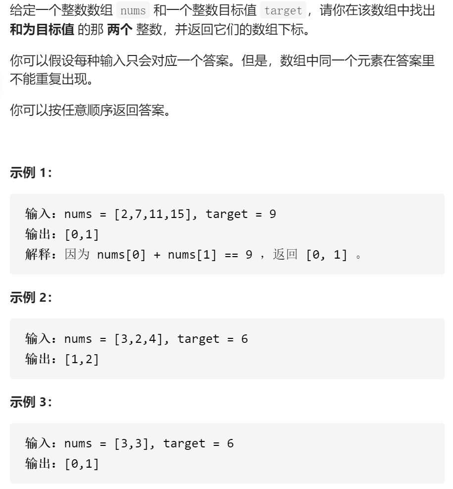

**解法1:暴力枚举**

```JavaScript
var twoSum = function(nums, target) {
 var results = []
 for (let i = 0; i < nums.length; i++){
     for (let j = i + 1; j < nums.length; j++) {
         if (nums[i] + nums[j] === target) {
             results.push(i)
             results.push(j)
             return results
         }
     }
 }
};
```

- 时间复杂度：O(N^2)，其中N是数组中的元素数量。最坏情况下数组中任意两个数都要被匹配一次
- 空间复杂度：O(1)

**解法2:哈希表**

> Hash表时一种数据结构，可以把它理解为一个key-value对，一个key-value对构成一个entry，只不过在Hash表中，需要先将原始的key经过Hash函数运算，映射到entry中的key上，然后就可以通过key值进行查询等操作，重要的是设计Hash函数，避免Hash冲突

注意到方法一的时间复杂度较高的原因是寻找 `target - x` 的时间复杂度过高。因此，我们需要一种更优秀的方法，能够快速寻找数组中是否存在目标元素。如果存在，我们需要找出它的索引。

使用哈希表，可以将寻找 `target - x` 的时间复杂度降低到从 O*(*N*) 降低到 O(1)*

这样我们创建一个哈希表，对于每一个 `x`，我们首先查询哈希表中是否存在 `target - x`，然后将 `x` 插入到哈希表中，即可保证不会让 `x` 和自己匹配。

```javascript
/**
 * @param {number[]} nums
 * @param {number} target
 * @return {number[]}
 */
function HashTable() { //Hash表构造函数
  var size = 0
  var entry = new Object()

  this.push = function (key, value) {
    ++size
    entry[key] = value

  }

  this.get = function (key) {
    if (key in entry) {
      return entry[key]
    } else {
      return null
    }
  }

  this.containsKey = function (key) {
    return (key in entry)
  }
}

var twoSum = function (nums, target) {
  var results = []
  var hash = new HashTable()//实例化Hash表
  hash.push(nums[0], 0)
  for (let i = 1; i < nums.length; i++) {
    if (hash.containsKey(target - nums[i])) {
      results.push(hash.get(target - nums[i]))
      results.push(i)
      return results
    }
    hash.push(nums[i], i)
  }
}
```

还可以通过JS自带的MAP对象，可以建立映射，key-value对

```javascript
var twoSum = function(nums, target) {
    let len = nums.length;
    // 创建 MAP
    const MAP = new Map();
    // 由于第一个元素在它之前一定没有元素与之匹配，所以先存入哈希表
    MAP.set(nums[0], 0);
    for (let i = 1; i < len; i++) {
        // 提取共用
        let other = target - nums[i];
        // 判断是否符合条件，返回对应的下标
        if (MAP.get(other) !== undefined) return [MAP.get(other), i];
        // 不符合的存入hash表
        MAP.set(nums[i], i)
    }
};
```

## 0002 两数相加

<strong style="color:red;">tips：注意0和1的判断，有时候进位了，但还没结束</strong>

<p>给你两个 <strong>非空</strong> 的链表，表示两个非负的整数。它们每位数字都是按照 <strong>逆序</strong> 的方式存储的，并且每个节点只能存储 <strong>一位</strong> 数字。</p>

<p>请你将两个数相加，并以相同形式返回一个表示和的链表。</p>

<p>你可以假设除了数字 0 之外，这两个数都不会以 0 开头。</p>

<p> </p>

<p><strong>示例 1：</strong></p>

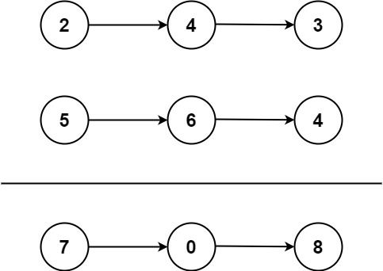

<pre>
<strong>输入：</strong>l1 = [2,4,3], l2 = [5,6,4]
<strong>输出：</strong>[7,0,8]
<strong>解释：</strong>342 + 465 = 807.
</pre>


<p><strong>示例 2：</strong></p>

<pre>
<strong>输入：</strong>l1 = [0], l2 = [0]
<strong>输出：</strong>[0]
</pre>


<p><strong>示例 3：</strong></p>

<pre>
<strong>输入：</strong>l1 = [9,9,9,9,9,9,9], l2 = [9,9,9,9]
<strong>输出：</strong>[8,9,9,9,0,0,0,1]
</pre>


<p> </p>

<p><strong>提示：</strong></p>

<ul>
	<li>每个链表中的节点数在范围 <code>[1, 100]</code> 内</li>
	<li><code>0 <= Node.val <= 9</code></li>
	<li>题目数据保证列表表示的数字不含前导零</li>
</ul>


```javascript
/**
 * Definition for singly-linked list.
 * function ListNode(val, next) {
 *     this.val = (val===undefined ? 0 : val)
 *     this.next = (next===undefined ? null : next)
 * }
 */
/**
 * @param {ListNode} l1
 * @param {ListNode} l2
 * @return {ListNode}
 */
var addTwoNumbers = function (l1, l2) {
    var zhengshu = 0
    var result = new ListNode(-1)//result始终指向链表头
    var cur = result//指向链表头，对链表进行操作
    while(l1 || l2 || zhengshu ) {
        var sum = (l1 ? l1.val : 0) + (l2 ? l2.val : 0) + zhengshu//判断l1、l2是否为空
        zhengshu = Math.floor(sum/10)
        cur.next = new ListNode(sum % 10)
        cur = cur.next
        l1 = l1 ? l1.next : l1;
        l2 = l2 ? l2.next : l2;
    }
    return result.next
};
```

## 0003 无重复字符的最长子串

<p>给定一个字符串，请你找出其中不含有重复字符的 <strong>最长子串 </strong>的长度。</p>

<p><strong>示例 1:</strong></p>

<pre>
<strong>输入: </strong>s = "abcabcbb"
<strong>输出: </strong>3 
<strong>解释:</strong> 因为无重复字符的最长子串是 <code>"abc"，所以其</code>长度为 3。
</pre>


<p><strong>示例 2:</strong></p>

<pre>
<strong>输入: </strong>s = "bbbbb"
<strong>输出: </strong>1
<strong>解释: </strong>因为无重复字符的最长子串是 <code>"b"</code>，所以其长度为 1。
</pre>


<p><strong>示例 3:</strong></p>

<pre>
<strong>输入: </strong>s = "pwwkew"
<strong>输出: </strong>3
<strong>解释: </strong>因为无重复字符的最长子串是 <code>"wke"</code>，所以其长度为 3。
     请注意，你的答案必须是 <strong>子串 </strong>的长度，<code>"pwke"</code> 是一个<em>子序列，</em>不是子串。
</pre>


<p><strong>示例 4:</strong></p>

<pre>
<strong>输入: </strong>s = ""
<strong>输出: </strong>0
</pre>


<p><strong>提示：</strong></p>

<ul>
	<li><code>0 <= s.length <= 5 * 10<sup>4</sup></code></li>
	<li><code>s</code> 由英文字母、数字、符号和空格组成</li>
</ul>


利用**滑动窗口**，i为窗口的左指针，right为窗口右指针，右指针不断右移探寻最大无重复子串，当遇到重复时，左指针自增，还是重复，继续自增，直到无重复，用max函数对当前子串长度和记录最大长度进行比较并记录

```JavaScript
/**
 * @param {string} s
 * @return {number}
 */
var lengthOfLongestSubstring = function(s) {
    const n = s.length
    var number = 0
    var result = new Set()
    var right = 0
    for (let i = 0; i < n; i++) {
        let ans = 0
        if(i != 0) {
            result.delete(s.charAt(i-1))
        }
        while((right < n) && !result.has(s.charAt(right))) {
            result.add(s.charAt(right))
            right++
        }
        ans = result.size
        number = Math.max(number, ans)
    }
    return number
};
```

## 0004 寻找两个正序数组的中位数


<p>给定两个大小分别为 <code>m</code> 和 <code>n</code> 的正序（从小到大）数组 <code>nums1</code> 和 <code>nums2</code>。请你找出并返回这两个正序数组的 <strong>中位数</strong> 。</p>

<p> </p>

<p><strong>示例 1：</strong></p>

<pre>
<strong>输入：</strong>nums1 = [1,3], nums2 = [2]
<strong>输出：</strong>2.00000
<strong>解释：</strong>合并数组 = [1,2,3] ，中位数 2
</pre>


<p><strong>示例 2：</strong></p>

<pre>
<strong>输入：</strong>nums1 = [1,2], nums2 = [3,4]
<strong>输出：</strong>2.50000
<strong>解释：</strong>合并数组 = [1,2,3,4] ，中位数 (2 + 3) / 2 = 2.5
</pre>


<p><strong>示例 3：</strong></p>

<pre>
<strong>输入：</strong>nums1 = [0,0], nums2 = [0,0]
<strong>输出：</strong>0.00000
</pre>


<p><strong>示例 4：</strong></p>

<pre>
<strong>输入：</strong>nums1 = [], nums2 = [1]
<strong>输出：</strong>1.00000
</pre>


<p><strong>示例 5：</strong></p>

<pre>
<strong>输入：</strong>nums1 = [2], nums2 = []
<strong>输出：</strong>2.00000
</pre>


<p> </p>

<p><strong>提示：</strong></p>

<ul>
	<li><code>nums1.length == m</code></li>
	<li><code>nums2.length == n</code></li>
	<li><code>0 <= m <= 1000</code></li>
	<li><code>0 <= n <= 1000</code></li>
	<li><code>1 <= m + n <= 2000</code></li>
	<li><code>-10<sup>6</sup> <= nums1[i], nums2[i] <= 10<sup>6</sup></code></li>
</ul>


**解法1：比大小后填充**

```javascript
/**
 * @param {number[]} nums1
 * @param {number[]} nums2
 * @return {number}
 */
var findMedianSortedArrays = function (nums1, nums2) {
  var m = nums1.length
  var n = nums2.length
  var results = []
  var p1 = 0,p2 = 0,count = 0
  while (p1 < m && p2 < n) {
    if (nums1[p1] > nums2[p2]) {
      results.push(nums2[p2])
      p2++
    } else if (nums1[p1] < nums2[p2]) {
      results.push(nums1[p1])
      p1++
    } else if ((nums1[p1] === nums2[p2])) {
      results.push(nums1[p1])
      results.push(nums2[p2])
      p1++
      p2++
    }
  }
  while (p1 < m) {
    results.push(nums1[p1])
    p1++
  }
  while (p2 < n) {
    results.push(nums2[p2])
    p2++
  }
  console.log(results);
  count = results.length
  if (count % 2 === 0) {
    return (results[count / 2] + results[count / 2 - 1]) / 2
  } else {
    return results[Math.floor(count / 2)]
  }
};
```

**解法2：二分法**

```javascript
/**
 * 二分解法
 * @param {number[]} nums1
 * @param {number[]} nums2
 * @return {number}
 */
var findMedianSortedArrays = function(nums1, nums2) {
  // make sure to do binary search for shorten array
  if (nums1.length > nums2.length) {
    [nums1, nums2] = [nums2, nums1]
  }
  const m = nums1.length
  const n = nums2.length
  let low = 0
  let high = m
  while(low <= high) {
    const i = low + Math.floor((high - low) / 2)
    const j = Math.floor((m + n + 1) / 2) - i

    const maxLeftA = i === 0 ? -Infinity : nums1[i-1]
    const minRightA = i === m ? Infinity : nums1[i]
    const maxLeftB = j === 0 ? -Infinity : nums2[j-1]
    const minRightB = j === n ? Infinity : nums2[j]

    if (maxLeftA <= minRightB && minRightA >= maxLeftB) {
      return (m + n) % 2 === 1
        ? Math.max(maxLeftA, maxLeftB)
        : (Math.max(maxLeftA, maxLeftB) + Math.min(minRightA, minRightB)) / 2
    } else if (maxLeftA > minRightB) {
      high = i - 1
    } else {
      low = low + 1
    }
  }
};
```

## 0005 最长回文子串

<p>给你一个字符串 <code>s</code>，找到 <code>s</code> 中最长的回文子串。</p>

<p><strong>示例 1：</strong></p>

<pre>
<strong>输入：</strong>s = "babad"
<strong>输出：</strong>"bab"
<strong>解释：</strong>"aba" 同样是符合题意的答案。
</pre>


<p><strong>示例 2：</strong></p>

<pre>
<strong>输入：</strong>s = "cbbd"
<strong>输出：</strong>"bb"
</pre>


<p><strong>示例 3：</strong></p>

<pre>
<strong>输入：</strong>s = "a"
<strong>输出：</strong>"a"
</pre>


<p><strong>示例 4：</strong></p>

<pre>
<strong>输入：</strong>s = "ac"
<strong>输出：</strong>"a"
</pre>


<p> </p>

<p><strong>提示：</strong></p>

<ul>
	<li><code>1 <= s.length <= 1000</code></li>
	<li><code>s</code> 仅由数字和英文字母（大写和/或小写）组成</li>
</ul>


**解法1：中心扩散法**

我们知道回文串一定是对称的，所以我们可以每次循环选择一个中心，进行左右扩展，判断左右字符是否相等即可。

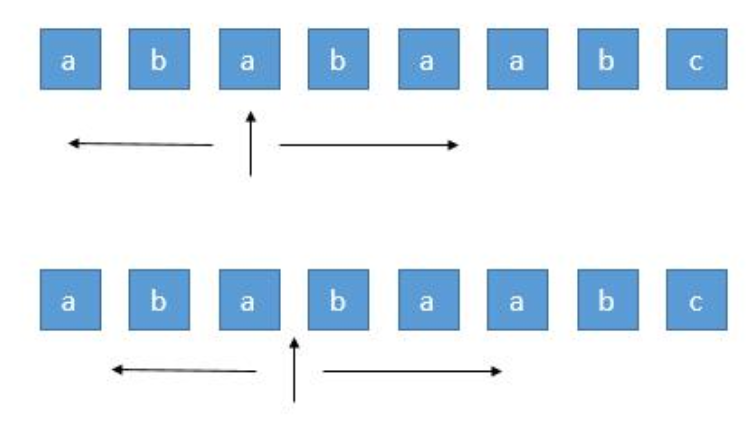

由于存在奇数的字符串和偶数的字符串，所以我们需要从一个字符开始扩展，或者从两个字符之间开始扩展，所以总共有 `n+n-1` 个中心。

```JavaScript
/**
 * @param {string} s
 * @return {string}
 */
var longestPalindrome = function(s) {
    let start = 0, end = 0;
    for(let i = 0; i < s.length; i ++) {
        let len1 = expandAroudcenter(s, i, i);
        let len2 = expandAroudcenter(s, i, i + 1);
        let len = Math.max(len1, len2);
        if(len >= (end - start + 1)) {
            start = i - Math.floor((len - 1) / 2);
            end = i + Math.floor(len / 2)
        }
    }
    return s.substring(start, end+1)
};

function expandAroudcenter(s, left, right) {
    let L = left, R = right
    while(L >= 0 && R < s.length && s.charAt(L) === s.charAt(R)) {
        L--;
        R++;
    }
    return R-L-1
}
```

时间复杂度：*O*(*n*²）

空间复杂度：*O*(1）

**解法2：动态规划**

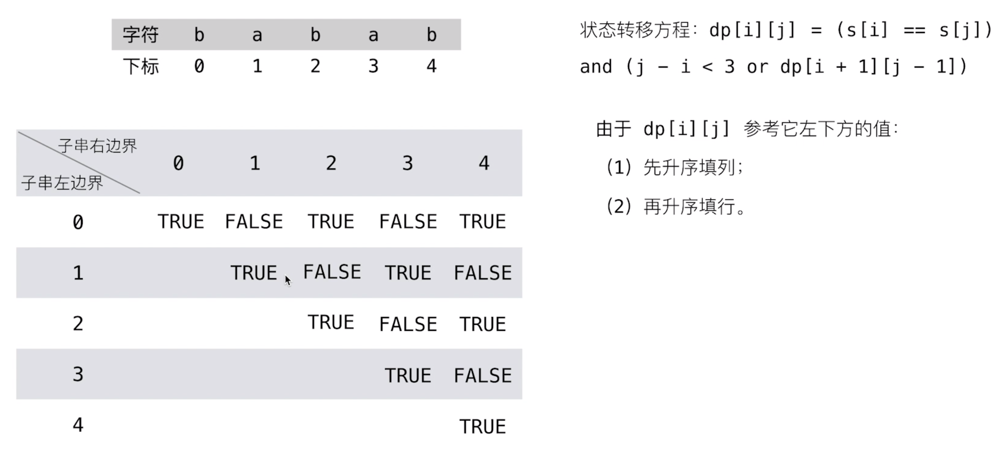

当前状态是否是回文串，取决于两个因素：左右两端是否相等 and 去掉左右两端的子串是否为回文串


## 0006 Z字形变换


<p>将一个给定字符串 <code>s</code> 根据给定的行数 <code>numRows</code> ，以从上往下、从左到右进行 Z 字形排列。</p>

<p>比如输入字符串为 <code>"PAYPALISHIRING"</code> 行数为 <code>3</code> 时，排列如下：</p>

<pre>
P   A   H   N
A P L S I I G
Y   I   R</pre>


<p>之后，你的输出需要从左往右逐行读取，产生出一个新的字符串，比如：<code>"PAHNAPLSIIGYIR"</code>。</p>

<p>请你实现这个将字符串进行指定行数变换的函数：</p>

<pre>
string convert(string s, int numRows);</pre>


<p> </p>

<p><strong>示例 1：</strong></p>

<pre>
<strong>输入：</strong>s = "PAYPALISHIRING", numRows = 3
<strong>输出：</strong>"PAHNAPLSIIGYIR"
</pre>

<strong>示例 2：</strong>

<pre>
<strong>输入：</strong>s = "PAYPALISHIRING", numRows = 4
<strong>输出：</strong>"PINALSIGYAHRPI"
<strong>解释：</strong>
P     I    N
A   L S  I G
Y A   H R
P     I
</pre>


<p><strong>示例 3：</strong></p>

<pre>
<strong>输入：</strong>s = "A", numRows = 1
<strong>输出：</strong>"A"
</pre>


<p> </p>

<p><strong>提示：</strong></p>

<ul>
	<li><code>1 <= s.length <= 1000</code></li>
	<li><code>s</code> 由英文字母（小写和大写）、<code>','</code> 和 <code>'.'</code> 组成</li>
	<li><code>1 <= numRows <= 1000</code></li>
</ul>

**解法：按行排序**

创建一个数组，存放numRows个元素，通过对down值的判断，依次从原字符串中取出字符放入

```javascript
/**
 * @param {string} s
 * @param {number} numRows
 * @return {string}
 */
var convert = function(s, numRows) {
    if(numRows == 1)
        return s;

    const len = Math.min(s.length, numRows);
    const rows = [];
    for(let i = 0; i< len; i++) rows[i] = "";
    let loc = 0;
    let down = false;

    for(const c of s) {
        rows[loc] += c;
        if(loc == 0 || loc == numRows - 1)
            down = !down;
        loc += down ? 1 : -1;
    }

    let ans = "";
    for(const row of rows) {
        ans += row;
    }
    return ans;
};
```


## 0007 整数反转


<p>给你一个 32 位的有符号整数 <code>x</code> ，返回将 <code>x</code> 中的数字部分反转后的结果。</p>

<p>如果反转后整数超过 32 位的有符号整数的范围 <code>[−2<sup>31</sup>,  2<sup>31 </sup>− 1]</code> ，就返回 0。</p>

<strong>假设环境不允许存储 64 位整数（有符号或无符号）。</strong>

<p> </p>

<p><strong>示例 1：</strong></p>

<pre>
<strong>输入：</strong>x = 123
<strong>输出：</strong>321
</pre>


<p><strong>示例 2：</strong></p>

<pre>
<strong>输入：</strong>x = -123
<strong>输出：</strong>-321
</pre>


<p><strong>示例 3：</strong></p>

<pre>
<strong>输入：</strong>x = 120
<strong>输出：</strong>21
</pre>


<p><strong>示例 4：</strong></p>

<pre>
<strong>输入：</strong>x = 0
<strong>输出：</strong>0
</pre>


<p> </p>

<p><strong>提示：</strong></p>

<ul>
	<li><code>-2<sup>31</sup> <= x <= 2<sup>31</sup> - 1</code></li>
</ul>


**解法：**

本题的关键在于对范围的处理，由于题目限制只允许32位整数出现，所以要对反转后数值大小进行判断。

考虑 x > 0的情况，记
$$
I N T_{-} M A X=2^{31}-1=2147483647
$$

由于
$$
\begin{aligned} I N T_{-} M A X &=\left\lfloor\frac{I N T_{-} M A X}{10}\right\rfloor \cdot 10+\left(I N T_{-} M A X \bmod 10\right) \\ &=\left\lfloor\frac{I N T_{-} M A X}{10}\right\rfloor \cdot 10+7 \end{aligned}
$$

则不等式 rev*10 + digit <= INT_MAX 等价于
$$
r e v \cdot 10+ $ digit $ \leq\left\lfloor\frac{I N T_{-} M A X}{10}\right\rfloor \cdot 10+7
$$

移项得
$$
\left(\right.  rev  \left.-\left\lfloor\frac{I N T_{-} M A X}{10}\right\rfloor\right) \cdot 10 \leq 7-  digit
$$

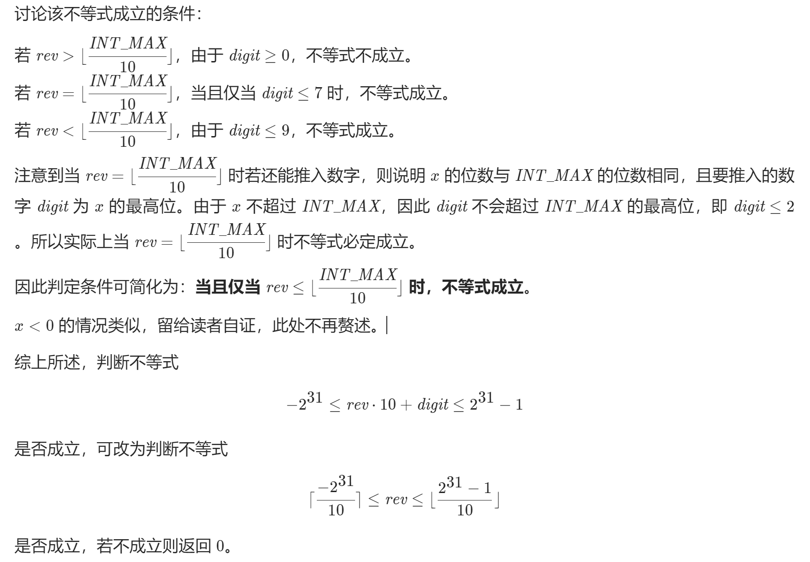

```javascript
/**
 * @param {number} x
 * @return {number}
 */
var reverse = function(x) {
    let res = 0; //存放结果
    let digit = 0; //存放整除后的余数

    while(x !== 0) {
        if(res < ~~(Math.pow(-2, 31)/10) || res > ~~((Math.pow(2, 31)-1)/10)) return 0;
        digit = x % 10;
        res = res * 10 + digit;
        x = ~~(x / 10);
    }
    return res;
}; 
```

<strong style="color:red;">注意：在JS求整操作中，尽量使用~~，Math.floor()在此处不可用，它是向下取整，而不是抹去小数，例如Math.floor(-1.5) = -2</strong>


## 0010 正则表达式匹配


<p>给你一个字符串 <code>s</code> 和一个字符规律 <code>p</code>，请你来实现一个支持 <code>'.'</code> 和 <code>'*'</code> 的正则表达式匹配。</p>

<ul>
	<li><code>'.'</code> 匹配任意单个字符</li>
	<li><code>'*'</code> 匹配零个或多个前面的那一个元素</li>
</ul>


<p>所谓匹配，是要涵盖 <strong>整个 </strong>字符串 <code>s</code>的，而不是部分字符串。</p>


<p><strong>示例 1：</strong></p>

<pre>
<strong>输入：</strong>s = "aa" p = "a"
<strong>输出：</strong>false
<strong>解释：</strong>"a" 无法匹配 "aa" 整个字符串。
</pre>


<p><strong>示例 2:</strong></p>

<pre>
<strong>输入：</strong>s = "aa" p = "a*"
<strong>输出：</strong>true
<strong>解释：</strong>因为 '*' 代表可以匹配零个或多个前面的那一个元素, 在这里前面的元素就是 'a'。因此，字符串 "aa" 可被视为 'a' 重复了一次。
</pre>


<p><strong>示例 3：</strong></p>

<pre>
<strong>输入：</strong>s = "ab" p = ".*"
<strong>输出：</strong>true
<strong>解释：</strong>".*" 表示可匹配零个或多个（'*'）任意字符（'.'）。
</pre>


<p><strong>示例 4：</strong></p>

<pre>
<strong>输入：</strong>s = "aab" p = "c*a*b"
<strong>输出：</strong>true
<strong>解释：</strong>因为 '*' 表示零个或多个，这里 'c' 为 0 个, 'a' 被重复一次。因此可以匹配字符串 "aab"。
</pre>


<p><strong>示例 5：</strong></p>

<pre>
<strong>输入：</strong>s = "mississippi" p = "mis*is*p*."
<strong>输出：</strong>false</pre>


<p> </p>

<p><strong>提示：</strong></p>

<ul>
	<li><code>0 <= s.length <= 20</code></li>
	<li><code>0 <= p.length <= 30</code></li>
	<li><code>s</code> 可能为空，且只包含从 <code>a-z</code> 的小写字母。</li>
	<li><code>p</code> 可能为空，且只包含从 <code>a-z</code> 的小写字母，以及字符 <code>.</code> 和 <code>*</code>。</li>
	<li>保证每次出现字符 <code>*</code> 时，前面都匹配到有效的字符</li>
</ul>


首先解题要先理解正则表达式具体匹配规则,先来做个最简单的假设:

- 假设`s=ab`,`p=a*b*`,那么毫无疑问`s.match(p)`是成立的
- 根据上面的例子,`p`变成`a*b*c`,那么这就是不成立的，因为`s`并没有`c`，如果`p`再加一个`*`变成`a*b*c*`，那么匹配又会变成立，因为`c`这个时候可以匹配为0个
- 那么当匹配到`*`号的时候具体到代码上逻辑是这样的:

```
if(p.charAt(i) === '*'){
  dp[i+1] = dp[i-1]
}
```

以上的逻辑思路就是当匹配到`a*b*c*`中时，判断最后一个`*`是否匹配成立只需要看第2个`*`,即`a*b*`是否匹配，如果匹配那么`a*b*c*`也是成立的,假如`s`换成是`ad`，那么走到`a*b`的时候就已经不匹配了,经过状态转移`a*b*c*`也不会匹配，所以使用**动态规划**就再合适不过

**第一步：建立二维数组**

假设`s=abbcddd`,`p=a*b*.dd*`,因此先建立一张对应二维数组的表:

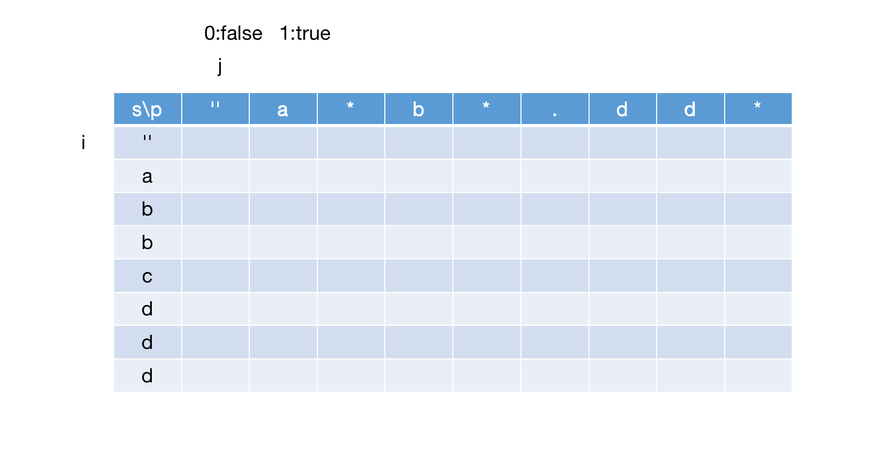

为何要在`p`前面加一个空字符串(只是在表格中加)，原因也很简单，假设当`s='',p=a*`时匹配是成立的，那么根据上面的逻辑`dp[0][j+1]=dp[0][j-1]`,那么就需要一个空值为true才能确保转移到`a*`后仍然为true

然后先建立一种简单的匹配情况，字符可以先把`s`假设为空字符串，`p`不变，那么可以s匹配p的结果如下(假设0为false,1为true):

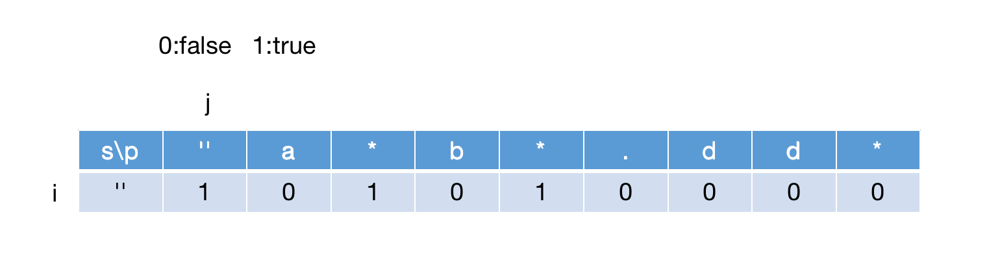

如上图，当`p[j]='.'`的时候可以当成是任意字符串但不能为空，因此匹配也为false，结合上述逻辑，一开始先匹配第一个空字符的逻辑可以总结为:

```
    dp[0][0] = true;
    for (let i = 1; i < p.length; i++) {
        if (p.charAt(i) === "*") {
            dp[0][i + 1] = dp[0][i - 1]
        }
    }
```

这个时候匹配完的`dp[0]`意义就是后续`dp[i][j]`进行状态转移的判断依据

**第二步: 匹配状态转移**

在`dp[0]`全部赋值后开始对字符串`s`和模式字符串`p`进行逐一匹配，那么匹配过程一共会碰到三种情况:

- `p[j]`为普通字符时:

  如果`s[i]===p[j]`,那么通过`dp[i+1][j+1]=dp[i][j]`判断，例子如下图：

  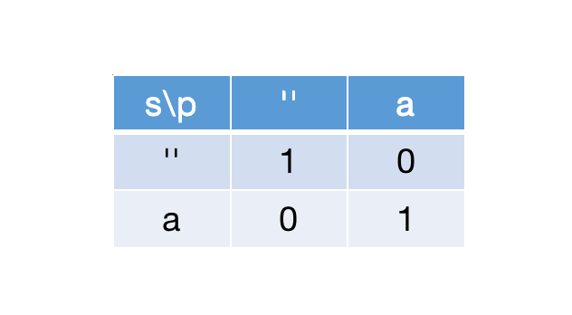

- `p[j]`为`.`时:

  可以把`p[j]`看成任意但不为空的字符，也是通过`dp[i+1][j+1]=dp[i][j]`判断，例子如下图：

  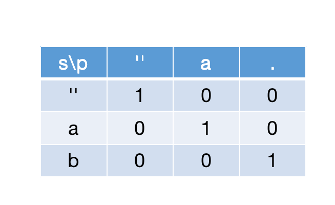

- `p[j]`为`*`时:

  1.如果`p[j-1]!==s[i]&&p[j-1]!=='.'`时，和上面的`dp[0][j+1]=dp[0][j-1]`的逻辑一样，把前一个`*`的状态值转移过来，如下图:


  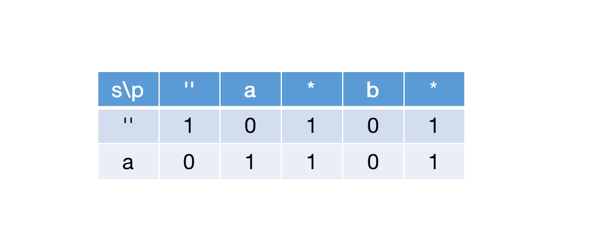

  当`i=0,j=3`时,`s[0]!==p[2]`，因此`dp[i+1][j+1]=false`

  2.当`p[j-1]==s[i]`时，对`*`可以匹配成功的情况可以分为三种，假设`p[j-1]=b`，出现的个数为`n`:

  - `n=0`时，复用上面的逻辑，即`dp[i+1][j+1]=dp[i+1][j-1]`
  - `n=1`时，`dp[i+1][j+1]`只需要等于`dp[i+1][j]`的值即可，如下图：
    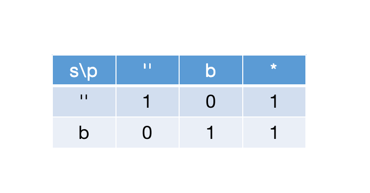
  - `n>=2`时，这个时候`dp[i+1][j]`和`dp[i+1][j-1]`都有可能为`false`，如下图:

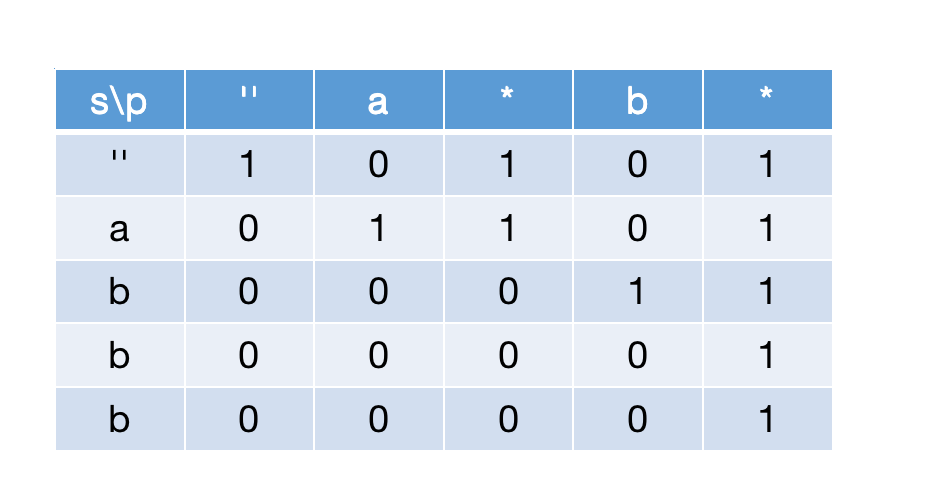
那么在出现多个`b`后`dp[i+1][j+1]`可以根据`dp[i][j+1]`判断

综上所述，当`p.charAt(j) === '*'`时，具体逻辑可以归纳为:

```
  if (p.charAt(j - 1) !== s.charAt(i) && p.charAt(j - 1) !== '.') {
      dp[i + 1][j + 1] = dp[i + 1][j - 1]
  } else {
      dp[i + 1][j + 1] = (dp[i + 1][j] || dp[i][j + 1] || dp[i + 1][j - 1])
  }
```

匹配完成后返回`dp[s.length][p.length]`就是最终结果。


```javascript
/**
 * @param {string} s
 * @param {string} p
 * @return {boolean}
 */
var isMatch = function(s, p) {
 let dp = Array(s.length + 1);
    for (let i = 0; i < dp.length; i++) {
        dp[i] = Array(p.length + 1).fill(false)
    }
    dp[0][0] = true;
    for (let i = 1; i < p.length; i++) {
        if (p.charAt(i) === "*") {
            dp[0][i + 1] = dp[0][i - 1]
        }
    }

    for (let i = 0; i < s.length; i++) {
        for (let j = 0; j < p.length; j++) {
            if (p.charAt(j) === '.') {
                dp[i + 1][j + 1] = dp[i][j]
            }

            if (p.charAt(j) === s.charAt(i)) {
                dp[i + 1][j + 1] = dp[i][j]
            }

            if (p.charAt(j) === '*') {
                if (p.charAt(j - 1) !== s.charAt(i) && p.charAt(j - 1) !== '.') {
                    dp[i + 1][j + 1] = dp[i + 1][j - 1]
                } else {
                    dp[i + 1][j + 1] = (dp[i + 1][j] || dp[i][j + 1] || dp[i + 1][j - 1])
                }
            }
        }
    }
    return dp[s.length][p.length]
};
```


## 0011盛水最多的容器


<p>给你 <code>n</code> 个非负整数 <code>a<sub>1</sub>，a<sub>2，</sub>...，a</code><sub><code>n</code>，</sub>每个数代表坐标中的一个点 <code>(i, a<sub>i</sub>)</code> 。在坐标内画 <code>n</code> 条垂直线，垂直线 <code>i</code> 的两个端点分别为 <code>(i, a<sub>i</sub>)</code> 和 <code>(i, 0)</code> 。找出其中的两条线，使得它们与 <code>x</code> 轴共同构成的容器可以容纳最多的水。</p>

<p><strong>说明：</strong>你不能倾斜容器。</p>

<p> </p>

<p><strong>示例 1：</strong></p>

<p></p>

<pre>
<strong>输入：</strong>[1,8,6,2,5,4,8,3,7]
<strong>输出：</strong>49 
<strong>解释：</strong>图中垂直线代表输入数组 [1,8,6,2,5,4,8,3,7]。在此情况下，容器能够容纳水（表示为蓝色部分）的最大值为 49。</pre>


<p><strong>示例 2：</strong></p>

<pre>
<strong>输入：</strong>height = [1,1]
<strong>输出：</strong>1
</pre>


<p><strong>示例 3：</strong></p>

<pre>
<strong>输入：</strong>height = [4,3,2,1,4]
<strong>输出：</strong>16
</pre>


<p><strong>示例 4：</strong></p>

<pre>
<strong>输入：</strong>height = [1,2,1]
<strong>输出：</strong>2
</pre>


<p> </p>

<p><strong>提示：</strong></p>

<ul>
	<li><code>n = height.length</code></li>
	<li><code>2 <= n <= 3 * 10<sup>4</sup></code></li>
	<li><code>0 <= height[i] <= 3 * 10<sup>4</sup></code></li>
</ul>


**解法：双指针（对撞指针）**

对撞指针就是左右两个指针对向移动

如果我们移动数字较大的那个指针，那么前者「两个指针指向的数字中较小值」不会增加，后者「指针之间的距离」会减小，那么这个乘积会减小。因此，我们移动数字较大的那个指针是不合理的。因此，我们移动数字较小的那个指针。

但是

```javascript
/**
 * @param {number[]} height
 * @return {number}
 */
var maxArea = function (height) {
  var left = 0;
  var right = height.length - 1;
  var area = 0;
  while (right >= left) {
    let num = Math.min(height[left], height[right]) * (right - left)
    area = num >= area ? num : area;
    if (height[right] >= height[left]) {
      left++;
    } else {
      right--;
    }
  }
  return area;
};
```


## 0015 三数之和


<p>给你一个包含 <code>n</code> 个整数的数组 <code>nums</code>，判断 <code>nums</code> 中是否存在三个元素 <em>a，b，c ，</em>使得 <em>a + b + c = </em>0 ？请你找出所有和为 <code>0</code> 且不重复的三元组。</p>

<p><strong>注意：</strong>答案中不可以包含重复的三元组。</p>

<p> </p>

<p><strong>示例 1：</strong></p>

<pre>
<strong>输入：</strong>nums = [-1,0,1,2,-1,-4]
<strong>输出：</strong>[[-1,-1,2],[-1,0,1]]
</pre>


<p><strong>示例 2：</strong></p>

<pre>
<strong>输入：</strong>nums = []
<strong>输出：</strong>[]
</pre>


<p><strong>示例 3：</strong></p>

<pre>
<strong>输入：</strong>nums = [0]
<strong>输出：</strong>[]
</pre>


<p> </p>

<p><strong>提示：</strong></p>

<ul>
	<li><code>0 <= nums.length <= 3000</code></li>
	<li><code>-10<sup>5</sup> <= nums[i] <= 10<sup>5</sup></code></li>
</ul>


**解法：排序 + 双指针**

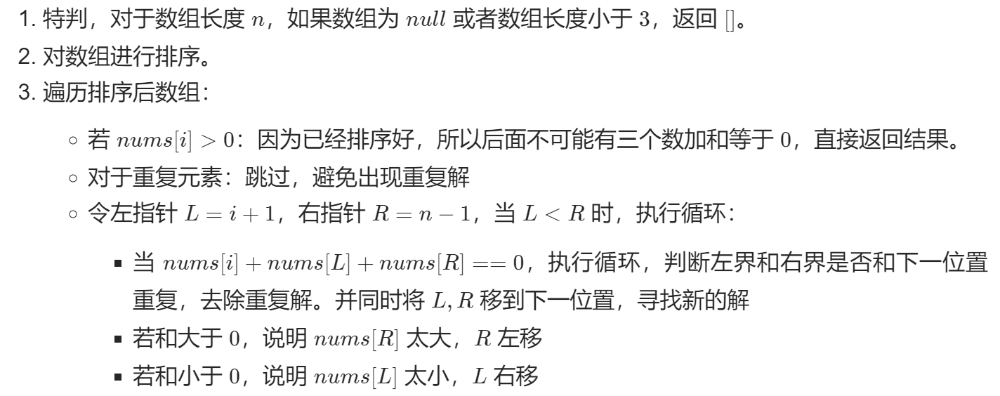


```javascript
/**
 * @param {number[]} nums
 * @return {number[][]}
 */
var threeSum = function(nums) {
    let result = [];
    if(nums.length < 3) return result;
    nums.sort((a,b) => a - b);
    for (let i = 0; i < nums.length; i ++) {
        if(nums[i] > 0) break;
        if(i > 0 && nums[i] === nums[i-1]) continue;
        let left = i + 1, right = nums.length - 1;
        while (left < right) {
            const sum = nums[i] + nums[left] + nums[right]
            if (sum === 0) {
                result.push([nums[i], nums[left], nums[right]]);
                while (nums[left] === nums[left + 1]) left++;
                left++;
                while (nums[right] === nums[right - 1]) right--;
                right--;
            } 
            else if (sum > 0) right--;
            else if (sum < 0) left ++;
        }
    }
    return result;
};
```


## 0017 电话号码的字母组合


<p>给定一个仅包含数字 <code>2-9</code> 的字符串，返回所有它能表示的字母组合。答案可以按 <strong>任意顺序</strong> 返回。</p>

<p>给出数字到字母的映射如下（与电话按键相同）。注意 1 不对应任何字母。</p>

<p></p>

<p> </p>

<p><strong>示例 1：</strong></p>

<pre>
<strong>输入：</strong>digits = "23"
<strong>输出：</strong>["ad","ae","af","bd","be","bf","cd","ce","cf"]
</pre>


<p><strong>示例 2：</strong></p>

<pre>
<strong>输入：</strong>digits = ""
<strong>输出：</strong>[]
</pre>


<p><strong>示例 3：</strong></p>

<pre>
<strong>输入：</strong>digits = "2"
<strong>输出：</strong>["a","b","c"]
</pre>


<p> </p>

<p><strong>提示：</strong></p>

<ul>
	<li><code>0 <= digits.length <= 4</code></li>
	<li><code>digits[i]</code> 是范围 <code>['2', '9']</code> 的一个数字。</li>
</ul>


**解法：回溯法**

深度优先搜索

我理解的回溯法是一种递归，对于**找出全部可能**的题目，适合用回溯

- 首先通过Map建立一个Hash表，映射数字和字母的关系
- 创建backtrace方法，nowcontent是当前拼接的字符串，left是剩余的数字
- 当剩余数字长度为0时，将nowcontent作为结果push
- 否则，在当前数字映射的字母中循环，继续调用backtrace，此时传入拼接好的字符串nowcontent+当前字母char，剩余数字left左边slice一位，传入函数，进行递归

```javascript
/**
 * @param {string} digits
 * @return {string[]}
 */
var letterCombinations = function(digits) {
    const res = [];
    if(digits.length === 0) return res;
    
    const number = new Map();
    number.set('2', 'abc');
    number.set('3', 'def');
    number.set('4', 'ghi');
    number.set('5', 'jkl');
    number.set('6', 'mno');
    number.set('7', 'pqrs');
    number.set('8', 'tuv');
    number.set('9', 'wxyz');

    function backtrace(nowcontent, left) {
        if(left.length === 0) {
            res.push(nowcontent)
        }else {
            for (let char of number.get(left.charAt(0))) {
                backtrace(nowcontent + char, left.slice(1));
            }
        }
    }

    backtrace('',digits);
    return res;
};
```


## 0019 删除链表倒数第N个节点


<p>给你一个链表，删除链表的倒数第 <code>n</code><em> </em>个结点，并且返回链表的头结点。</p>

<p><strong>进阶：</strong>你能尝试使用一趟扫描实现吗？</p>

<p> </p>

<p><strong>示例 1：</strong></p>

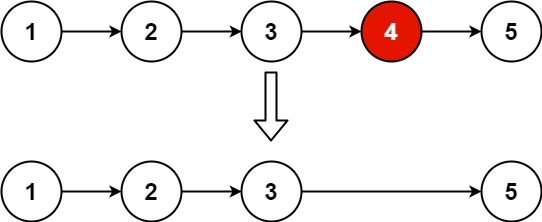

<pre>
<strong>输入：</strong>head = [1,2,3,4,5], n = 2
<strong>输出：</strong>[1,2,3,5]
</pre>


<p><strong>示例 2：</strong></p>

<pre>
<strong>输入：</strong>head = [1], n = 1
<strong>输出：</strong>[]
</pre>


<p><strong>示例 3：</strong></p>

<pre>
<strong>输入：</strong>head = [1,2], n = 1
<strong>输出：</strong>[1]
</pre>


<p> </p>

<p><strong>提示：</strong></p>

<ul>
	<li>链表中结点的数目为 <code>sz</code></li>
	<li><code>1 <= sz <= 30</code></li>
	<li><code>0 <= Node.val <= 100</code></li>
	<li><code>1 <= n <= sz</code></li>
</ul>


**解法：快慢指针**


```javascript
/**
 * Definition for singly-linked list.
//  * function ListNode(val, next) {
//  *     this.val = (val===undefined ? 0 : val)
//  *     this.next = (next===undefined ? null : next)
//  * }
 */
/**
 * @param {ListNode} head
 * @param {number} n
 * @return {ListNode}
 */
var removeNthFromEnd = function(head, n) {
    const markHead = head;
    let left = markHead, right = markHead;
    // 快先走 n+1 步
    while(n--) {
        right = right.next;
    }
    // fast、slow 一起前进
    while(right.next && right) {
        right = right.next
        left = left.next
    }
    left.next = left.next.next;
    return markHead;
};
```


## 0020 有效的括号


<p>给定一个只包括 <code>'('</code>，<code>')'</code>，<code>'{'</code>，<code>'}'</code>，<code>'['</code>，<code>']'</code> 的字符串 <code>s</code> ，判断字符串是否有效。</p>

<p>有效字符串需满足：</p>

<ol>
	<li>左括号必须用相同类型的右括号闭合。</li>
	<li>左括号必须以正确的顺序闭合。</li>
</ol>


<p> </p>

<p><strong>示例 1：</strong></p>

<pre>
<strong>输入：</strong>s = "()"
<strong>输出：</strong>true
</pre>


<p><strong>示例 2：</strong></p>

<pre>
<strong>输入：</strong>s = "()[]{}"
<strong>输出：</strong>true
</pre>


<p><strong>示例 3：</strong></p>

<pre>
<strong>输入：</strong>s = "(]"
<strong>输出：</strong>false
</pre>


<p><strong>示例 4：</strong></p>

<pre>
<strong>输入：</strong>s = "([)]"
<strong>输出：</strong>false
</pre>


<p><strong>示例 5：</strong></p>

<pre>
<strong>输入：</strong>s = "{[]}"
<strong>输出：</strong>true</pre>


<p> </p>

<p><strong>提示：</strong></p>

<ul>
	<li><code>1 <= s.length <= 10<sup>4</sup></code></li>
	<li><code>s</code> 仅由括号 <code>'()[]{}'</code> 组成</li>
</ul>


**解法：栈**

先进先出，后进后出

```javascript
/**
 * @param {string} s
 * @return {boolean}
 */
var isValid = function(s) {
    if(s.length % 2 !==0) {
        return false;
    }
    const map = {'(':')', '{':'}', '[':']'}
    const res = [];
    res.push(s.charAt(0));
    for(let i = 1; i < s.length; i++) {
        if(s.charAt(i) === map[res[res.length - 1]]){
            res.pop();
        }else {
            res.push(s.charAt(i)); 
        }
    }
    return res.length === 0 ? true : false
};
```


## 0021 合并两个有序链表


<p>将两个升序链表合并为一个新的 <strong>升序</strong> 链表并返回。新链表是通过拼接给定的两个链表的所有节点组成的。 </p>

<p> </p>

<p><strong>示例 1：</strong></p>

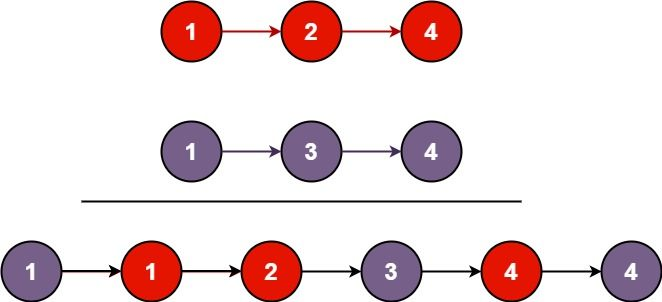

<pre>
<strong>输入：</strong>l1 = [1,2,4], l2 = [1,3,4]
<strong>输出：</strong>[1,1,2,3,4,4]
</pre>


<p><strong>示例 2：</strong></p>

<pre>
<strong>输入：</strong>l1 = [], l2 = []
<strong>输出：</strong>[]
</pre>


<p><strong>示例 3：</strong></p>

<pre>
<strong>输入：</strong>l1 = [], l2 = [0]
<strong>输出：</strong>[0]
</pre>


<p> </p>

<p><strong>提示：</strong></p>

<ul>
	<li>两个链表的节点数目范围是 <code>[0, 50]</code></li>
	<li><code>-100 <= Node.val <= 100</code></li>
	<li><code>l1</code> 和 <code>l2</code> 均按 <strong>非递减顺序</strong> 排列</li>
</ul>


**解法：迭代**

比较大小，插入新链表

```javascript
/**
 * Definition for singly-linked list.
 * function ListNode(val, next) {
 *     this.val = (val===undefined ? 0 : val)
 *     this.next = (next===undefined ? null : next)
 * }
 */
/**
 * @param {ListNode} l1
 * @param {ListNode} l2
 * @return {ListNode}
 */
var mergeTwoLists = function(l1, l2) {
    let head = new ListNode();
    const mark = head;
    while(l1 || l2) {
        head.next = new ListNode();
        head = head.next;
        if(l1 && l2) {
            if(l1.val > l2.val) {
                head.val = l2.val; 
                l2 = l2.next;
            }else {
                head.val = l1.val;
                l1 = l1.next;
              } 
            
        }else if(l1) {
            head.val = l1.val;
            l1 = l1.next;
        }else if(l2) {
            head.val = l2.val;
            l2 = l2.next;
        }
    }
    return mark.next;
};
```


## 0022 括号生成

<p>数字 <code>n</code> 代表生成括号的对数，请你设计一个函数，用于能够生成所有可能的并且 <strong>有效的 </strong>括号组合。</p>

<p> </p>

<p><strong>示例 1：</strong></p>

<pre>
<strong>输入：</strong>n = 3
<strong>输出：</strong>["((()))","(()())","(())()","()(())","()()()"]
</pre>


<p><strong>示例 2：</strong></p>

<pre>
<strong>输入：</strong>n = 1
<strong>输出：</strong>["()"]
</pre>


<p> </p>

<p><strong>提示：</strong></p>

<ul>
	<li><code>1 <= n <= 8</code></li>
</ul>


**解法：回溯法**

深度优先遍历，利用系统栈


```javascript
/**
 * @param {number} n
 * @return {string[]}
 */
var generateParenthesis = function(n) {
    const res = [];
    function backtrace(str, L, R) {
        if(L === 0 && R === 0) res.push(str);
        if(L > 0) {
            backtrace(str + '(', L-1, R);
        }
        if(R > L) {
            backtrace(str + ')', L, R-1);
        }
    }
    backtrace('', n, n);
    return res;
};
```


## 0023 合并K个升序链表


<p>给你一个链表数组，每个链表都已经按升序排列。</p>

<p>请你将所有链表合并到一个升序链表中，返回合并后的链表。</p>

<p>&nbsp;</p>

<p><strong>示例 1：</strong></p>

<pre><strong>输入：</strong>lists = [[1,4,5],[1,3,4],[2,6]]
<strong>输出：</strong>[1,1,2,3,4,4,5,6]
<strong>解释：</strong>链表数组如下：
[
  1-&gt;4-&gt;5,
  1-&gt;3-&gt;4,
  2-&gt;6
]
将它们合并到一个有序链表中得到。
1-&gt;1-&gt;2-&gt;3-&gt;4-&gt;4-&gt;5-&gt;6
</pre>


<p><strong>示例 2：</strong></p>

<pre><strong>输入：</strong>lists = []
<strong>输出：</strong>[]
</pre>


<p><strong>示例 3：</strong></p>

<pre><strong>输入：</strong>lists = [[]]
<strong>输出：</strong>[]
</pre>


<p>&nbsp;</p>

<p><strong>提示：</strong></p>

<ul>
	<li><code>k == lists.length</code></li>
	<li><code>0 &lt;= k &lt;= 10^4</code></li>
	<li><code>0 &lt;= lists[i].length &lt;= 500</code></li>
	<li><code>-10^4 &lt;= lists[i][j] &lt;= 10^4</code></li>
	<li><code>lists[i]</code> 按 <strong>升序</strong> 排列</li>
	<li><code>lists[i].length</code> 的总和不超过 <code>10^4</code></li>
</ul>


**解法1：顺序合并**

通过一个for语句，对数组中的链表进行两两合并

```javascript
/**
 * Definition for singly-linked list.
 * function ListNode(val, next) {
 *     this.val = (val===undefined ? 0 : val)
 *     this.next = (next===undefined ? null : next)
 * }
 */
/**
 * @param {ListNode[]} lists
 * @return {ListNode}
 */
var mergeKLists = function(lists) {

    if(lists.length === 0) return null;
    if(lists.length === 1) return lists[0];
    
var mergeTwoLists = function(l1, l2) {
    const prehead = new ListNode(-1);

    let prev = prehead;
    while (l1 != null && l2 != null) {
        if (l1.val <= l2.val) {
            prev.next = l1;
            l1 = l1.next;
        } else {
            prev.next = l2;
            l2 = l2.next;
        }
        prev = prev.next;
    }

    // 合并后 l1 和 l2 最多只有一个还未被合并完，我们直接将链表末尾指向未合并完的链表即可
    prev.next = l1 === null ? l2 : l1;

    return prehead.next;
};

    for(let i = 0; i < lists.length - 1; i ++) {
        lists[i+1] = mergeTwoLists(lists[i], lists[i+1]);
    };
    return lists[lists.length - 1];
};
```


**解法2：分治算法**


分治算法对于递归调用的情况，可以将系统栈从n层缩减到logn层


## 0031 下一个排列


<p>实现获取 <strong>下一个排列</strong> 的函数，算法需要将给定数字序列重新排列成字典序中下一个更大的排列。</p>

<p>如果不存在下一个更大的排列，则将数字重新排列成最小的排列（即升序排列）。</p>

<p>必须<strong><a href="https://baike.baidu.com/item/%E5%8E%9F%E5%9C%B0%E7%AE%97%E6%B3%95" target="_blank"> 原地 </a></strong>修改，只允许使用额外常数空间。</p>

<p> </p>

<p><strong>示例 1：</strong></p>

<pre>
<strong>输入：</strong>nums = [1,2,3]
<strong>输出：</strong>[1,3,2]
</pre>


<p><strong>示例 2：</strong></p>

<pre>
<strong>输入：</strong>nums = [3,2,1]
<strong>输出：</strong>[1,2,3]
</pre>


<p><strong>示例 3：</strong></p>

<pre>
<strong>输入：</strong>nums = [1,1,5]
<strong>输出：</strong>[1,5,1]
</pre>


<p><strong>示例 4：</strong></p>

<pre>
<strong>输入：</strong>nums = [1]
<strong>输出：</strong>[1]
</pre>


<p> </p>

<p><strong>提示：</strong></p>

<ul>
	<li><code>1 <= nums.length <= 100</code></li>
	<li><code>0 <= nums[i] <= 100</code></li>
</ul>


**解法：两遍扫描**

那么什么是字典序法呢？

从上面的全排列也可以看出来了，从左往右依次增大，对这就是字典序法。可是如何用算法来实现字典序法全排列呢？

我们再来看一段文字描述：（用字典序法找`124653`的下一个排列）

- 如果当前排列是`124653`，找它的下一个排列的方法是，从这个序列中从右至左找第一个左邻小于右邻的数
- 如果找不到，则所有排列求解完成，如果找得到则说明排列未完成
- 本例中将找到`46`，计`4`所在的位置为`i`,找到后不能直接将`46`位置互换，而又要从右到左到第一个比`4`大的数
- 本例找到的数是`5`，其位置计为`j`，将`i`与`j`所在元素交换`125643`
- 然后将`i+1`至最后一个元素从小到大排序得到`125346`，这就是`124653`的下一个排列

```javascript
/**
 * @param {number[]} nums
 * @return {void} Do not return anything, modify nums in-place instead.
 */
var nextPermutation = function(nums) {
    for(var i = nums.length - 1; i >0; i--) {
        if(nums[i-1] < nums[i]) {
            let j = i;
            let n = i;
            while(n < nums.length) {
                if(nums[n] > nums[i-1] && nums[n] <= nums[j]) {
                    j = n;
                }
                n++;
            }
            [nums[i-1],nums[j]] = [nums[j],nums[i-1]]//ES6解构赋值，可用于互换数据
            break;
        }else　{continue;}
    }
    let left = i, right = nums.length - 1;
    while(left < right) {
        [nums[left], nums[right]] = [nums[right],nums[left]];
        left++;
        right--;
    }
};
```


## 0032 最长有效括号


<p>给你一个只包含 <code>'('</code> 和 <code>')'</code> 的字符串，找出最长有效（格式正确且连续）括号子串的长度。</p>

<p> </p>

<div class="original__bRMd">
<div>
<p><strong>示例 1：</strong></p>


<pre>
<strong>输入：</strong>s = "(()"
<strong>输出：</strong>2
<strong>解释：</strong>最长有效括号子串是 "()"
</pre>


<p><strong>示例 2：</strong></p>

<pre>
<strong>输入：</strong>s = ")()())"
<strong>输出：</strong>4
<strong>解释：</strong>最长有效括号子串是 "()()"
</pre>


<p><strong>示例 3：</strong></p>

<pre>
<strong>输入：</strong>s = ""
<strong>输出：</strong>0
</pre>


<p> </p>

<p><strong>提示：</strong></p>

<ul>
	<li><code>0 <= s.length <= 3 * 10<sup>4</sup></code></li>
	<li><code>s[i]</code> 为 <code>'('</code> 或 <code>')'</code></li>
</ul>


**解法1：栈**

- 在栈中预置 -1 作为一个“参照物”，并改变计算方式：当前索引 - 出栈后新的栈顶索引。


- 当遍历到索引 5 的右括号，此时栈顶为 2，出栈，栈顶变为 -1，有效长度为 5 - (-1) = 6。如果像之前那样，5 找不到 -1 减。
- 当遍历到索引 6 的右括号，它不是需要入栈的左括号，又匹配不到左括号，好似废物，怎么利用它呢？
- 它后面可能也出现这么一段有效长度，它要成为 -1 那样的“参照物”。它之前出现的有效长度都求过了，-1 的使命已经完成了，要被替代。
- 所以我们照常让 -1 出栈。不同的是，此时栈空了，让索引 6 入栈当 “参照物”。

**总结：两种索引会入栈**

1. 等待被匹配的左括号索引。
2. 充当「参照物」的右括号索引。因为：当左括号匹配光时，栈需要留一个垫底的参照物，用于计算一段连续的有效长度。

```javascript
/**
 * @param {string} s
 * @return {number}
 */
var longestValidParentheses = function(s) {
    let maxLen = 0;
    const stack = [];
    stack.push(-1);
    for(let i = 0; i < s.length; i++) {
        const char = s[i];
        if(char === '(') {
            stack.push(i);
        }else {
            stack.pop();
            if(stack.length) {
                maxLen = Math.max(maxLen, i-stack[stack.length - 1]);
            }else {
                stack.push(i);
            }
        }
    }
    return maxLen;
};
```


## 0033 搜索旋转排列的数组

<p>整数数组 <code>nums</code> 按升序排列，数组中的值 <strong>互不相同</strong> 。</p>

<p>在传递给函数之前，<code>nums</code> 在预先未知的某个下标 <code>k</code>（<code>0 <= k < nums.length</code>）上进行了 <strong>旋转</strong>，使数组变为 <code>[nums[k], nums[k+1], ..., nums[n-1], nums[0], nums[1], ..., nums[k-1]]</code>（下标 <strong>从 0 开始</strong> 计数）。例如， <code>[0,1,2,4,5,6,7]</code> 在下标 <code>3</code> 处经旋转后可能变为 <code>[4,5,6,7,0,1,2]</code> 。</p>

<p>给你 <strong>旋转后</strong> 的数组 <code>nums</code> 和一个整数 <code>target</code> ，如果 <code>nums</code> 中存在这个目标值 <code>target</code> ，则返回它的下标，否则返回 <code>-1</code> 。</p>

<p> </p>

<p><strong>示例 1：</strong></p>

<pre>
<strong>输入：</strong>nums = [<code>4,5,6,7,0,1,2]</code>, target = 0
<strong>输出：</strong>4
</pre>


<p><strong>示例 2：</strong></p>

<pre>
<strong>输入：</strong>nums = [<code>4,5,6,7,0,1,2]</code>, target = 3
<strong>输出：</strong>-1</pre>


<p><strong>示例 3：</strong></p>

<pre>
<strong>输入：</strong>nums = [1], target = 0
<strong>输出：</strong>-1
</pre>


<p> </p>

<p><strong>提示：</strong></p>

<ul>
	<li><code>1 <= nums.length <= 5000</code></li>
	<li><code>-10^4 <= nums[i] <= 10^4</code></li>
	<li><code>nums</code> 中的每个值都 <strong>独一无二</strong></li>
	<li>题目数据保证 <code>nums</code> 在预先未知的某个下标上进行了旋转</li>
	<li><code>-10^4 <= target <= 10^4</code></li>
</ul>


<p> </p>

<p><strong>进阶：</strong>你可以设计一个时间复杂度为 <code>O(log n)</code> 的解决方案吗？</p>


**解法：二分法**

此题不能直接用二分，因此思路是先二分，判断左右两边哪边为顺序的，将target值放进去比较，舍弃另一边，如果target不在顺序的一边，则进入非顺序一边，继续判断，直到target在顺序的一边，**注意等号的判断**


```javascript
/**
 * @param {number[]} nums
 * @param {number} target
 * @return {number}
 */
var search = function(nums, target) {
    let left = 0, right = nums.length - 1;
    let mid;
    while (left <= right) {
        mid = (left + right) >> 1;
        if(target === nums[mid]) return mid;
        if(nums[mid] >= nums[left]) {
            if(target >= nums[left] && target <= nums[mid]) {
                right = mid - 1;
            }else {
                left = mid + 1;
            }
        }else {
            if(target >= nums[mid] && target <= nums[right]) {
                left = mid + 1;
            }else {
                right = mid - 1;
            }
        }
    }
    return -1;
};
```

此题还可以先通过二分法找到最小位置，在进行二分查找


## 0034 在排序数组中查找元素的第一个和最后一个位置

<p>给定一个按照升序排列的整数数组 <code>nums</code>，和一个目标值 <code>target</code>。找出给定目标值在数组中的开始位置和结束位置。</p>

<p>如果数组中不存在目标值 <code>target</code>，返回 <code>[-1, -1]</code>。</p>

<p><strong>进阶：</strong></p>

<ul>
	<li>你可以设计并实现时间复杂度为 <code>O(log n)</code> 的算法解决此问题吗？</li>
</ul>


<p> </p>

<p><strong>示例 1：</strong></p>

<pre>
<strong>输入：</strong>nums = [<code>5,7,7,8,8,10]</code>, target = 8
<strong>输出：</strong>[3,4]</pre>


<p><strong>示例 2：</strong></p>

<pre>
<strong>输入：</strong>nums = [<code>5,7,7,8,8,10]</code>, target = 6
<strong>输出：</strong>[-1,-1]</pre>


<p><strong>示例 3：</strong></p>

<pre>
<strong>输入：</strong>nums = [], target = 0
<strong>输出：</strong>[-1,-1]</pre>


<p> </p>

<p><strong>提示：</strong></p>

<ul>
	<li><code>0 <= nums.length <= 10<sup>5</sup></code></li>
	<li><code>-10<sup>9</sup> <= nums[i] <= 10<sup>9</sup></code></li>
	<li><code>nums</code> 是一个非递减数组</li>
	<li><code>-10<sup>9</sup> <= target <= 10<sup>9</sup></code></li>
</ul>


**解法1：二分查找 + 双指针**

先通过二分法随便找到一个目标 target，之后通过while循环，让左右指针从中间开始向两边扩展，直到遇到不是target的值

```javascript
/**
 * @param {number[]} nums
 * @param {number} target
 * @return {number[]}
 */
var searchRange = function(nums, target) {
    if(nums.length === 0) return [-1,-1];
    var L = 0, R = nums.length-1, mid = 0;
    while(L <= R) {
        mid = (L + R)>>1;
        if(nums[mid] > target) R = mid - 1;
        else if (nums[mid] < target) L = mid + 1;
        else {
            L=mid;
            R=mid;
            while(nums[L] === target || nums[R] === target) {
                if(nums[L] === target) L--;
                if(nums[R] === target) R++;
            }
            return [L+1,R-1];
        }
    }
    return [-1,-1];
};
```


**解法2：二分查找**

通过二分法寻找数组中第一个大于等于 target 的值，和第一个大于 target 的值

```javascript
const binarySearch = (nums, target, lower) => {
    let left = 0, right = nums.length - 1, ans = nums.length;
    while (left <= right) {
        const mid = Math.floor((left + right) / 2);
        if (nums[mid] > target || (lower && nums[mid] >= target)) {
            right = mid - 1;
            ans = mid;
        } else {
            left = mid + 1;
        }
    }
    return ans;
}

var searchRange = function(nums, target) {
    let ans = [-1, -1];
    const leftIdx = binarySearch(nums, target, true);
    const rightIdx = binarySearch(nums, target, false) - 1;
    if (leftIdx <= rightIdx && rightIdx < nums.length && nums[leftIdx] === target && nums[rightIdx] === target) {
        ans = [leftIdx, rightIdx];
    } 
    return ans;
};
```


## 0039 数组总和

<p>给定一个<strong>无重复元素</strong>的数组&nbsp;<code>candidates</code>&nbsp;和一个目标数&nbsp;<code>target</code>&nbsp;，找出&nbsp;<code>candidates</code>&nbsp;中所有可以使数字和为&nbsp;<code>target</code>&nbsp;的组合。</p>

<p><code>candidates</code>&nbsp;中的数字可以无限制重复被选取。</p>

<p><strong>说明：</strong></p>

<ul>
	<li>所有数字（包括&nbsp;<code>target</code>）都是正整数。</li>
	<li>解集不能包含重复的组合。&nbsp;</li>
</ul>


<p><strong>示例&nbsp;1：</strong></p>

<pre><strong>输入：</strong>candidates = <code>[2,3,6,7], </code>target = <code>7</code>,
<strong>所求解集为：</strong>
[
  [7],
  [2,2,3]
]
</pre>


<p><strong>示例&nbsp;2：</strong></p>

<pre><strong>输入：</strong>candidates = [2,3,5]<code>, </code>target = 8,
<strong>所求解集为：</strong>
[
&nbsp; [2,2,2,2],
&nbsp; [2,3,3],
&nbsp; [3,5]
]</pre>


<p>&nbsp;</p>

<p><strong>提示：</strong></p>

<ul>
	<li><code>1 &lt;= candidates.length &lt;= 30</code></li>
	<li><code>1 &lt;= candidates[i] &lt;= 200</code></li>
	<li><code>candidate</code> 中的每个元素都是独一无二的。</li>
	<li><code>1 &lt;= target &lt;= 500</code></li>
</ul>


**解法：回溯 + 剪枝**

以输入：`candidates = [2, 3, 6, 7]`, `target = 7` 为例：


但是此种方法的结果会输出`[2,2,3],[2,3,2],[3,2,2],[7]`从而导致重复

而重复的原因是元素的重复使用，因此需要进行优化。遇到这一类相同元素不计算顺序的问题，我们在搜索的时候就需要 **按某种顺序搜索**。具体的做法是：每一次搜索的时候设置 **下一轮搜索的起点** `begin`

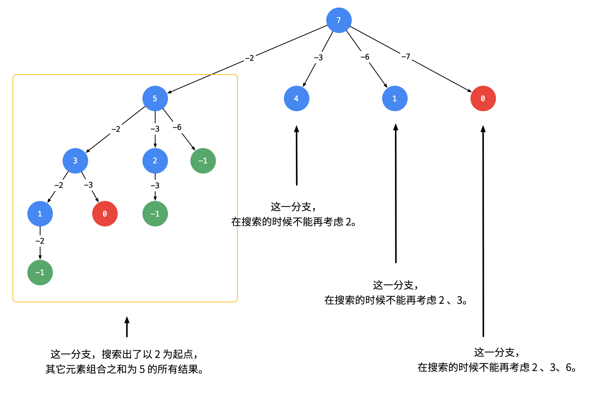

```js
/**
 * @param {number[]} candidates
 * @param {number} target
 * @return {number[][]}
 */
var combinationSum = function(candidates, target) {
    if (candidates.length === 0) return [];
    const res = [];
    const dfs = (target, ans, index) => {
        if(target < 0) return;
        if(target === 0) {
            res.push(ans);
            return;
        }
        for(let i = index; i < candidates.length; i++) {
            dfs(target - candidates[i], [...ans, candidates[i]], i);
        }
    }
    dfs(target, [], 0);
    return res;
};
```

此处的`[...ans, candidates[i]]`为扩展运算符，用于合并两个数组；此处不能把数组名传进去，因为每次都需要开辟新的独立空间，因此直接传入合并后的数组

可以不用 for 循环

```js
/**
 * @param {number[]} candidates
 * @param {number} target
 * @return {number[][]}
 */
var combinationSum = function(candidates, target) {
    const ans = [];
    candidates = candidates.sort((a,b)=>a-b);
    const dfs = (target, combine, idx) => {
        if (idx === candidates.length) {
            return;
        }
        if (target === 0) {
            ans.push(combine);
            return;
        }
        // 直接跳过，让其index++，之后再判断是否选择当前数
        dfs(target, combine, idx + 1);
        // 选择当前数
        if (target - candidates[idx] >= 0) {
            dfs(target - candidates[idx], [...combine, candidates[idx]], idx);
        }
    }
    dfs(target, [], 0);
    return ans;
};
```


## 0042 接雨水

<p>给定 <em>n</em> 个非负整数表示每个宽度为 1 的柱子的高度图，计算按此排列的柱子，下雨之后能接多少雨水。</p>

<p> </p>

<p><strong>示例 1：</strong></p>

<p></p>

<pre>
<strong>输入：</strong>height = [0,1,0,2,1,0,1,3,2,1,2,1]
<strong>输出：</strong>6
<strong>解释：</strong>上面是由数组 [0,1,0,2,1,0,1,3,2,1,2,1] 表示的高度图，在这种情况下，可以接 6 个单位的雨水（蓝色部分表示雨水）。 
</pre>


<p><strong>示例 2：</strong></p>

<pre>
<strong>输入：</strong>height = [4,2,0,3,2,5]
<strong>输出：</strong>9
</pre>


<p> </p>

<p><strong>提示：</strong></p>

<ul>
	<li><code>n == height.length</code></li>
	<li><code>0 <= n <= 3 * 10<sup>4</sup></code></li>
	<li><code>0 <= height[i] <= 10<sup>5</sup></code></li>
</ul>


**解法1：暴力法**

直接按问题描述进行。对于数组中的每个元素，我们找出<strong style="color:#ff0000;">下雨后水能达到的最高位置</strong>，等于两边最大高度的较小值减去当前高度的值

```js
/**
 * @param {number[]} height
 * @return {number}
 */
var trap = function(height) {
    let ans = 0;
    let size = height.length;
    for (let i = 1; i < size - 1; i++) {
        let left_max = 0, right_max = 0;
        for(let j = i; j >= 0; j--) {
            left_max = Math.max(left_max, height[j]);
        }
        for(let j = i; j < size; j++) {
            right_max = Math.max(right_max, height[j]);
        }
        ans += Math.min(left_max, right_max) - height[i];
    }
    return ans;
};
```


**解法2：动态规划**


```js
var trap = function(height) {
    let ans = 0;
    const n = height.length;
    if(n === 0) return 0;

    const leftMax = new Array(n).fill(0);
    leftMax[0] = height[0];
    for(let i = 1; i < n ;i ++) {
        leftMax[i] = Math.max(leftMax[i-1], height[i]);
    }

    const rightMax = new Array(n).fill(0);
    rightMax[n-1] = height[n-1];
    for(let i = n - 2; i >= 0; i--) {
        rightMax[i] = Math.max(rightMax[i + 1], height[i]);
    }

    for (let i = 0; i < n; i++) {
        ans += Math.min(leftMax[i], rightMax[i]) - height[i];
    }
    return ans;
};
```


**解法3：双指针**

动态规划中使用两次遍历才获取左右两边最大高度，能否通过一次遍历就获取呢？思路就是左右向中间靠拢求取各自最大值的同时，取二者中较小的

把动态规划中的空间复杂度降到 O(1) 

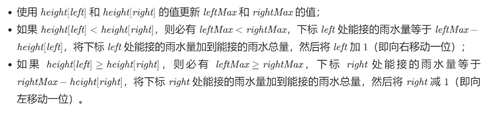

```js
var trap = function(height) {
    let ans = 0;
    let left = 0, right = height.length - 1;
    let leftMax = 0, rightMax = 0;
    while (left < right) {
        leftMax = Math.max(leftMax, height[left]);
        rightMax = Math.max(rightMax, height[right]);
        if (height[left] < height[right]) {
            ans += leftMax - height[left];
            ++left;
        } else {
            ans += rightMax - height[right];
            --right;
        }
    }
    return ans;
};
```


## 0046 全排列


<p>给定一个<strong> 没有重复</strong> 数字的序列，返回其所有可能的全排列。</p>

<p><strong>示例:</strong></p>

<pre><strong>输入:</strong> [1,2,3]
<strong>输出:</strong>
[
  [1,2,3],
  [1,3,2],
  [2,1,3],
  [2,3,1],
  [3,1,2],
  [3,2,1]
]</pre>


**解法：回溯法**

每一个层的节点为当前剩余长度，在每一层使用 for 循环调用 dfs 函数，splice函数删除数组中相应位置的元素，进入下一层后剩余长度-1，直到为0返回

传参的时候注意开辟<strong style="color:red;">新空间</strong>

```js
/**
 * @param {number[]} nums
 * @return {number[][]}
 */
var permute = function(nums) {
    const res = [];
    let length = nums.length;
    const dfs = (left_nums, ans, left_length )=>{
        if(left_length === 0) {res.push(ans); return;}
        for (let i = 0; i < left_length; i++) {
            let left = [...left_nums];
            left.splice(i,1);
            dfs(left, [...ans, [...left_nums][i]], (left_length-1));
        }
    }
    dfs(nums, [], length);
    return res;
};
```

上述算法浪费了太多内存空间，但是没有对每种情况都进行剪枝

下面的算法只开辟了 res 和 used 额外空间，模拟每种可能的情况，并进行剪枝

used用于记录已经使用的元素，及时对 path 进行入栈和出栈操作，节省空间


```js
const permute = (nums) => {
  const res = [];
  const used = {};

  function dfs(path) {
    if (path.length == nums.length) { // 个数选够了
      res.push(path.slice()); // 拷贝一份path，加入解集res
      return;                 // 结束当前递归分支
    }
    for (const num of nums) { // for枚举出每个可选的选项
      // if (path.includes(num)) continue; // 别这么写！查找的时间是O(n)，增加时间复杂度
      if (used[num]) continue; // 使用过的，跳过
      path.push(num);         // 选择当前的数，加入path
      used[num] = true;       // 记录一下 使用了
      dfs(path);              // 基于选了当前的数，递归
      path.pop();             // 上一句的递归结束，回溯，将最后选的数pop出来
      used[num] = false;      // 撤销这个记录
    }
  }

  dfs([]); // 递归的入口，空path传进去
  return res;
};
```


## 0048 旋转图像


<p>给定一个 <em>n </em>× <em>n</em> 的二维矩阵 <code>matrix</code> 表示一个图像。请你将图像顺时针旋转 90 度。</p>

<p>你必须在<strong><a href="https://baike.baidu.com/item/%E5%8E%9F%E5%9C%B0%E7%AE%97%E6%B3%95" target="_blank"> 原地</a></strong> 旋转图像，这意味着你需要直接修改输入的二维矩阵。<strong>请不要 </strong>使用另一个矩阵来旋转图像。</p>

<p> </p>

<p><strong>示例 1：</strong></p>


<pre>
<strong>输入：</strong>matrix = [[1,2,3],[4,5,6],[7,8,9]]
<strong>输出：</strong>[[7,4,1],[8,5,2],[9,6,3]]
</pre>


<p><strong>示例 2：</strong></p>


<pre>
<strong>输入：</strong>matrix = [[5,1,9,11],[2,4,8,10],[13,3,6,7],[15,14,12,16]]
<strong>输出：</strong>[[15,13,2,5],[14,3,4,1],[12,6,8,9],[16,7,10,11]]
</pre>


<p><strong>示例 3：</strong></p>

<pre>
<strong>输入：</strong>matrix = [[1]]
<strong>输出：</strong>[[1]]
</pre>


<p><strong>示例 4：</strong></p>

<pre>
<strong>输入：</strong>matrix = [[1,2],[3,4]]
<strong>输出：</strong>[[3,1],[4,2]]
</pre>


<p> </p>

<p><strong>提示：</strong></p>

<ul>
	<li><code>matrix.length == n</code></li>
	<li><code>matrix[i].length == n</code></li>
	<li><code>1 <= n <= 20</code></li>
	<li><code>-1000 <= matrix[i][j] <= 1000</code></li>
</ul>


**解法1：翻转数组**

先进行水平翻转，再进行主对角线翻转

```js
var rotate = function(matrix) {
    const n = matrix.length;
    for(let i = 0; i < Math.floor(n/2); i++) {
        for(let j = 0; j < n; j++) {
            [matrix[i][j], matrix[n-i-1][j]]=[matrix[n-i-1][j], matrix[i][j]];
        }
    }

    for(let i = 0; i < n; i++) {
        for(let j = 0; j < i; j++) {
            [matrix[i][j], matrix[j][i]] = [matrix[j][i], matrix[i][j]];
        }
    }
};
```

**解法2：从外向内旋转**


```js
var rotate = function(matrix) {
    const length = matrix.length;
    for(let i = 0; i < Math.floor(length/2); i++) {
        for (let j = i; j < length-i-1; j++) {
            let temp = matrix[i][j];
            let m = length - j - 1;
            let n = length - i - 1;
            matrix[i][j] = matrix[m][i];
            matrix[m][i] = matrix[n][m];
            matrix[n][m] = matrix[j][n];
            matrix[j][n] = temp;
        }
    }
};
```

 

## 0049 字母异位词分组

<p>给定一个字符串数组，将字母异位词组合在一起。字母异位词指字母相同，但排列不同的字符串。</p>

<p><strong>示例:</strong></p>

<pre><strong>输入:</strong> <code>[&quot;eat&quot;, &quot;tea&quot;, &quot;tan&quot;, &quot;ate&quot;, &quot;nat&quot;, &quot;bat&quot;]</code>
<strong>输出:</strong>
[
  [&quot;ate&quot;,&quot;eat&quot;,&quot;tea&quot;],
  [&quot;nat&quot;,&quot;tan&quot;],
  [&quot;bat&quot;]
]</pre>


<p><strong>说明：</strong></p>

<ul>
	<li>所有输入均为小写字母。</li>
	<li>不考虑答案输出的顺序。</li>
</ul>


**解法：Hash表 + 排序**

先对获取到的字符串转换成数组，按升序排序，再转换为字符串，存入 Map 中，之后若有修改，再进行 set 操作

```js
/**
 * @param {string[]} strs
 * @return {string[][]}
 */
var groupAnagrams = function(strs) {
    const map = new Map();
    for(let str of strs) {
        const arr = Array.from(str);
        arr.sort();
        let s = arr.toString();
        let list = map.get(s) ? map.get(s) : new Array();
        list.push(str);
        map.set(s, list);
    }
    return Array.from(map.values())
};
```


## 0053 最大字序和

<p>给定一个整数数组 <code>nums</code> ，找到一个具有最大和的连续子数组（子数组最少包含一个元素），返回其最大和。</p>

<p> </p>

<p><strong>示例 1：</strong></p>

<pre>
<strong>输入：</strong>nums = [-2,1,-3,4,-1,2,1,-5,4]
<strong>输出：</strong>6
<strong>解释：</strong>连续子数组 [4,-1,2,1] 的和最大，为 6 。
</pre>


<p><strong>示例 2：</strong></p>

<pre>
<strong>输入：</strong>nums = [1]
<strong>输出：</strong>1
</pre>


<p><strong>示例 3：</strong></p>

<pre>
<strong>输入：</strong>nums = [0]
<strong>输出：</strong>0
</pre>


<p><strong>示例 4：</strong></p>

<pre>
<strong>输入：</strong>nums = [-1]
<strong>输出：</strong>-1
</pre>


<p><strong>示例 5：</strong></p>

<pre>
<strong>输入：</strong>nums = [-100000]
<strong>输出：</strong>-100000
</pre>


<p> </p>

<p><strong>提示：</strong></p>

<ul>
	<li><code>1 <= nums.length <= 3 * 10<sup>4</sup></code></li>
	<li><code>-10<sup>5</sup> <= nums[i] <= 10<sup>5</sup></code></li>
</ul>


<p> </p>

**解法1：贪心算法**

若当前指针所指元素之前的和小于0，则舍弃当前元素之前的数列

```js
var maxSubArray = function(nums) {
    let pre = 0, max = nums[0];
    nums.forEach((current)=>{
        if(pre < 0 ) {
            pre = current;
        }else {
            pre = pre + current;
        }
        max = Math.max(max, pre);
    })
    return max;
};
```


**解法2：动态规划**

若前一个元素大于0，则将其加到当前元素上

动态规划的核心是：为了找到不同子序列之间的递推关系，**以子序列的结束点为基准的**，这点开阔了我们的思路。比如：以 `b` 为结束点的所有子序列: `[a , b]` `[b]` 以 `c` 为结束点的所有子序列: `[a, b, c] [b, c] [ c ]`。

参考题解：https://leetcode-cn.com/problems/maximum-subarray/solution/dong-tai-gui-hua-fen-zhi-fa-python-dai-ma-java-dai/  **详细解析了动态规划的过程以及关键点无后效性**

```js
var maxSubArray = function(nums) {
    const n = nums.length;
    let max = nums[0];
    for(let i = 1; i < n; i++) {
        if(nums[i - 1] > 0) {
            nums[i] += nums[i - 1];
        }
        max = Math.max(max, nums[i]);
    }
    return max;
};
```


## 0055 跳跃游戏

<p>给定一个非负整数数组 <code>nums</code> ，你最初位于数组的 <strong>第一个下标</strong> 。</p>

<p>数组中的每个元素代表你在该位置可以跳跃的最大长度。</p>

<p>判断你是否能够到达最后一个下标。</p>

<p> </p>

<p><strong>示例 1：</strong></p>

<pre>
<strong>输入：</strong>nums = [2,3,1,1,4]
<strong>输出：</strong>true
<strong>解释：</strong>可以先跳 1 步，从下标 0 到达下标 1, 然后再从下标 1 跳 3 步到达最后一个下标。
</pre>


<p><strong>示例 2：</strong></p>

<pre>
<strong>输入：</strong>nums = [3,2,1,0,4]
<strong>输出：</strong>false
<strong>解释：</strong>无论怎样，总会到达下标为 3 的位置。但该下标的最大跳跃长度是 0 ， 所以永远不可能到达最后一个下标。
</pre>


<p> </p>

<p><strong>提示：</strong></p>

<ul>
	<li><code>1 <= nums.length <= 3 * 10<sup>4</sup></code></li>
	<li><code>0 <= nums[i] <= 10<sup>5</sup></code></li>
</ul>


**解法1：贪心算法**

实时维护最远可以到达的位置

```js
var canJump = function(nums) {
    const n = nums.length;
    let rightmost = 0;
    for(let i = 0; i < n; i++) {
        if (i <= rightmost) {
            rightmost = Math.max(rightmost, i + nums[i]);
            if (rightmost >= n - 1) {
                return true;
            }
        }
    }
    return false;
};
```


**解法2：动态规划**

实时更新当前位置最多能走几步

```js
var canJump = function(nums) {
    const n = nums.length;
    if(n === 1) return true;
    for(let i = 0; i < n - 1; i++) {
        if(i >= 1){
            nums[i] = nums[i] >= nums[i-1] - 1 ? nums[i] : nums[i-1] - 1;
        }
        if(nums[i] >= n - 1 - i ) return true;
        if(nums[i] === 0) return false;
    }
    return false;
};
```


## 0056 合并区间

<p>以数组 <code>intervals</code> 表示若干个区间的集合，其中单个区间为 <code>intervals[i] = [start<sub>i</sub>, end<sub>i</sub>]</code> 。请你合并所有重叠的区间，并返回一个不重叠的区间数组，该数组需恰好覆盖输入中的所有区间。</p>

<p> </p>

<p><strong>示例 1：</strong></p>

<pre>
<strong>输入：</strong>intervals = [[1,3],[2,6],[8,10],[15,18]]
<strong>输出：</strong>[[1,6],[8,10],[15,18]]
<strong>解释：</strong>区间 [1,3] 和 [2,6] 重叠, 将它们合并为 [1,6].
</pre>


<p><strong>示例 2：</strong></p>

<pre>
<strong>输入：</strong>intervals = [[1,4],[4,5]]
<strong>输出：</strong>[[1,5]]
<strong>解释：</strong>区间 [1,4] 和 [4,5] 可被视为重叠区间。</pre>


<p> </p>

<p><strong>提示：</strong></p>

<ul>
	<li><code>1 <= intervals.length <= 10<sup>4</sup></code></li>
	<li><code>intervals[i].length == 2</code></li>
	<li><code>0 <= start<sub>i</sub> <= end<sub>i</sub> <= 10<sup>4</sup></code></li>
</ul>


**解法：排序**

利用 sort 函数进行排序，之后判断是否处于同一区间

```js
var merge = function (intervals) {
  let res = [];
  intervals.sort((a, b) => a[0] - b[0]);

  let prev = intervals[0];

  for (let i = 1; i < intervals.length; i++) {
    let cur = intervals[i];
    if (prev[1] >= cur[0]) { // 有重合
      prev[1] = Math.max(cur[1], prev[1]); 
    } else {       // 不重合，prev推入res数组 
      res.push(prev);
      prev = cur;  // 更新 prev
    }
  }

  res.push(prev);
  return res;
};
```


## 0062 不同路径

<p>一个机器人位于一个 <code>m x n</code><em> </em>网格的左上角 （起始点在下图中标记为 “Start” ）。</p>

<p>机器人每次只能向下或者向右移动一步。机器人试图达到网格的右下角（在下图中标记为 “Finish” ）。</p>

<p>问总共有多少条不同的路径？</p>

<p> </p>

<p><strong>示例 1：</strong></p>

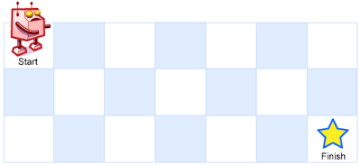

<pre>
<strong>输入：</strong>m = 3, n = 7
<strong>输出：</strong>28</pre>


<p><strong>示例 2：</strong></p>

<pre>
<strong>输入：</strong>m = 3, n = 2
<strong>输出：</strong>3
<strong>解释：</strong>
从左上角开始，总共有 3 条路径可以到达右下角。
1. 向右 -> 向下 -> 向下
2. 向下 -> 向下 -> 向右
3. 向下 -> 向右 -> 向下
</pre>


<p><strong>示例 3：</strong></p>

<pre>
<strong>输入：</strong>m = 7, n = 3
<strong>输出：</strong>28
</pre>


<p><strong>示例 4：</strong></p>

<pre>
<strong>输入：</strong>m = 3, n = 3
<strong>输出：</strong>6</pre>


<p> </p>

<p><strong>提示：</strong></p>

<ul>
	<li><code>1 <= m, n <= 100</code></li>
	<li>题目数据保证答案小于等于 <code>2 * 10<sup>9</sup></code></li>
</ul>


**解法：动态规划**
$$
f(i, j)=f(i-1, j)+f(i, j-1)
$$

```js
var uniquePaths = function(m, n) {
    const dp = new Array(m).fill(0).map(() => new Array(n).fill(0));
    for(let i = 0; i < m; i++) {
        for(let j = 0; j < n; j++) {
            if(i === 0 || j === 0) dp[i][j] = 1;
            else {
                dp[i][j] = dp[i-1][j] + dp[i][j-1];
            }
        }
    }

    return dp[m-1][n-1];
};
```


## 0064 最小路径和

<p>给定一个包含非负整数的 <code><em>m</em> x <em>n</em></code> 网格 <code>grid</code> ，请找出一条从左上角到右下角的路径，使得路径上的数字总和为最小。</p>

<p><strong>说明：</strong>每次只能向下或者向右移动一步。</p>

<p> </p>

<p><strong>示例 1：</strong></p>

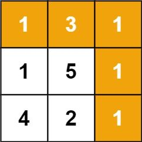

<pre>
<strong>输入：</strong>grid = [[1,3,1],[1,5,1],[4,2,1]]
<strong>输出：</strong>7
<strong>解释：</strong>因为路径 1→3→1→1→1 的总和最小。
</pre>


<p><strong>示例 2：</strong></p>

<pre>
<strong>输入：</strong>grid = [[1,2,3],[4,5,6]]
<strong>输出：</strong>12
</pre>


<p> </p>

<p><strong>提示：</strong></p>

<ul>
	<li><code>m == grid.length</code></li>
	<li><code>n == grid[i].length</code></li>
	<li><code>1 <= m, n <= 200</code></li>
	<li><code>0 <= grid[i][j] <= 100</code></li>
</ul>


**解法：动态规划**

```js
var minPathSum = function(grid) {
    for(let i = 0; i < grid.length; i++) {
        for(let j = 0; j < grid[i].length; j++) {
            if(i === 0 && j === 0) continue;
            else if(i === 0) grid[i][j] += grid[i][j-1];
            else if(j === 0) grid[i][j] += grid[i-1][j];
            else grid[i][j] += Math.min(grid[i-1][j],grid[i][j-1]);
        }
    }
    return grid.pop().pop();
};
```


## 0070 爬楼梯

<p>假设你正在爬楼梯。需要 <em>n</em>&nbsp;阶你才能到达楼顶。</p>

<p>每次你可以爬 1 或 2 个台阶。你有多少种不同的方法可以爬到楼顶呢？</p>

<p><strong>注意：</strong>给定 <em>n</em> 是一个正整数。</p>

<p><strong>示例 1：</strong></p>

<pre><strong>输入：</strong> 2
<strong>输出：</strong> 2
<strong>解释：</strong> 有两种方法可以爬到楼顶。
1.  1 阶 + 1 阶
2.  2 阶</pre>


<p><strong>示例 2：</strong></p>

<pre><strong>输入：</strong> 3
<strong>输出：</strong> 3
<strong>解释：</strong> 有三种方法可以爬到楼顶。
1.  1 阶 + 1 阶 + 1 阶
2.  1 阶 + 2 阶
3.  2 阶 + 1 阶
</pre>


**解法：动态规划**
$$
f(i)=f(i-1)+f(i-2)
$$

```js
var climbStairs = function(n) {
    const dp = new Array(n).fill(0);
    for(let i = 0; i < dp.length; i++) {
        if(i === 0) dp[i] = 1;
        else if(i === 1) dp[i] = 2;
        else {
            dp[i] = dp[i-1] + dp[i-2];
        }
    }
    return dp.pop();
};
```


## 0072 编辑距离

<p>给你两个单词 <code>word1</code> 和 <code>word2</code>，请你计算出将 <code>word1</code> 转换成 <code>word2</code><em> </em>所使用的最少操作数 。</p>

<p>你可以对一个单词进行如下三种操作：</p>

<ul>
	<li>插入一个字符</li>
	<li>删除一个字符</li>
	<li>替换一个字符</li>
</ul>


<p> </p>

<p><strong>示例 1：</strong></p>

<pre>
<strong>输入：</strong>word1 = "horse", word2 = "ros"
<strong>输出：</strong>3
<strong>解释：</strong>
horse -> rorse (将 'h' 替换为 'r')
rorse -> rose (删除 'r')
rose -> ros (删除 'e')
</pre>


<p><strong>示例 2：</strong></p>

<pre>
<strong>输入：</strong>word1 = "intention", word2 = "execution"
<strong>输出：</strong>5
<strong>解释：</strong>
intention -> inention (删除 't')
inention -> enention (将 'i' 替换为 'e')
enention -> exention (将 'n' 替换为 'x')
exention -> exection (将 'n' 替换为 'c')
exection -> execution (插入 'u')
</pre>


<p> </p>

<p><strong>提示：</strong></p>

<ul>
	<li><code>0 <= word1.length, word2.length <= 500</code></li>
	<li><code>word1</code> 和 <code>word2</code> 由小写英文字母组成</li>
</ul>


**解法：动态规划**


```js
var minDistance = function(word1, word2) {
    const m = word1.length;
    const n = word2.length;
    const dp = new Array(m+1).fill(0).map(() => new Array(n+1).fill(0));
    
    for(let i = 0; i <= m; i++) dp[i][0] = i;
    for(let j = 0; j <= n; j++) dp[0][j] = j;

    for(let i = 1; i <= m; i++) {
        for (let j = 1; j <= n; j++) {
            if(word1.charAt(i-1) === word2.charAt(j-1)) dp[i][j] = dp[i-1][j-1];
            else dp[i][j] = Math.min(dp[i-1][j], dp[i][j-1], dp[i-1][j-1]) + 1;
        }
    }
    return dp[m][n];
};
```

动态规划的关键是找到状态转移方程

此题中，可以观察到，对于`word1`我们可以进行三种操作：插入、删除、修改

* **增** `dp[i][j] = dp[i][j - 1] + 1`
* **删** `dp[i][j] = dp[i - 1][j] + 1`
* **改** `dp[i][j] = dp[i - 1][j - 1] + 1`

则状态转移方程可以表示为`dp[i][j] = Math.min(dp[i-1][j], dp[i][j-1], dp[i-1][j-1]) + 1`

有一种特殊情况，`if(word1.charAt(i-1) === word2.charAt(j-1)) dp[i][j] = dp[i-1][j-1]`


## 0075 颜色分类

<p>给定一个包含红色、白色和蓝色，一共 <code>n</code><em> </em>个元素的数组，<strong><a href="https://baike.baidu.com/item/%E5%8E%9F%E5%9C%B0%E7%AE%97%E6%B3%95" target="_blank">原地</a></strong>对它们进行排序，使得相同颜色的元素相邻，并按照红色、白色、蓝色顺序排列。</p>

<p>此题中，我们使用整数 <code>0</code>、 <code>1</code> 和 <code>2</code> 分别表示红色、白色和蓝色。</p>

<ul>
</ul>


<p> </p>

<p><strong>示例 1：</strong></p>

<pre>
<strong>输入：</strong>nums = [2,0,2,1,1,0]
<strong>输出：</strong>[0,0,1,1,2,2]
</pre>


<p><strong>示例 2：</strong></p>

<pre>
<strong>输入：</strong>nums = [2,0,1]
<strong>输出：</strong>[0,1,2]
</pre>


<p><strong>示例 3：</strong></p>

<pre>
<strong>输入：</strong>nums = [0]
<strong>输出：</strong>[0]
</pre>


<p><strong>示例 4：</strong></p>

<pre>
<strong>输入：</strong>nums = [1]
<strong>输出：</strong>[1]
</pre>


<p> </p>

<p><strong>提示：</strong></p>

<ul>
	<li><code>n == nums.length</code></li>
	<li><code>1 <= n <= 300</code></li>
	<li><code>nums[i]</code> 为 <code>0</code>、<code>1</code> 或 <code>2</code></li>
</ul>


<p> </p>

<p><strong>进阶：</strong></p>

<ul>
	<li>你可以不使用代码库中的排序函数来解决这道题吗？</li>
	<li>你能想出一个仅使用常数空间的一趟扫描算法吗？</li>
</ul>


**解法：双指针**

左右指针从左右两端向中间移动，`nums[i]=2` 移到右边`nums[i]=0` 移到左边

```js
var sortColors = function(nums) {
    const n = nums.length;
    let p0 = 0, p2 = n - 1;
    for(let i = 0; i <= p2; i++) {
        while(nums[i] === 2 && i <= p2) {
            [nums[i], nums[p2]] = [nums[p2], nums[i]];
            p2--;
        }
        if(nums[i] === 0) {
            [nums[i], nums[p0]] = [nums[p0], nums[i]];
            p0++;
        }
    } 
};
```


## 0076 最小覆盖子串

<p>给你一个字符串 <code>s</code> 、一个字符串 <code>t</code> 。返回 <code>s</code> 中涵盖 <code>t</code> 所有字符的最小子串。如果 <code>s</code> 中不存在涵盖 <code>t</code> 所有字符的子串，则返回空字符串 <code>""</code> 。</p>

<p><strong>注意：</strong>如果 <code>s</code> 中存在这样的子串，我们保证它是唯一的答案。</p>

<p> </p>

<p><strong>示例 1：</strong></p>

<pre>
<strong>输入：</strong>s = "ADOBECODEBANC", t = "ABC"
<strong>输出：</strong>"BANC"
</pre>


<p><strong>示例 2：</strong></p>

<pre>
<strong>输入：</strong>s = "a", t = "a"
<strong>输出：</strong>"a"
</pre>


<p> </p>

<p><strong>提示：</strong></p>

<ul>
	<li><code>1 <= s.length, t.length <= 10<sup>5</sup></code></li>
	<li><code>s</code> 和 <code>t</code> 由英文字母组成</li>
</ul>


<p> </p>

**解法：滑动窗口**

* 利用双指针维护一个滑动窗口，不断移动右指针
* 判断右指针的字符是否与字典表中的匹配
  * 是：将字典表中的次数 - 1，直到为 0（这里有个技巧：创建一个变量（needType）记录需要匹配的字符数量，初始长度为 Map 的 size,当对应的字符次数为 0 时，就减 1）
  * 否：继续移动右指针
* 当needType的值为 0 时，就证明在当前窗口所有字符都匹配成功了
  *　移动左指针，缩小滑动窗口的大小
  *　移动过程中判断左指针指向的值是否为字典中值，如果是就证明匹配的值少了一个，这是需要更新 Map 中的次数，以及needType的数量
  *　记录每次窗口中的字符，找到最小的返回

```js
var minWindow = function(s, t) {
    let l = 0, r = 0;
    let res = '';
    const map = new Map();

    for(let char of t) {
        map.set(char, map.has(char) ? map.get(char) + 1 : 1);
    }

    let needType = map.size;

    while(r < s.length) {
        const char = s.charAt(r);
        if(map.has(char)) {
            map.set(char, map.get(char) - 1);
            if(map.get(char) === 0) needType -= 1;
        }
        
        while(needType === 0) {
            const c = s[l];
            let current = s.slice(l, r + 1);
            if(!res || current.length < res.length) res = current;
            if(map.has(c)) {
                map.set(c, map.get(c) + 1);
                if(map.get(c) === 1) needType += 1;
            }
            l++;
        }
        r++;
    }

    return res;
};
```


## 0078 子集


<p>给你一个整数数组 <code>nums</code> ，数组中的元素 <strong>互不相同</strong> 。返回该数组所有可能的子集（幂集）。</p>

<p>解集 <strong>不能</strong> 包含重复的子集。你可以按 <strong>任意顺序</strong> 返回解集。</p>

<p> </p>

<p><strong>示例 1：</strong></p>

<pre>
<strong>输入：</strong>nums = [1,2,3]
<strong>输出：</strong>[[],[1],[2],[1,2],[3],[1,3],[2,3],[1,2,3]]
</pre>


<p><strong>示例 2：</strong></p>

<pre>
<strong>输入：</strong>nums = [0]
<strong>输出：</strong>[[],[0]]
</pre>


<p> </p>

<p><strong>提示：</strong></p>

<ul>
	<li><code>1 <= nums.length <= 10</code></li>
	<li><code>-10 <= nums[i] <= 10</code></li>
	<li><code>nums</code> 中的所有元素 <strong>互不相同</strong></li>
</ul>


**解法：回溯法**

```js
var subsets = function(nums) {
    const res = [[]];
    const n = nums.length
    const dfs = (idx, current) => {
        for(let i = idx; i < n; i++) {
            const c = [...current, nums[i]]
            res.push(c);
            if(i === n - 1) return;
            else dfs(i+1, c);
        }
    }
    dfs(0,[]);
    return res;
};
```


## 0079 单词搜索

<p>给定一个 <code>m x n</code> 二维字符网格 <code>board</code> 和一个字符串单词 <code>word</code> 。如果 <code>word</code> 存在于网格中，返回 <code>true</code> ；否则，返回 <code>false</code> 。</p>

<p>单词必须按照字母顺序，通过相邻的单元格内的字母构成，其中“相邻”单元格是那些水平相邻或垂直相邻的单元格。同一个单元格内的字母不允许被重复使用。</p>

<p> </p>

<p><strong>示例 1：</strong></p>

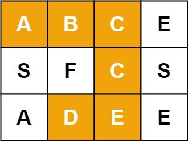

<pre>
<strong>输入：</strong>board = [["A","B","C","E"],["S","F","C","S"],["A","D","E","E"]], word = "ABCCED"
<strong>输出：</strong>true
</pre>


<p><strong>示例 2：</strong></p>

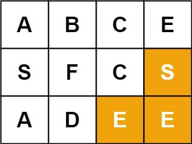

<pre>
<strong>输入：</strong>board = [["A","B","C","E"],["S","F","C","S"],["A","D","E","E"]], word = "SEE"
<strong>输出：</strong>true
</pre>


<p><strong>示例 3：</strong></p>

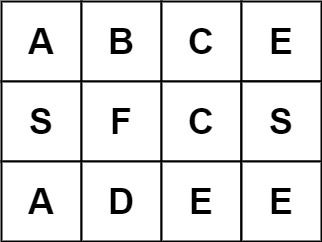

<pre>
<strong>输入：</strong>board = [["A","B","C","E"],["S","F","C","S"],["A","D","E","E"]], word = "ABCB"
<strong>输出：</strong>false
</pre>


<p> </p>

<p><strong>提示：</strong></p>

<ul>
	<li><code>m == board.length</code></li>
	<li><code>n = board[i].length</code></li>
	<li><code>1 <= m, n <= 6</code></li>
	<li><code>1 <= word.length <= 15</code></li>
	<li><code>board</code> 和 <code>word</code> 仅由大小写英文字母组成</li>
</ul>


<p> </p>

<p><strong>进阶：</strong>你可以使用搜索剪枝的技术来优化解决方案，使其在 <code>board</code> 更大的情况下可以更快解决问题？</p>


**解法：回溯法**

深度优先搜索

* 首先对 board 进行遍历，如果首字母相同，则开始 dfs
* 创建一个数组 status 用于记录当前位置的元素是否被遍历过，若未处理过，则本次分支置为true，<strong style="color:red;">注意：在每次dfs结束后要将status置为false，因为是深度优先搜索</strong>
* 对于每一次dfs，先判断当前元素是否被遍历过，之后判断当前元素是否相同
  * 若达到word结尾，则将flag置为true
  * 否则，向上下左右四个方向进行搜索

```js
var exist = function(board, word) {
    const status = new Array(board.length).fill(false).map(() => new Array(board[0].length).fill(false));
    const directions = [[0,-1], [0, 1], [-1, 0], [1, 0]];
    let flag = false;

    const dfs = (x, y, current) => {
        if(status[x][y] === true) return;
        status[x][y] = true;
        if(word.charAt(current) === board[x][y]) {
            if(current === word.length - 1) {
                flag = true;
                return;
            }else {
                for(let direct of directions) {
                    if(x + direct[0] >= 0 && y + direct[1] >= 0 && x + direct[0] < board.length && y + direct[1] < board[0].length) {
                        dfs(x + direct[0], y + direct[1], current + 1);
                    }
                }
            }
        }
        status[x][y] = false;
        return;
    }

    for(let i = 0; i < board.length; i++) {
        for(let j = 0; j < board[0].length; j++) {
            if(flag === true) break;
            if(board[i][j] === word.charAt(0)) dfs(i, j, 0);
        }
    }

    return flag;
};
```


## 0084 柱状图中最大的矩形

<p>给定 <em>n</em> 个非负整数，用来表示柱状图中各个柱子的高度。每个柱子彼此相邻，且宽度为 1 。</p>

<p>求在该柱状图中，能够勾勒出来的矩形的最大面积。</p>

<p>&nbsp;</p>

<p></p>

<p><small>以上是柱状图的示例，其中每个柱子的宽度为 1，给定的高度为&nbsp;<code>[2,1,5,6,2,3]</code>。</small></p>

<p>&nbsp;</p>

<p></p>

<p><small>图中阴影部分为所能勾勒出的最大矩形面积，其面积为&nbsp;<code>10</code>&nbsp;个单位。</small></p>

<p>&nbsp;</p>

<p><strong>示例:</strong></p>

<pre><strong>输入:</strong> [2,1,5,6,2,3]
<strong>输出:</strong> 10</pre>


**解法：单调栈**

1. 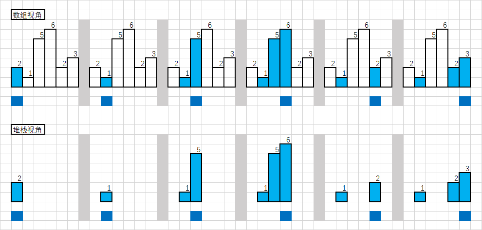

2. 对于一个高度，如果能得到向左和向右的边界，那么就能对每个高度求一次面积
3. 遍历所有高度，即可得出最大面积
4. 使用单调栈，在出栈操作时得到前后边界并计算面积

```js
var largestRectangleArea = function(heights) {
    heights.unshift(0);
    heights.push(0);
    const n = heights.length;
    const stack = [];
    let res = 0;

    for(let i = 0; i < n; i++) {
        while(stack.length > 0 && heights[i] < heights[stack[stack.length - 1]]) {
            let current = stack[stack.length - 1];
            stack.pop();
            let left = stack[stack.length - 1] + 1;
            let right = i - 1;
            res = Math.max(res, heights[current] * (right - left + 1));
        };
        stack.push(i);
    }

    return res;
};
```


## 0085 最大矩形

<p>给定一个仅包含 <code>0</code> 和 <code>1</code> 、大小为 <code>rows x cols</code> 的二维二进制矩阵，找出只包含 <code>1</code> 的最大矩形，并返回其面积。</p>

<p> </p>

<p><strong>示例 1：</strong></p>

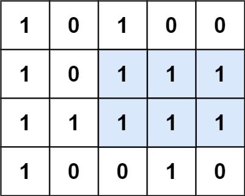

<pre>
<strong>输入：</strong>matrix = [["1","0","1","0","0"],["1","0","1","1","1"],["1","1","1","1","1"],["1","0","0","1","0"]]
<strong>输出：</strong>6
<strong>解释：</strong>最大矩形如上图所示。
</pre>


<p><strong>示例 2：</strong></p>

<pre>
<strong>输入：</strong>matrix = []
<strong>输出：</strong>0
</pre>


<p><strong>示例 3：</strong></p>

<pre>
<strong>输入：</strong>matrix = [["0"]]
<strong>输出：</strong>0
</pre>


<p><strong>示例 4：</strong></p>

<pre>
<strong>输入：</strong>matrix = [["1"]]
<strong>输出：</strong>1
</pre>


<p><strong>示例 5：</strong></p>

<pre>
<strong>输入：</strong>matrix = [["0","0"]]
<strong>输出：</strong>0
</pre>


<p> </p>

<p><strong>提示：</strong></p>

<ul>
	<li><code>rows == matrix.length</code></li>
	<li><code>cols == matrix[0].length</code></li>
	<li><code>0 <= row, cols <= 200</code></li>
	<li><code>matrix[i][j]</code> 为 <code>'0'</code> 或 <code>'1'</code></li>
</ul>


**解法1：暴力解**

* 先求出第i行每个元素最大连通宽度
* 遍历每个元素，k = i 后 k 逐渐递减，向上寻找，求面积乘积

```js
var maximalRectangle = function(matrix) {
    const m = matrix.length;
    if (m === 0) {
        return 0;
    }
    const n = matrix[0].length;
    const left = new Array(m).fill(0).map(() => new Array(n).fill(0));

    for (let i = 0; i < m; i++) {
        for (let j = 0; j < n; j++) {
            if (matrix[i][j] === '1') {
                left[i][j] = (j === 0 ? 0 : left[i][j - 1]) + 1;
            }
        }
    }

    let ret = 0;
    for (let i = 0; i < m; i++) {
        for (let j = 0; j < n; j++) {
            if (matrix[i][j] === '0') {
                continue;
            }
            let width = left[i][j];
            let area = width;
            for (let k = i - 1; k >= 0; k--) {
                width = Math.min(width, left[k][j]);
                area = Math.max(area, (i - k + 1) * width);
            }
            ret = Math.max(ret, area);
        }
    }
    return ret;
};
```

**解法2：单调栈**

本题和上一题有很大的相似之处，求出每一行的heights，传给上一题的函数即可


```js
    var maximalRectangle = function (matrix) {
      if (matrix.length === 0) return 0;
      let res = 0;
      const height = new Array(matrix[0].length).fill(0);
      for (let i = 0; i < matrix.length; i++) {
        for (let j = 0; j < matrix[0].length; j++) {
          if (matrix[i][j] === '1') {
            height[j] += 1;
          } else {
            height[j] = 0;
          }
        }
        res = Math.max(res, largestRectangleArea(height))
      }
      return res;
    };

    var largestRectangleArea = function (heights) {
      heights.unshift(0);
      heights.push(0);
      const n = heights.length;
      const stack = [];
      let res = 0;

      for (let i = 0; i < n; i++) {
        while (stack.length > 0 && heights[i] < heights[stack[stack.length - 1]]) {
          let current = stack[stack.length - 1];
          stack.pop();
          let left = stack[stack.length - 1] + 1;
          let right = i - 1;
          res = Math.max(res, heights[current] * (right - left + 1));
        };
        stack.push(i);
      }
      heights.shift();
      heights.pop();
      return res;
    };
```


## 0094 二叉树的中序遍历

<p>给定一个二叉树的根节点 <code>root</code> ，返回它的 <strong>中序</strong> 遍历。</p>

<p> </p>

<p><strong>示例 1：</strong></p>

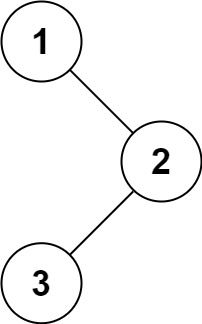

<pre>
<strong>输入：</strong>root = [1,null,2,3]
<strong>输出：</strong>[1,3,2]
</pre>


<p><strong>示例 2：</strong></p>

<pre>
<strong>输入：</strong>root = []
<strong>输出：</strong>[]
</pre>


<p><strong>示例 3：</strong></p>

<pre>
<strong>输入：</strong>root = [1]
<strong>输出：</strong>[1]
</pre>


<p><strong>示例 4：</strong></p>

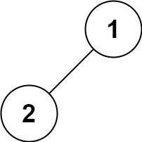

<pre>
<strong>输入：</strong>root = [1,2]
<strong>输出：</strong>[2,1]
</pre>


<p><strong>示例 5：</strong></p>

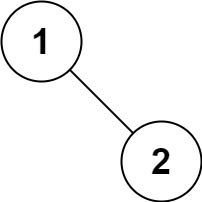

<pre>
<strong>输入：</strong>root = [1,null,2]
<strong>输出：</strong>[1,2]
</pre>


<p> </p>

<p><strong>提示：</strong></p>

<ul>
	<li>树中节点数目在范围 <code>[0, 100]</code> 内</li>
	<li><code>-100 <= Node.val <= 100</code></li>
</ul>


<p> </p>

<p><strong>进阶:</strong> 递归算法很简单，你可以通过迭代算法完成吗？</p>


**解法1：递归**

中序遍历即首先遍历左子树，然后访问当前节点，最后遍历右子树

```js
var inorderTraversal = function(root) {
    if(root) {
        const res = []
        function inorder(node) {
            if(node.left) {
                inorder(node.left)
            }
            res.push(node.val)
            if(node.right) {
                inorder(node.right)
            }
        }
        inorder(root)
        return res
    }else return []
};
```

**解法2：迭代**

```js
var inorderTraversal = function(root) {
    const res = [];
    const stk = [];
    while (root || stk.length) {
        while (root) {
            stk.push(root);
            root = root.left;
        }
        root = stk.pop();
        res.push(root.val);
        root = root.right;
    }
    return res;
};
```

**解法3：Morris 中序遍历**

Morris 遍历算法是另一种遍历二叉树的方法，它能将非递归的中序遍历空间复杂度降为 O(1)。

Morris 遍历算法整体步骤如下（假设当前遍历到的节点为 x）：

* 如果 x 无左孩子，先将 x 的值加入答案数组，再访问 x 的右孩子，即 x=x.right
* 如果 x 有左孩子，则找到 x 左子树上最右的节点（即左子树中序遍历的最后一个节点，xx 在中序遍历中的前驱节点），我们记为 predecessor。根据 predecessor 的右孩子是否为空，进行如下操作
  * 如果 predecessor 的右孩子为空，则将其右孩子指向 x，然后访问 x 的左孩子，即 x=x.left
  * 如果 predecessor 的右孩子不为空，则此时其右孩子指向 x，说明我们已经遍历完 xx 的左子树，我们将 predecessor 的右孩子置空，将 xx 的值加入答案数组，然后访问 x 的右孩子，即 x=x.right

* 重复上述操作，直至访问完整棵树

```js
var inorderTraversal = function(root) {
    const res = [];
    let predecessor = null;

    while (root) {
        if (root.left) {
            // predecessor 节点就是当前 root 节点向左走一步，然后一直向右走至无法走为止
            predecessor = root.left;
            while (predecessor.right && predecessor.right !== root) {
                predecessor = predecessor.right;
            }

            // 让 predecessor 的右指针指向 root，继续遍历左子树
            if (!predecessor.right) {
                predecessor.right = root;
                root = root.left;
            }
            // 说明左子树已经访问完了，我们需要断开链接
            else {
                res.push(root.val);
                predecessor.right = null;
                root = root.right;
            }
        }
        // 如果没有左孩子，则直接访问右孩子
        else {
            res.push(root.val);
            root = root.right;
        }
    }

    return res;
};
```


## 0096 不同的二叉搜索树

<p>给定一个整数 <em>n</em>，求以&nbsp;1 ...&nbsp;<em>n</em>&nbsp;为节点组成的二叉搜索树有多少种？</p>

<p><strong>示例:</strong></p>

<pre><strong>输入:</strong> 3
<strong>输出:</strong> 5
<strong>解释:
</strong>给定 <em>n</em> = 3, 一共有 5 种不同结构的二叉搜索树:


**解法：动态规划**

题目要求是计算不同二叉搜索树的个数。为此，我们可以定义两个函数：

* G(n): 长度为 n 的序列能构成的不同二叉搜索树的个数。
* F(i,n): 以 i 为根、序列长度为 n 的不同二叉搜索树个数 (1 ≤ i ≤ n)。

可见，G(n) 是我们求解需要的函数

$$
G ( n ) = \sum _ { i = 1 } ^ { n } F ( i , n )
$$

举例而言，创建以 33 为根、长度为 77 的不同二叉搜索树，整个序列是[1,2,3,4,5,6,7]，我们需要从左子序列[1,2]构建左子树，从右子序列[4,5,6,7]构建右子树，然后将它们组合（即**笛卡尔积**）。

对于这个例子，不同二叉搜索树的个数为 F(3, 7)。我们将[1,2]构建不同左子树的数量表示为 G(2), 从[4,5,6,7]构建不同右子树的数量表示为 G(4)，注意到 G(n) 和序列的内容无关，**只和序列的长度有关**。于是，F(3,7)=G(2)⋅G(4)。 因此，我们可以得到以下公式：

$$
G ( n ) = \sum _ { i = 1 } ^ { n } G ( i - 1 ) \cdot G ( n - i )
$$

```JS
/**
 * @param {number} n
 * @return {number}
 */
var numTrees = function(n) {
    const G = new Array(n + 1).fill(0);
    G[0] = 1;
    G[1] = 1;

    for (let i = 2; i <= n; ++i) {
        for (let j = 1; j <= i; ++j) {
            G[i] += G[j - 1] * G[i - j];
        }
    }
    return G[n];
};
```


## 0098 验证二叉搜索树

<p>给定一个二叉树，判断其是否是一个有效的二叉搜索树。</p>

<p>假设一个二叉搜索树具有如下特征：</p>

<ul>
	<li>节点的左子树只包含<strong>小于</strong>当前节点的数。</li>
	<li>节点的右子树只包含<strong>大于</strong>当前节点的数。</li>
	<li>所有左子树和右子树自身必须也是二叉搜索树。</li>
</ul>


<p><strong>示例&nbsp;1:</strong></p>

<pre><strong>输入:</strong>
    2
   / \
  1   3
<strong>输出:</strong> true
</pre>


<p><strong>示例&nbsp;2:</strong></p>

<pre><strong>输入:
</strong>    5
   / \
  1   4
&nbsp;    / \
&nbsp;   3   6
<strong>输出:</strong> false
<strong>解释:</strong> 输入为: [5,1,4,null,null,3,6]。
&nbsp;    根节点的值为 5 ，但是其右子节点值为 4 。
</pre>


**解法1：递归**

如果该二叉树的左子树不为空，则左子树上所有节点的值均小于它的根节点的值； 若它的右子树不空，则右子树上所有节点的值均大于它的根节点的值；它的左右子树也为二叉搜索树。

因此设计一个helper函数，传入root，上限，下限，左右子树都为二叉搜索树时，返回true

```js
/**
 * Definition for a binary tree node.
 * function TreeNode(val, left, right) {
 *     this.val = (val===undefined ? 0 : val)
 *     this.left = (left===undefined ? null : left)
 *     this.right = (right===undefined ? null : right)
 * }
 */
/**
 * @param {TreeNode} root
 * @return {boolean}
 */
var isValidBST = function(root) {
    const helper = (root, lower, upper) => {
        if(root === null) {
            return true;
        }
        if(root.val <= lower || root.val >= upper) {
            return false;
        }
        return helper(root.left, lower, root.val) && helper(root.right, root.val, upper);
    }
    return helper(root, -Infinity, Infinity);
};
```


**解法2：中序遍历**

二叉搜索树「中序遍历」得到的值构成的序列一定是升序的，这启示我们在中序遍历的时候实时检查当前节点的值是否大于前一个中序遍历到的节点的值即可。如果均大于说明这个序列是升序的，整棵树是二叉搜索树，否则不是

```js
var isValidBST = function(root) {
    let stk = [];
    let inorder = -Infinity;
    while(stk.length || root) {
        while(root) {
            stk.push(root); 
            root = root.left;
        }
        root = stk.pop();
        if(root.val <= inorder) return false;
        inorder = root.val;
        root = root.right;
    }
    return true;
};
```


## 0101 对称二叉树


<p>给定一个二叉树，检查它是否是镜像对称的。</p>

<p>&nbsp;</p>

<p>例如，二叉树&nbsp;<code>[1,2,2,3,4,4,3]</code> 是对称的。</p>

<pre>    1
   / \
  2   2
 / \ / \
3  4 4  3
</pre>


<p>&nbsp;</p>

<p>但是下面这个&nbsp;<code>[1,2,2,null,3,null,3]</code> 则不是镜像对称的:</p>

<pre>    1
   / \
  2   2
   \   \
   3    3
</pre>


<p>&nbsp;</p>

<p><strong>进阶：</strong></p>

<p>你可以运用递归和迭代两种方法解决这个问题吗？</p>


**解法1：递归**

如果同时满足下面的条件，两个树互为镜像：

- 它们的两个根结点具有相同的值
- 每个树的右子树都与另一个树的左子树镜像对称

用两个指针p和q， p 右移时，q 左移，p 左移时，q右移。每次检查当前 p 和 q节点的值是否相等，如果相等再判断左右子树是否对称

在return的时候注意用与连接，达到同时判断的目的

```js
var isSymmetric = function(root) {
    const check = (p,q) => {
        if(!p && !q) return true
        if(!p || !q) return false
        return p.val === q.val && check(p.left, q.right) && check(p.right, q.left)
    }
    return check(root, root)
};
```


**解法2：迭代**

递归转迭代通常使用一个队列来维护

通过一个队列进行维护，首先把root的左右子树放进去

当队列长度大于0时，将头部两个取出进行比较，之后再按顺序将左子树的左子树，右子树的右子树，左子树的右子树，右子树的左子树放进队列，进行比较

```js
var isSymmetric = function(root) {
    if(root === null || (root.left === null && root.right === null)) return true
    const q = []
    let left = new TreeNode(), right = new TreeNode()
    q.push(root.left)
    q.push(root.right)
    while(q.length > 0) {
        left = q.shift();
        right = q.shift();
        if(left === null && right === null) continue
        if(left === null || right === null) return false
        if(left.val !== right.val) return false
        q.push(left.left)
        q.push(right.right)
        q.push(left.right)
        q.push(right.left)
    }
    return true
};
```


## 0102 二叉树的层序遍历


<p>给你一个二叉树，请你返回其按 <strong>层序遍历</strong> 得到的节点值。 （即逐层地，从左到右访问所有节点）。</p>

<p> </p>

<p><strong>示例：</strong><br />
二叉树：<code>[3,9,20,null,null,15,7]</code>,</p>


<pre>
    3
   / \
  9  20
    /  \
   15   7
</pre>


<p>返回其层序遍历结果：</p>

<pre>
[
  [3],
  [9,20],
  [15,7]
]
</pre>


**解法：广度优先搜索 + 循环不变式**

我们可以用一种巧妙的方法修改广度优先搜索：

* 首先根元素入队
* 当队列不为空的时候
  * 求当前队列的长度length
  * 依次从队列中取length个元素进行拓展，然后进入下一次迭代

它和普通广度优先搜索的区别在于，普通广度优先搜索每次只取一个元素拓展，而这里每次取length个元素。在上述过程中的第 i 次迭代就得到了二叉树的第 i层的length个元素

```js
var levelOrder = function(root) {
    const res = []
    if(!root) return res
    const q = []
    q.push(root)
    while(q.length > 0) {
        const currentLevelSize = q.length
        res.push([])
        for(let i = 1; i <= currentLevelSize; i++) {
            const node = q.shift()
            res[res.length - 1].push(node.val)
            if(node.left) q.push(node.left)
            if(node.right) q.push(node.right)
        }
    }
    return res
};
```


## 0104 二叉树的最大深度

<p>给定一个二叉树，找出其最大深度。</p>

<p>二叉树的深度为根节点到最远叶子节点的最长路径上的节点数。</p>

<p><strong>说明:</strong>&nbsp;叶子节点是指没有子节点的节点。</p>

<p><strong>示例：</strong><br>
给定二叉树 <code>[3,9,20,null,null,15,7]</code>，</p>


<pre>    3
   / \
  9  20
    /  \
   15   7</pre>


<p>返回它的最大深度&nbsp;3 。</p>


<p>给定一个二叉树，找出其最大深度。</p>

<p>二叉树的深度为根节点到最远叶子节点的最长路径上的节点数。</p>

<p><strong>说明:</strong>&nbsp;叶子节点是指没有子节点的节点。</p>

<p><strong>示例：</strong><br>
给定二叉树 <code>[3,9,20,null,null,15,7]</code>，</p>


<pre>    3
   / \
  9  20
    /  \
   15   7</pre>


<p>返回它的最大深度&nbsp;3 。</p>


**解法1：深度优先搜索**

```js
var maxDepth = function(root) {
    let res = 0
    if(!root) return res
    const isDeepest = (current, depth) => {
        if(current.left) isDeepest(current.left, depth + 1)
        if (current.right) isDeepest(current.right, depth + 1)
        res = Math.max(res, depth)
        return
    }
    isDeepest(root, 1)
    return res
};
```

```js
var maxDepth = function(root) {
    if(!root) return 0;
    let leftD = 1 + maxDepth(root.left)
    let rightD = 1 + maxDepth(root.right)
    return Math.max(leftD, rightD) 
};
```

**解法2：广度优先搜索**

```js
var maxDepth = function(root) {
    let res = 0
    if(!root) return res
    const q = []
    q.push(root)
    while(q.length > 0) {
        let length = q.length
        while(length > 0) {
            let node = q.shift()
            if(node.left) q.push(node.left)
            if(node.right) q.push(node.right)
            length--
        }
        res++
    }
    return res
};
```


## 0105 从前序与中序遍历序列构造二叉树

给定一棵树的前序遍历 `preorder` 与中序遍历 `inorder`。请构造二叉树并返回其根节点。

示例 1:


```
Input: preorder = [3,9,20,15,7], inorder = [9,3,15,20,7]
Output: [3,9,20,null,null,15,7]
```

示例 2:

```
Input: preorder = [-1], inorder = [-1]
Output: [-1]
```


提示:

* `1 <= preorder.length <= 3000`
* `inorder.length == preorder.length`
* `-3000 <= preorder[i], inorder[i] <= 3000`
* `preorder 和 inorder 均无重复元素`
* `inorder 均出现在 preorder`
* `preorder 保证为二叉树的前序遍历序列`
* `inorder 保证为二叉树的中序遍历序列`


**解法：递归**

对于任意一颗树而言，前序遍历的形式总是

```
[ 根节点, [左子树的前序遍历结果], [右子树的前序遍历结果] ]
```

即根节点总是前序遍历中的第一个节点。而中序遍历的形式总是

```
[ [左子树的中序遍历结果], 根节点, [右子树的中序遍历结果] ]
```

只要我们在中序遍历中**定位**到根节点，那么我们就可以分别知道左子树和右子树中的节点数目。由于同一颗子树的前序遍历和中序遍历的长度显然是相同的，因此我们就可以对应到前序遍历的结果中，对上述形式中的所有**左右括号**进行定位。

这样以来，我们就知道了左子树的前序遍历和中序遍历结果，以及右子树的前序遍历和中序遍历结果，我们就可以递归地对构造出左子树和右子树，再将这两颗子树接到根节点的左右位置。

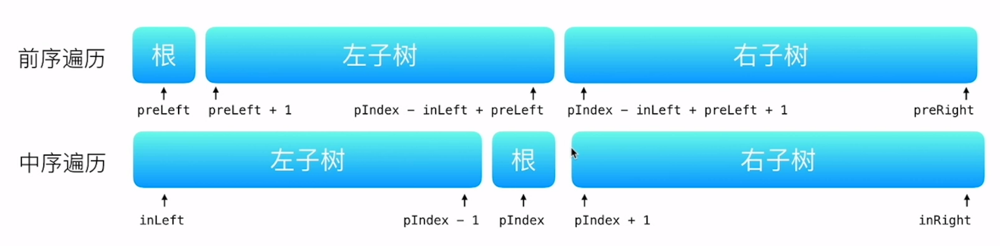

```js
/**
 * Definition for a binary tree node.
 * function TreeNode(val, left, right) {
 *     this.val = (val===undefined ? 0 : val)
 *     this.left = (left===undefined ? null : left)
 *     this.right = (right===undefined ? null : right)
 * }
 */
/**
 * @param {number[]} preorder
 * @param {number[]} inorder
 * @return {TreeNode}
 */
var buildTree = function(preorder, inorder) {
    const idxMap = new Map()
    const n = inorder.length
    for(let i = 0; i < n; i++) {
        idxMap.set(inorder[i],i)
    }

    const myBuildTree = (preLeft, preRight, inLeft, inRight) => {
        if(preLeft > preRight) return null
        const pIndex = idxMap.get(preorder[preLeft])
        const root = new TreeNode(preorder[preLeft])
        root.left = myBuildTree(preLeft+1, pIndex-inLeft+preLeft, inLeft, pIndex-1)
        root.right = myBuildTree(pIndex-inLeft+preLeft+1, preRight, pIndex+1, inRight)
        return root
    }
    return myBuildTree(0, n-1, 0, n-1)
};
```


## 0114 二叉树展开为链表


<p>给你二叉树的根结点 <code>root</code> ，请你将它展开为一个单链表：</p>

<ul>
	<li>展开后的单链表应该同样使用 <code>TreeNode</code> ，其中 <code>right</code> 子指针指向链表中下一个结点，而左子指针始终为 <code>null</code> 。</li>
	<li>展开后的单链表应该与二叉树 <a href="https://baike.baidu.com/item/%E5%85%88%E5%BA%8F%E9%81%8D%E5%8E%86/6442839?fr=aladdin" target="_blank"><strong>先序遍历</strong></a> 顺序相同。</li>
</ul>


<p> </p>

<p><strong>示例 1：</strong></p>


<pre>
<strong>输入：</strong>root = [1,2,5,3,4,null,6]
<strong>输出：</strong>[1,null,2,null,3,null,4,null,5,null,6]
</pre>


<p><strong>示例 2：</strong></p>

<pre>
<strong>输入：</strong>root = []
<strong>输出：</strong>[]
</pre>


<p><strong>示例 3：</strong></p>

<pre>
<strong>输入：</strong>root = [0]
<strong>输出：</strong>[0]
</pre>


<p> </p>

<p><strong>提示：</strong></p>

<ul>
	<li>树中结点数在范围 <code>[0, 2000]</code> 内</li>
	<li><code>-100 <= Node.val <= 100</code></li>
</ul>


<p> </p>

<p><strong>进阶：</strong>你可以使用原地算法（<code>O(1)</code> 额外空间）展开这棵树吗？</p>


**解法1：前序遍历**

通过前序遍历，把每个节点按照前序遍历的顺序存到一个list中，最后再将其连接起来

```js
/**
 * Definition for a binary tree node.
 * function TreeNode(val, left, right) {
 *     this.val = (val===undefined ? 0 : val)
 *     this.left = (left===undefined ? null : left)
 *     this.right = (right===undefined ? null : right)
 * }
 */
/**
 * @param {TreeNode} root
 * @return {void} Do not return anything, modify root in-place instead.
 */
var flatten = function(root) {
    const list = [];
    preorderTraversal(root, list);
    const size = list.length;
    for (let i = 1; i < size; i++) {
        const prev = list[i - 1], curr = list[i];
        prev.left = null;
        prev.right = curr;
    }
};

const preorderTraversal = (root, list) => {
    if (root != null) {
        list.push(root);
        preorderTraversal(root.left, list);
        preorderTraversal(root.right, list);
    }
}
```


**解法2：前序遍历和展开同时进行**

使用方法一的前序遍历，由于将节点展开之后会破坏二叉树的结构而丢失子节点的信息，因此前序遍历和展开为单链表分成了两步。能不能在不丢失子节点的信息的情况下，将前序遍历和展开为单链表同时进行？

之所以会在破坏二叉树的结构之后丢失子节点的信息，是因为在对左子树进行遍历时，没有存储右子节点的信息，在遍历完左子树之后才获得右子节点的信息。只要对前序遍历进行修改，在遍历左子树之前就获得左右子节点的信息，并存入栈内，子节点的信息就不会丢失，就可以将前序遍历和展开为单链表同时进行。

该做法不适用于递归实现的前序遍历，只适用于迭代实现的前序遍历。修改后的前序遍历的具体做法是，每次从栈内弹出一个节点作为当前访问的节点，获得该节点的子节点，如果子节点不为空，则依次将右子节点和左子节点压入栈内（注意入栈顺序）。

展开为单链表的做法是，维护上一个访问的节点 prev，每次访问一个节点时，令当前访问的节点为 curr，将 prev 的左子节点设为 null 以及将 prev 的右子节点设为 curr，然后将 curr 赋值给 prev，进入下一个节点的访问，直到遍历结束。需要注意的是，初始时 prev 为 null，只有在 prev 不为 null 时才能对 prev 的左右子节点进行更新。

```js
var flatten = function(root) {
    if(root === null) return
    const stack = []
    stack.push(root)
    let prev = null
    while(stack.length) {
        const current = stack.pop()
        if(prev !== null) {
            prev.left = null
            prev.right = current
        }
        if(current.right !== null) stack.push(current.right)
        if(current.left !== null) stack.push(current.left)
        prev = current
    }
};
```


**解法3：寻找前驱节点**

注意到前序遍历访问各节点的顺序是根节点、左子树、右子树。如果一个节点的左子节点为空，则该节点不需要进行展开操作。如果一个节点的左子节点不为空，则该节点的左子树中的最后一个节点被访问之后，该节点的右子节点被访问。该节点的左子树中最后一个被访问的节点是左子树中的最右边的节点，也是该节点的前驱节点。因此，问题转化成寻找当前节点的前驱节点。

具体做法是，对于当前节点，如果其左子节点不为空，则在其左子树中找到最右边的节点，作为前驱节点，将当前节点的右子节点赋给前驱节点的右子节点，然后将当前节点的左子节点赋给当前节点的右子节点，并将当前节点的左子节点设为空。对当前节点处理结束后，继续处理链表中的下一个节点，直到所有节点都处理结束。

```js
var flatten = function(root) {
    let current = root
    while(current !== null) {
        if(current.left !== null) {
            const next = current.left
            let pre = next
            while(pre.right !== null) {
                pre = pre.right
            }
            pre.right = current.right
            current.left = null
            current.right = next
        }
        current = current.right
    }
};
```


## 0121 买卖股票的最佳时机

<p>给定一个数组 <code>prices</code> ，它的第 <code>i</code> 个元素 <code>prices[i]</code> 表示一支给定股票第 <code>i</code> 天的价格。</p>

<p>你只能选择 <strong>某一天</strong> 买入这只股票，并选择在 <strong>未来的某一个不同的日子</strong> 卖出该股票。设计一个算法来计算你所能获取的最大利润。</p>

<p>返回你可以从这笔交易中获取的最大利润。如果你不能获取任何利润，返回 <code>0</code> 。</p>

<p> </p>

<p><strong>示例 1：</strong></p>

<pre>
<strong>输入：</strong>[7,1,5,3,6,4]
<strong>输出：</strong>5
<strong>解释：</strong>在第 2 天（股票价格 = 1）的时候买入，在第 5 天（股票价格 = 6）的时候卖出，最大利润 = 6-1 = 5 。
     注意利润不能是 7-1 = 6, 因为卖出价格需要大于买入价格；同时，你不能在买入前卖出股票。
</pre>


<p><strong>示例 2：</strong></p>

<pre>
<strong>输入：</strong>prices = [7,6,4,3,1]
<strong>输出：</strong>0
<strong>解释：</strong>在这种情况下, 没有交易完成, 所以最大利润为 0。
</pre>


<p> </p>

<p><strong>提示：</strong></p>

<ul>
	<li><code>1 <= prices.length <= 10<sup>5</sup></code></li>
	<li><code>0 <= prices[i] <= 10<sup>4</sup></code></li>
</ul>


**解法：找最小**

```js
var maxProfit = function(prices) {
    let max = 0, min = prices[0]
    for(let i = 0; i < prices.length; i++) {
        if(prices[i] < min) {
            min = prices[i]
            continue
        }
        max = (prices[i] - min) > max ? (prices[i] - min) : max
    } 
    return max
};
```


## 0124 二叉树中的最大路径和

<p><strong>路径</strong> 被定义为一条从树中任意节点出发，沿父节点-子节点连接，达到任意节点的序列。同一个节点在一条路径序列中 <strong>至多出现一次</strong> 。该路径<strong> 至少包含一个 </strong>节点，且不一定经过根节点。</p>

<p><strong>路径和</strong> 是路径中各节点值的总和。</p>

<p>给你一个二叉树的根节点 <code>root</code> ，返回其 <strong>最大路径和</strong> 。</p>

<p> </p>

<p><strong>示例 1：</strong></p>


<pre>
<strong>输入：</strong>root = [1,2,3]
<strong>输出：</strong>6
<strong>解释：</strong>最优路径是 2 -> 1 -> 3 ，路径和为 2 + 1 + 3 = 6</pre>


<p><strong>示例 2：</strong></p>


<pre>
<strong>输入：</strong>root = [-10,9,20,null,null,15,7]
<strong>输出：</strong>42
<strong>解释：</strong>最优路径是 15 -> 20 -> 7 ，路径和为 15 + 20 + 7 = 42
</pre>


<p> </p>

<p><strong>提示：</strong></p>

<ul>
	<li>树中节点数目范围是 <code>[1, 3 * 10<sup>4</sup>]</code></li>
	<li><code>-1000 <= Node.val <= 1000</code></li>
</ul>


**解法：递归**

* 通过递归，分辨判断左右子节点贡献值，如果大于0，则取用，如果小于0，则抛弃
* 注意初始值不能设为0，如果设为零，遇到全是负数的情况则无法判断，所以要设置成**负无穷**

```js
var maxPathSum = function(root) {
    let res = -Infinity
    const maximum = (node) => {
        if(node === null) return 0
        let leftMax = Math.max(maximum(node.left), 0)
        let rightMax = Math.max(maximum(node.right), 0)
        let current = leftMax + rightMax + node.val
        res = Math.max(current, res)
        return node.val + Math.max(leftMax, rightMax)
    }
    maximum(root)
    return res
};
```


## 0128 最长连续序列

<p>给定一个未排序的整数数组 <code>nums</code> ，找出数字连续的最长序列（不要求序列元素在原数组中连续）的长度。</p>

<p> </p>

<p><strong>进阶：</strong>你可以设计并实现时间复杂度为 <code>O(n)</code><em> </em>的解决方案吗？</p>

<p> </p>

<p><strong>示例 1：</strong></p>

<pre>
<strong>输入：</strong>nums = [100,4,200,1,3,2]
<strong>输出：</strong>4
<strong>解释：</strong>最长数字连续序列是 <code>[1, 2, 3, 4]。它的长度为 4。</code></pre>


<p><strong>示例 2：</strong></p>

<pre>
<strong>输入：</strong>nums = [0,3,7,2,5,8,4,6,0,1]
<strong>输出：</strong>9
</pre>


<p> </p>

<p><strong>提示：</strong></p>

<ul>
	<li><code>0 <= nums.length <= 10<sup>4</sup></code></li>
	<li><code>-10<sup>9</sup> <= nums[i] <= 10<sup>9</sup></code></li>
</ul>


**解法：哈希表**

* 创建一个Set，去除重复元素
* 遍历这个哈希表
  * 判断是否存在`num-1`，如果存在则跳过本次，因为从`num-1`开始一定更长
  * 不断匹配`num+1` `num+2` `num+3`等是否存在，寻找最长匹配，更新max

```js
var longestConsecutive = function(nums) {
    let max = 0
    const hash = new Set()
    for(let num of nums) {
        hash.add(num)
    }
    for(let num of hash) {
        let current_max = 1
        if(hash.has(num-1)) continue
        while(hash.has(num+1)) {
            current_max += 1
            num++
        }
        max = Math.max(current_max, max)
    }
    return max
};
```


## 0136 只出现一次的数字

<p>给定一个<strong>非空</strong>整数数组，除了某个元素只出现一次以外，其余每个元素均出现两次。找出那个只出现了一次的元素。</p>

<p><strong>说明：</strong></p>

<p>你的算法应该具有线性时间复杂度。 你可以不使用额外空间来实现吗？</p>

<p><strong>示例 1:</strong></p>

<pre><strong>输入:</strong> [2,2,1]
<strong>输出:</strong> 1
</pre>


<p><strong>示例&nbsp;2:</strong></p>

<pre><strong>输入:</strong> [4,1,2,1,2]
<strong>输出:</strong> 4</pre>


**解法1：遍历**

```js
var singleNumber = function(nums) {
    nums.sort()
    if(nums.length === 1) return nums[0]
    let i = 1
    while(i <= nums.length) {
        if(nums[i] === nums[i-1]) {
            i = i+2
        }else if(nums[i] === nums[i+1]) return nums[i-1]
    }
};
```

**解法2：异或运算符**

异或运算有如下三种性质：

* 任何数和 0 做异或运算，结果仍然是原来的数
* 任何数和其自身做异或运算，结果是 0
* 异或运算满足交换律和结合律

根据第三条性质，数组中全部元素的异或运算结果可以写成：
$$
( a _ { 1 } ⊕ a _ { 1 } ) ⊕ ( a _ { 2 } ⊕ a _ { 2 } ) ⊕ \cdots ⊕ ( a _ { m } \theta a _ { m } ) ⊕ a _ { m + 1 }
$$

```js
var singleNumber = function(nums) {
    return nums.reduce((a,b)=>a^b)
};
```


## 0139 单词拆分

<p>给定一个<strong>非空</strong>字符串 <em>s</em> 和一个包含<strong>非空</strong>单词的列表 <em>wordDict</em>，判定&nbsp;<em>s</em> 是否可以被空格拆分为一个或多个在字典中出现的单词。</p>

<p><strong>说明：</strong></p>

<ul>
	<li>拆分时可以重复使用字典中的单词。</li>
	<li>你可以假设字典中没有重复的单词。</li>
</ul>


<p><strong>示例 1：</strong></p>

<pre><strong>输入:</strong> s = &quot;leetcode&quot;, wordDict = [&quot;leet&quot;, &quot;code&quot;]
<strong>输出:</strong> true
<strong>解释:</strong> 返回 true 因为 &quot;leetcode&quot; 可以被拆分成 &quot;leet code&quot;。
</pre>


<p><strong>示例 2：</strong></p>

<pre><strong>输入:</strong> s = &quot;applepenapple&quot;, wordDict = [&quot;apple&quot;, &quot;pen&quot;]
<strong>输出:</strong> true
<strong>解释:</strong> 返回 true 因为 <code>&quot;</code>applepenapple<code>&quot;</code> 可以被拆分成 <code>&quot;</code>apple pen apple<code>&quot;</code>。
&nbsp;    注意你可以重复使用字典中的单词。
</pre>


<p><strong>示例 3：</strong></p>

<pre><strong>输入:</strong> s = &quot;catsandog&quot;, wordDict = [&quot;cats&quot;, &quot;dog&quot;, &quot;sand&quot;, &quot;and&quot;, &quot;cat&quot;]
<strong>输出:</strong> false
</pre>


**解法：动态规划**

状态转移方程如下：

$$
d p [ i ] = d p [ j ] ＆＆ check( s [ j ... i - 1 ]
$$

注意：

* dp的长度设为n+1是为了预设0位置为分割点
* dp[0]设为true
* <strong style="color:red;">状态转移方程也可以带有类似check的判断条件，不要总局限于dp</strong>


```js
var wordBreak = function(s, wordDict) {
    const n = s.length
    const dp = new Array(n+1).fill(false)
    dp[0] = true
    for(let i = 1; i <= n; i++) {
        for(let j = 0; j < i; j++) {
            if(dp[j] && wordDict.includes(s.substr(j, i - j))) {
                dp[i] = true
                break
            }
        }
    }
    return dp[n]
};
```


## 0141 环形链表

<p>给定一个链表，判断链表中是否有环。</p>

<p>如果链表中有某个节点，可以通过连续跟踪 <code>next</code> 指针再次到达，则链表中存在环。 为了表示给定链表中的环，我们使用整数 <code>pos</code> 来表示链表尾连接到链表中的位置（索引从 0 开始）。 如果 <code>pos</code> 是 <code>-1</code>，则在该链表中没有环。<strong>注意：<code>pos</code> 不作为参数进行传递</strong>，仅仅是为了标识链表的实际情况。</p>

<p>如果链表中存在环，则返回 <code>true</code> 。 否则，返回 <code>false</code> 。</p>

<p>&nbsp;</p>

<p><strong>进阶：</strong></p>

<p>你能用 <em>O(1)</em>（即，常量）内存解决此问题吗？</p>

<p>&nbsp;</p>

<p><strong>示例 1：</strong></p>

<p></p>

<pre><strong>输入：</strong>head = [3,2,0,-4], pos = 1
<strong>输出：</strong>true
<strong>解释：</strong>链表中有一个环，其尾部连接到第二个节点。
</pre>


<p><strong>示例&nbsp;2：</strong></p>

<p></p>

<pre><strong>输入：</strong>head = [1,2], pos = 0
<strong>输出：</strong>true
<strong>解释：</strong>链表中有一个环，其尾部连接到第一个节点。
</pre>


<p><strong>示例 3：</strong></p>

<p></p>

<pre><strong>输入：</strong>head = [1], pos = -1
<strong>输出：</strong>false
<strong>解释：</strong>链表中没有环。
</pre>


<p>&nbsp;</p>

<p><strong>提示：</strong></p>

<ul>
	<li>链表中节点的数目范围是 <code>[0, 10<sup>4</sup>]</code></li>
	<li><code>-10<sup>5</sup> &lt;= Node.val &lt;= 10<sup>5</sup></code></li>
	<li><code>pos</code> 为 <code>-1</code> 或者链表中的一个 <strong>有效索引</strong> 。</li>
</ul>


**解法：快慢指针**

快指针每次走两步，慢指针每次走一步，如果有环，那么二者必然会相遇

```js
var hasCycle = function(head) {
    let slow = fast = head
    while(slow && fast && fast.next) {
        slow = slow.next
        fast = fast.next.next
        if(slow === fast) return true
    }
    return false
};
```


## 0142 环形链表2

<p>给定一个链表，返回链表开始入环的第一个节点。 如果链表无环，则返回 <code>null</code>。</p>

<p>为了表示给定链表中的环，我们使用整数 <code>pos</code> 来表示链表尾连接到链表中的位置（索引从 0 开始）。 如果 <code>pos</code> 是 <code>-1</code>，则在该链表中没有环。<strong>注意，<code>pos</code> 仅仅是用于标识环的情况，并不会作为参数传递到函数中。</strong></p>

<p><strong>说明：</strong>不允许修改给定的链表。</p>

<p><strong>进阶：</strong></p>

<ul>
	<li>你是否可以使用 <code>O(1)</code> 空间解决此题？</li>
</ul>


<p> </p>

<p><strong>示例 1：</strong></p>

<p></p>

<pre>
<strong>输入：</strong>head = [3,2,0,-4], pos = 1
<strong>输出：</strong>返回索引为 1 的链表节点
<strong>解释：</strong>链表中有一个环，其尾部连接到第二个节点。
</pre>


<p><strong>示例 2：</strong></p>

<p></p>

<pre>
<strong>输入：</strong>head = [1,2], pos = 0
<strong>输出：</strong>返回索引为 0 的链表节点
<strong>解释：</strong>链表中有一个环，其尾部连接到第一个节点。
</pre>


<p><strong>示例 3：</strong></p>

<p></p>

<pre>
<strong>输入：</strong>head = [1], pos = -1
<strong>输出：</strong>返回 null
<strong>解释：</strong>链表中没有环。
</pre>


<p> </p>

<p><strong>提示：</strong></p>

<ul>
	<li>链表中节点的数目范围在范围 <code>[0, 10<sup>4</sup>]</code> 内</li>
	<li><code>-10<sup>5</sup> <= Node.val <= 10<sup>5</sup></code></li>
	<li><code>pos</code> 的值为 <code>-1</code> 或者链表中的一个有效索引</li>
</ul>


**解法1：Hash表**

```js
var detectCycle = function(head) {
    const hash = new Map()
    while(head) {
        if(hash.get(head)) return head
        hash.set(head, 1)
        head = head.next
    }
    return null
};
```


**解法2：快慢指针**


如下图所示，设链表中环外部分的长度为 a。slow 指针进入环后，又走了 b 的距离与 fast 相遇。此时，fast 指针已经走完了环的 n 圈，因此它走过的总距离为 a+n(b+c)+b=a+(n+1)b+nc

根据题意，任意时刻，fast 指针走过的距离都为 slow 指针的 2 倍。因此，我们有*a*=*c*+(*n*−1)(*b*+*c*)

因此，当发现 slow 与fast 相遇时，我们再额外使用一个指针 ptr。起始，它指向链表头部；随后，它和slow 每次向后移动一个位置。最终，它们会在入环点相遇。

```js
var detectCycle = function(head) {
    if (head === null) {
        return null;
    }
    let slow = head, fast = head;
    while (fast !== null) {
        slow = slow.next;
        if (fast.next !== null) {
            fast = fast.next.next;
        } else {
            return null;
        }
        if (fast === slow) {
            let ptr = head;
            while (ptr !== slow) {
                ptr = ptr.next;
                slow = slow.next;
            }
            return ptr;
        }
    }
    return null;
};
```


## 0146 LRU 缓存机制


<div class="title__3Vvk">运用你所掌握的数据结构，设计和实现一个  <a href="https://baike.baidu.com/item/LRU" target="_blank">LRU (最近最少使用) 缓存机制</a> 。</div>

<div class="original__bRMd">
<div>
<p>实现 <code>LRUCache</code> 类：</p>


<ul>
	<li><code>LRUCache(int capacity)</code> 以正整数作为容量 <code>capacity</code> 初始化 LRU 缓存</li>
	<li><code>int get(int key)</code> 如果关键字 <code>key</code> 存在于缓存中，则返回关键字的值，否则返回 <code>-1</code> 。</li>
	<li><code>void put(int key, int value)</code> 如果关键字已经存在，则变更其数据值；如果关键字不存在，则插入该组「关键字-值」。当缓存容量达到上限时，它应该在写入新数据之前删除最久未使用的数据值，从而为新的数据值留出空间。</li>
</ul>


<p> </p>

<p><strong>进阶</strong>：你是否可以在 <code>O(1)</code> 时间复杂度内完成这两种操作？</p>


<p><strong>示例：</strong></p>

<pre>
<strong>输入</strong>
["LRUCache", "put", "put", "get", "put", "get", "put", "get", "get", "get"]
[[2], [1, 1], [2, 2], [1], [3, 3], [2], [4, 4], [1], [3], [4]]
<strong>输出</strong>
[null, null, null, 1, null, -1, null, -1, 3, 4]

<strong>解释</strong>
LRUCache lRUCache = new LRUCache(2);
lRUCache.put(1, 1); // 缓存是 {1=1}
lRUCache.put(2, 2); // 缓存是 {1=1, 2=2}
lRUCache.get(1);    // 返回 1
lRUCache.put(3, 3); // 该操作会使得关键字 2 作废，缓存是 {1=1, 3=3}
lRUCache.get(2);    // 返回 -1 (未找到)
lRUCache.put(4, 4); // 该操作会使得关键字 1 作废，缓存是 {4=4, 3=3}
lRUCache.get(1);    // 返回 -1 (未找到)
lRUCache.get(3);    // 返回 3
lRUCache.get(4);    // 返回 4

<p><strong>提示：</strong></p>

<ul>
	<li><code>1 <= capacity <= 3000</code></li>
	<li><code>0 <= key <= 3000</code></li>
	<li><code>0 <= value <= 10<sup>4</sup></code></li>
	<li>最多调用 <code>3 * 10<sup>4</sup></code> 次 <code>get</code> 和 <code>put</code></li>
</ul>


**解法：哈希表**

一个Map对象在迭代时会根据对象中元素的插入顺序来进行

* get操作
  * 如果元素存在，先delete再set, 元素便会置为最新使用；如果不存在，返回-1

* put操作
  * 如果元素存在，先delete再set, 元素便会置为最新使用
  * 如果容器超限，进行删除末尾元素操作，使用 Map{}.keys().next()得到迭代器的第一个元素，为使用时间最远的元素，进行删除

```js
/**
 * @param {number} capacity
 */
var LRUCache = function(capacity) {
    this.cache = new Map()
    this.capacity = capacity
};

/** 
 * @param {number} key
 * @return {number}
 */
LRUCache.prototype.get = function(key) {
    if(this.cache.has(key)) {
        let value = this.cache.get(key)
        this.cache.delete(key)
        this.cache.set(key, value)
        return value
    }else return -1
};

/** 
 * @param {number} key 
 * @param {number} value
 * @return {void}
 */
LRUCache.prototype.put = function(key, value) {
    if(this.cache.has(key)) {
        this.cache.delete(key)
    }else if(this.cache.size >= this.capacity) {
        this.cache.delete(this.cache.keys().next().value)
    }
    this.cache.set(key, value)
};
```


## 0148 排序链表

<p>给你链表的头结点 <code>head</code> ，请将其按 <strong>升序</strong> 排列并返回 <strong>排序后的链表</strong> 。</p>

<p><b>进阶：</b></p>

<ul>
	<li>你可以在 <code>O(n log n)</code> 时间复杂度和常数级空间复杂度下，对链表进行排序吗？</li>
</ul>


<p> </p>

<p><strong>示例 1：</strong></p>


<pre>
<b>输入：</b>head = [4,2,1,3]
<b>输出：</b>[1,2,3,4]
</pre>


<p><strong>示例 2：</strong></p>


<pre>
<b>输入：</b>head = [-1,5,3,4,0]
<b>输出：</b>[-1,0,3,4,5]
</pre>


<p><strong>示例 3：</strong></p>

<pre>
<b>输入：</b>head = []
<b>输出：</b>[]
</pre>


<p> </p>

<p><b>提示：</b></p>

<ul>
	<li>链表中节点的数目在范围 <code>[0, 5 * 10<sup>4</sup>]</code> 内</li>
	<li><code>-10<sup>5</sup> <= Node.val <= 10<sup>5</sup></code></li>
</ul>


**解法1：哈希表**

存到哈希表中，转成数组进行排序，最后连接链表

```js
var sortList = function(head) {
    if (head === null) return head
    const map = new Map()
    while(head) {
        map.set(head, head.val)
        head = head.next
    }
    const array = Array.from(map)
    array.sort((a, b) => {return a[1] - b[1]})

    head = array[0][0]
    let res = head

    for(let i = 1; i < array.length; i++) {
        head.next = array[i][0]
        head = head.next
        if(i === array.length - 1) head.next = null
    }
    return res
};
```


**解法2：归并排序（分治）**


* 分割环节：找到链表中点，断开
  * 使用快慢指针找中点，奇数找到中点，偶数找到中线左边的点
  * 传入mid和head进行下一次分割
  * 终止条件：当`head.next === null`时终止，注意还要判断`head === null`因为对单个数进行分割会产生null
* 合并环节：传入左右两部分进行合并，参考21题

```js
const sort = (head) => {
    if(head === null || head.next === null) return head
    let slow = head, fast = head.next
    while(fast && fast.next) {
        slow = slow.next
        fast = fast.next.next
    }
    let mid = slow.next
    slow.next = null
    let left = sort(head)
    let right = sort(mid)
    return merge(left, right)
}

const merge = (left, right) => {
    let temp = new ListNode()
    let dummyHead = temp
    while(left && right) {
        if(left.val < right.val) {
            temp.next = left
            left = left.next
        }else {
            temp.next = right
            right = right.next
        }
        temp = temp.next
    }
    while(left) {
        temp.next = left
        left = left.next
        temp = temp.next
    }
    while(right) {
        temp.next = right
        right = right.next
        temp = temp.next
    }
    return dummyHead.next
}

var sortList = function(head) {
    return sort(head)
};
```


## 0152 乘积最大子数组

<p>给你一个整数数组 <code>nums</code>&nbsp;，请你找出数组中乘积最大的连续子数组（该子数组中至少包含一个数字），并返回该子数组所对应的乘积。</p>

<p>&nbsp;</p>

<p><strong>示例 1:</strong></p>

<pre><strong>输入:</strong> [2,3,-2,4]
<strong>输出:</strong> <code>6</code>
<strong>解释:</strong>&nbsp;子数组 [2,3] 有最大乘积 6。
</pre>


<p><strong>示例 2:</strong></p>

<pre><strong>输入:</strong> [-2,0,-1]
<strong>输出:</strong> 0
<strong>解释:</strong>&nbsp;结果不能为 2, 因为 [-2,-1] 不是子数组。</pre>


**解法：动态规划**

考虑当前位置：

- 如果是一个负数的话，那么我们希望以它前一个位置结尾的某个段的积也是个负数，这样可以负负得正，并且我们希望这个积尽可能「负得更多」，即尽可能小。
- 如果是一个正数的话，我们更希望以它前一个位置结尾的某个段的积也是个正数，并且希望它尽可能地大。

因此，维护一个最大值和最小值，根据当前值的正负进行判断

```js
var maxProduct = function(nums) {
    if(nums.length === 1) return nums[0]
    let max = min = 0
    let res = 0
    for(let num of nums) {
        if(num > 0) {
            max = Math.max(num, max * num)
            min = num * min
        }else {
            let tmax = max
            max = num * min
            min = Math.min(num, tmax * num)
        }
        res = Math.max(res,max)
    }
    return res
};
```


## 0155 最小栈


<p>设计一个支持 <code>push</code> ，<code>pop</code> ，<code>top</code> 操作，并能在常数时间内检索到最小元素的栈。</p>

<ul>
	<li><code>push(x)</code> &mdash;&mdash; 将元素 x 推入栈中。</li>
	<li><code>pop()</code>&nbsp;&mdash;&mdash; 删除栈顶的元素。</li>
	<li><code>top()</code>&nbsp;&mdash;&mdash; 获取栈顶元素。</li>
	<li><code>getMin()</code> &mdash;&mdash; 检索栈中的最小元素。</li>
</ul>

<p>&nbsp;</p>

<p><strong>示例:</strong></p>

<pre><strong>输入：</strong>
[&quot;MinStack&quot;,&quot;push&quot;,&quot;push&quot;,&quot;push&quot;,&quot;getMin&quot;,&quot;pop&quot;,&quot;top&quot;,&quot;getMin&quot;]
[[],[-2],[0],[-3],[],[],[],[]]


<strong>输出：</strong>
[null,null,null,null,-3,null,0,-2]

<strong>解释：</strong>
MinStack minStack = new MinStack();
minStack.push(-2);
minStack.push(0);
minStack.push(-3);
minStack.getMin();   --&gt; 返回 -3.
minStack.pop();
minStack.top();      --&gt; 返回 0.
minStack.getMin();   --&gt; 返回 -2.


<p><strong>提示：</strong></p>

<ul>
	<li><code>pop</code>、<code>top</code> 和 <code>getMin</code> 操作总是在 <strong>非空栈</strong> 上调用。</li>
</ul>


**解法：辅助栈**

用一个辅助栈存放最小元素

```js
/**
 * initialize your data structure here.
 */
var MinStack = function() {
    this.x_stack = []
    this.min_stack = [Infinity]
};

/** 
 * @param {number} val
 * @return {void}
 */
MinStack.prototype.push = function(val) {
    this.x_stack.push(val)
    this.min_stack.push(Math.min(this.min_stack[this.min_stack.length - 1], val))
};

/**
 * @return {void}
 */
MinStack.prototype.pop = function() {
    this.x_stack.pop()
    this.min_stack.pop()
};

/**
 * @return {number}
 */
MinStack.prototype.top = function() {
    return this.x_stack[this.x_stack.length - 1]
};

/**
 * @return {number}
 */
MinStack.prototype.getMin = function() {
    return this.min_stack[this.min_stack.length - 1]
};

/**
 * Your MinStack object will be instantiated and called as such:
 * var obj = new MinStack()
 * obj.push(val)
 * obj.pop()
 * var param_3 = obj.top()
 * var param_4 = obj.getMin()
 */
```


## 0160 相交链表

<p>编写一个程序，找到两个单链表相交的起始节点。</p>

<p>如下面的两个链表<strong>：</strong></p>

<p><a href="https://cdn.jsdelivr.net/gh/doocs/leetcode@main/solution/0100-0199/0160.Intersection%20of%20Two%20Linked%20Lists/images/160_statement.png" target="_blank"></a></p>

<p>在节点 c1 开始相交。</p>

<p>&nbsp;</p>

<p><strong>示例 1：</strong></p>

<p><a href="https://assets.leetcode.com/uploads/2018/12/13/160_example_1.png" target="_blank"></a></p>

<pre><strong>输入：</strong>intersectVal = 8, listA = [4,1,8,4,5], listB = [5,0,1,8,4,5], skipA = 2, skipB = 3
<strong>输出：</strong>Reference of the node with value = 8
<strong>输入解释：</strong>相交节点的值为 8 （注意，如果两个链表相交则不能为 0）。从各自的表头开始算起，链表 A 为 [4,1,8,4,5]，链表 B 为 [5,0,1,8,4,5]。在 A 中，相交节点前有 2 个节点；在 B 中，相交节点前有 3 个节点。
</pre>


<p>&nbsp;</p>

<p><strong>示例&nbsp;2：</strong></p>

<p><a href="https://assets.leetcode.com/uploads/2018/12/13/160_example_2.png" target="_blank"></a></p>

<pre><strong>输入：</strong>intersectVal&nbsp;= 2, listA = [0,9,1,2,4], listB = [3,2,4], skipA = 3, skipB = 1
<strong>输出：</strong>Reference of the node with value = 2
<strong>输入解释：</strong>相交节点的值为 2 （注意，如果两个链表相交则不能为 0）。从各自的表头开始算起，链表 A 为 [0,9,1,2,4]，链表 B 为 [3,2,4]。在 A 中，相交节点前有 3 个节点；在 B 中，相交节点前有 1 个节点。
</pre>


<p>&nbsp;</p>

<p><strong>示例&nbsp;3：</strong></p>

<p><a href="https://assets.leetcode.com/uploads/2018/12/13/160_example_3.png" target="_blank"></a></p>

<pre><strong>输入：</strong>intersectVal = 0, listA = [2,6,4], listB = [1,5], skipA = 3, skipB = 2
<strong>输出：</strong>null
<strong>输入解释：</strong>从各自的表头开始算起，链表 A 为 [2,6,4]，链表 B 为 [1,5]。由于这两个链表不相交，所以 intersectVal 必须为 0，而 skipA 和 skipB 可以是任意值。
<strong>解释：</strong>这两个链表不相交，因此返回 null。
</pre>


<p>&nbsp;</p>

<p><strong>注意：</strong></p>

<ul>
	<li>如果两个链表没有交点，返回 <code>null</code>.</li>
	<li>在返回结果后，两个链表仍须保持原有的结构。</li>
	<li>可假定整个链表结构中没有循环。</li>
	<li>程序尽量满足 O(<em>n</em>) 时间复杂度，且仅用 O(<em>1</em>) 内存。</li>
</ul>


**解法：双指针**

* 设置pA和pB指向headA和headB，同时开始移动
* 谁先移动结束，就移动到另外一个的头部，跟随剩下的接着移动，这样就可以求出二者在相交前节点数量的差
* 之后再从头走相同步数找到相交点

```js
var getIntersectionNode = function(headA, headB) {
    let pA = headA, pB = headB
    while(pA && pB) {
        pA = pA.next
        pB = pB.next
    }
    if(pA === null) {
        pA = headB
        while(pB) {
            pA = pA.next
            pB = pB.next
        }
        pB = headA
        while(pA && pB) {
            if (pA === pB) return pA
            pA = pA.next
            pB = pB.next
        }
    }
    if(pB === null) {
        pB = headA
        while(pA) {
            pA = pA.next
            pB = pB.next
        }
        pA = headB
        while(pA && pB) {
            if (pA === pB) return pA
            pA = pA.next
            pB = pB.next
        }
    }
    return null
};
```

这种写法太麻烦，提供一种简单的写法

```js
var getIntersectionNode = function(headA, headB) {
    if(headA === null || headB === null) return null
    let pA = headA, pB = headB
    while(pA !== pB) {
        pA = pA ? pA.next : headB
        pB = pB ? pB.next : headA 
    }
    return pA
};
```


## 0169 多数元素

<p>给定一个大小为 <em>n </em>的数组，找到其中的多数元素。多数元素是指在数组中出现次数 <strong>大于</strong> <code>⌊ n/2 ⌋</code> 的元素。</p>

<p>你可以假设数组是非空的，并且给定的数组总是存在多数元素。</p>

<p> </p>

<p><strong>示例 1：</strong></p>

<pre>
<strong>输入：</strong>[3,2,3]
<strong>输出：</strong>3</pre>


<p><strong>示例 2：</strong></p>

<pre>
<strong>输入：</strong>[2,2,1,1,1,2,2]
<strong>输出：</strong>2
</pre>
<p><strong>进阶：</strong></p>

<ul>
	<li>尝试设计时间复杂度为 O(n)、空间复杂度为 O(1) 的算法解决此问题。</li>
</ul>


**解法1：排序**

```js
var majorityElement = function(nums) {
    nums.sort()
    return nums[Math.floor(nums.length/2)]
};
```


**解法2：哈希表**

```js
var majorityElement = function(nums) {
    const hash = {}
    for(let num of nums) {
        if(hash[num]) {
            hash[num]++
        }else {
            hash[num] = 1
        }
    }
    let res = 0
    let count = 0
    for(let num in hash) {
        if(hash[num] > count){
            count = hash[num]
            res = num
        }
    }
    return res
};
```

<strong style="color:red;">其他解法里还有分治算法和投票算法，二刷记得重温</strong>


## 0198 打家劫舍

<p>你是一个专业的小偷，计划偷窃沿街的房屋。每间房内都藏有一定的现金，影响你偷窃的唯一制约因素就是相邻的房屋装有相互连通的防盗系统，<strong>如果两间相邻的房屋在同一晚上被小偷闯入，系统会自动报警</strong>。</p>

<p>给定一个代表每个房屋存放金额的非负整数数组，计算你<strong> 不触动警报装置的情况下 </strong>，一夜之内能够偷窃到的最高金额。</p>

<p> </p>

<p><strong>示例 1：</strong></p>

<pre>
<strong>输入：</strong>[1,2,3,1]
<strong>输出：</strong>4
<strong>解释：</strong>偷窃 1 号房屋 (金额 = 1) ，然后偷窃 3 号房屋 (金额 = 3)。
     偷窃到的最高金额 = 1 + 3 = 4 。</pre>


<p><strong>示例 2：</strong></p>

<pre>
<strong>输入：</strong>[2,7,9,3,1]
<strong>输出：</strong>12
<strong>解释：</strong>偷窃 1 号房屋 (金额 = 2), 偷窃 3 号房屋 (金额 = 9)，接着偷窃 5 号房屋 (金额 = 1)。
     偷窃到的最高金额 = 2 + 9 + 1 = 12 。
</pre>


<p> </p>

<p><strong>提示：</strong></p>

<ul>
	<li><code>1 <= nums.length <= 100</code></li>
	<li><code>0 <= nums[i] <= 400</code></li>
</ul>


**解法：动态规划**

`dp = Max(dp[i-2]+nums[i], dp[i-1])`

对于一个房间，可以选择偷或者不偷

* 偷，那么就是 i-2 和当前的和
* 不偷，那么就继承 i-1 的钱

```js
var rob = function(nums) {
    const dp = new Array(nums.length).fill(0)
    if(nums.length <= 2) {
        return nums[1] ? Math.max(nums[0], nums[1]) : nums[0]
    }
    dp[0] = nums[0]
    dp[1] = Math.max(nums[0], nums[1])
    for(let i = 2; i < nums.length; i++) {
        dp[i] = Math.max((dp[i-2] + nums[i]),dp[i-1])
    }
    return dp[nums.length - 1]
};
```


## 0200 岛屿数量

<p>给你一个由 <code>'1'</code>（陆地）和 <code>'0'</code>（水）组成的的二维网格，请你计算网格中岛屿的数量。</p>

<p>岛屿总是被水包围，并且每座岛屿只能由水平方向和/或竖直方向上相邻的陆地连接形成。</p>

<p>此外，你可以假设该网格的四条边均被水包围。</p>

<p> </p>

<p><strong>示例 1：</strong></p>

<pre>
<strong>输入：</strong>grid = [
  ["1","1","1","1","0"],
  ["1","1","0","1","0"],
  ["1","1","0","0","0"],
  ["0","0","0","0","0"]
]
<strong>输出：</strong>1
</pre>


<p><strong>示例 2：</strong></p>

<pre>
<strong>输入：</strong>grid = [
  ["1","1","0","0","0"],
  ["1","1","0","0","0"],
  ["0","0","1","0","0"],
  ["0","0","0","1","1"]
]
<strong>输出：</strong>3
</pre>


<p> </p>

<p><strong>提示：</strong></p>

<ul>
	<li><code>m == grid.length</code></li>
	<li><code>n == grid[i].length</code></li>
	<li><code>1 <= m, n <= 300</code></li>
	<li><code>grid[i][j]</code> 的值为 <code>'0'</code> 或 <code>'1'</code></li>
</ul>


**解法：深度优先搜索**

* 判断遇到的是不是1，如果是1，则把它置为0，然后进入上下左右dfs进行所有连通1的搜索，都置为0
* 遍历grid，如果第一次遇到1，则res++

```js
var numIslands = function(grid) {
    let res = 0
    const dfs = (x, y) => {
        if(x < 0 || y < 0 || x >= grid.length || y >= grid[0].length) return
        if(grid[x][y] === '0') return
        if(grid[x][y] === '1') {
            grid[x][y] = '0'
            dfs(x-1, y)
            dfs(x, y+1)
            dfs(x+1,y)
            dfs(x,y-1)
        }
    }

    for(let i = 0; i < grid.length; i++) {
        for(let j = 0; j < grid[0].length; j++) {
            if(grid[i][j] === '1') {
                res++
                dfs(i, j)
            }else continue
        }
    }
    return res
};
```


## 0206 反转链表

<p>反转一个单链表。</p>

<p><strong>示例:</strong></p>

<pre><strong>输入:</strong> 1-&gt;2-&gt;3-&gt;4-&gt;5-&gt;NULL
<strong>输出:</strong> 5-&gt;4-&gt;3-&gt;2-&gt;1-&gt;NULL</pre>


<p><strong>进阶:</strong><br>
你可以迭代或递归地反转链表。你能否用两种方法解决这道题？</p>


**解法1：递归**

```js
var reverseList = function(head) {
    if (head == null || head.next == null) {
        return head
    }
    const newHead = reverseList(head.next)
    head.next.next = head
    head.next = null
    return newHead
};
```


**解法2：迭代**

```js
var reverseList = function(head) {
    let pre = new ListNode()
    while(head) {
        const next = head.next
        head.next = pre.next
        pre.next = head
        head = next
    }
    return pre.next
};
```


## 0207 课程表

<p>你这个学期必须选修 <code>numCourses</code> 门课程，记为 <code>0</code> 到 <code>numCourses - 1</code> 。</p>

<p>在选修某些课程之前需要一些先修课程。 先修课程按数组 <code>prerequisites</code> 给出，其中 <code>prerequisites[i] = [a<sub>i</sub>, b<sub>i</sub>]</code> ，表示如果要学习课程 <code>a<sub>i</sub></code> 则 <strong>必须</strong> 先学习课程  <code>b<sub>i</sub></code><sub> </sub>。</p>

<ul>
	<li>例如，先修课程对 <code>[0, 1]</code> 表示：想要学习课程 <code>0</code> ，你需要先完成课程 <code>1</code> 。</li>
</ul>


<p>请你判断是否可能完成所有课程的学习？如果可以，返回 <code>true</code> ；否则，返回 <code>false</code> 。</p>

<p> </p>

<p><strong>示例 1：</strong></p>

<pre>
<strong>输入：</strong>numCourses = 2, prerequisites = [[1,0]]
<strong>输出：</strong>true
<strong>解释：</strong>总共有 2 门课程。学习课程 1 之前，你需要完成课程 0 。这是可能的。</pre>


<p><strong>示例 2：</strong></p>

<pre>
<strong>输入：</strong>numCourses = 2, prerequisites = [[1,0],[0,1]]
<strong>输出：</strong>false
<strong>解释：</strong>总共有 2 门课程。学习课程 1 之前，你需要先完成​课程 0 ；并且学习课程 0 之前，你还应先完成课程 1 。这是不可能的。</pre>


<p> </p>

<p><strong>提示：</strong></p>

<ul>
	<li><code>1 <= numCourses <= 10<sup>5</sup></code></li>
	<li><code>0 <= prerequisites.length <= 5000</code></li>
	<li><code>prerequisites[i].length == 2</code></li>
	<li><code>0 <= a<sub>i</sub>, b<sub>i</sub> < numCourses</code></li>
	<li><code>prerequisites[i]</code> 中的所有课程对 <strong>互不相同</strong></li>
</ul>


**解法1：广度优先搜索**

本题属于典型的**拓扑排序**


* 这种叫 有向无环图，把一个 有向无环图转成线性的排序 就叫**拓扑排序**。
* 有向图有 **入度** 和 **出度** 的概念：

  * 如果存在一条有向边 A --> B，则这条边给 A 增加了 1 个出度，给 B 增加了 1 个入度。
* 所以，顶点 0、1、2 的入度为 0。顶点 3、4、5 的入度为 2。

首先设计数据结构：

* **入度数组：**用来存储每个节点的入度
* **关系表：**用一个哈希表存储每个节点的后序节点（数组）

算法：

* 遍历，存储所有节点的入度值

* 让所有入度为0的节点进入队列
* 逐个出列，读取关系表中的后续节点，该节点入度值-1，若为0，则该节点也入入列，直到没有节点入列
* 终止条件为：出列的数量和总数量相同

```js
var canFinish = function(numCourses, prerequisites) {
    const relation = {}
    const inDegree = new Array(numCourses).fill(0)
    // save relationships and indegree
    for(let i = 0; i < prerequisites.length; i++) {
        inDegree[prerequisites[i][0]]++
        if(relation[prerequisites[i][1]]) {
            relation[prerequisites[i][1]].push(prerequisites[i][0])
        }else {
            relation[prerequisites[i][1]] = [prerequisites[i][0]]
        }
    }
    // when the indegree value = 0, push it into the queue
    const queue = []
    for(let i = 0; i < numCourses; i++) {
        if(inDegree[i] === 0) queue.push(i)
    }
    let count = 0
    while(queue.length) {
        const current = queue.shift()
        count++
        const toEnQueue = relation[current]
        if(toEnQueue && toEnQueue.length) {
            for(let i = 0; i < toEnQueue.length; i++) {
                inDegree[toEnQueue[i]]--
                if(inDegree[toEnQueue[i]] === 0) {
                    queue.push(toEnQueue[i])
                }
            }
        }
    }
    return count === numCourses
};
```


**解法2：深度优先搜索**

DFS要找到图中的环

```js
var canFinish = function(numCourses, prerequisites) {
    const flags = new Array(numCourses).fill(0) //flags存储当前访问状态,0表示未被访问,1表示当前节点正在访问,-1表示已被访问过
    const map = {}  //map存储关系表 前后序关系
    for(let i = 0; i < prerequisites.length; i++) {
        if(map[prerequisites[i][1]]) {
            map[prerequisites[i][1]].push(prerequisites[i][0])
        }else {
            map[prerequisites[i][1]] = [prerequisites[i][0]]
        }
    }
    //dfs进行搜索，如果flag=1说明在当前搜索轮中已经经过一次，遇到环了，返回false
    //如果flag=-1，说明该节点已经被搜索过，激活了
    //如果都不是，则置为1，从map中取出后序节点，进入dfs
    const dfs = (current) => {
        if(flags[current] === 1) return false
        if(flags[current] === -1) return true
        flags[current] = 1
        if(map[current]) {
            for(let i of map[current]) {
                if(!dfs(i)) return false
            }
        }
        flags[current] = -1
        return true
    }
	//从每一个节点开始进行dfs搜索
    for(let i = 0; i < numCourses; i++) {
        if(!dfs(i)) return false
    }

    return true
};
```


## 0208 实现 Trie (前缀树)

<p><strong><a href="https://baike.baidu.com/item/字典树/9825209?fr=aladdin" target="_blank">Trie</a></strong>（发音类似 "try"）或者说 <strong>前缀树</strong> 是一种树形数据结构，用于高效地存储和检索字符串数据集中的键。这一数据结构有相当多的应用情景，例如自动补完和拼写检查。</p>

<p>请你实现 Trie 类：</p>

<ul>
	<li><code>Trie()</code> 初始化前缀树对象。</li>
	<li><code>void insert(String word)</code> 向前缀树中插入字符串 <code>word</code> 。</li>
	<li><code>boolean search(String word)</code> 如果字符串 <code>word</code> 在前缀树中，返回 <code>true</code>（即，在检索之前已经插入）；否则，返回 <code>false</code> 。</li>
	<li><code>boolean startsWith(String prefix)</code> 如果之前已经插入的字符串 <code>word</code> 的前缀之一为 <code>prefix</code> ，返回 <code>true</code> ；否则，返回 <code>false</code> 。</li>
</ul>


<p> </p>

<p><strong>示例：</strong></p>

<pre>
<strong>输入</strong>
["Trie", "insert", "search", "search", "startsWith", "insert", "search"]
[[], ["apple"], ["apple"], ["app"], ["app"], ["app"], ["app"]]
<strong>输出</strong>
[null, null, true, false, true, null, true]

<strong>解释</strong>
Trie trie = new Trie();
trie.insert("apple");
trie.search("apple");   // 返回 True
trie.search("app");     // 返回 False
trie.startsWith("app"); // 返回 True
trie.insert("app");
trie.search("app");     // 返回 True

<p> </p>

<p><strong>提示：</strong></p>

<ul>
	<li><code>1 <= word.length, prefix.length <= 2000</code></li>
	<li><code>word</code> 和 <code>prefix</code> 仅由小写英文字母组成</li>
	<li><code>insert</code>、<code>search</code> 和 <code>startsWith</code> 调用次数 <strong>总计</strong> 不超过 <code>3 * 10<sup>4</sup></code> 次</li>
</ul>


**解法：前缀树**

```js
/**
 * Initialize your data structure here.
 */
var Trie = function() {
    this.children = {};
};

/**
 * Inserts a word into the trie. 
 * @param {string} word
 * @return {void}
 */
Trie.prototype.insert = function(word) {
    let node = this.children;
    for (const ch of word) {
        if (!node[ch]) {
            node[ch] = {};
        }
        node = node[ch];
    }
    node.isEnd = true;
};

/**
 * Returns if the word is in the trie. 
 * @param {string} word
 * @return {boolean}
 */
Trie.prototype.searchPrefix = function(prefix) {
    let node = this.children;
    for (const ch of prefix) {
        if (!node[ch]) {
            return false;
        }
        node = node[ch];
    }
    return node;
}


Trie.prototype.search = function(word) {
    const node = this.searchPrefix(word);
    return node !== undefined && node.isEnd !== undefined;
};

/**
 * Returns if there is any word in the trie that starts with the given prefix. 
 * @param {string} prefix
 * @return {boolean}
 */
Trie.prototype.startsWith = function(prefix) {
    return this.searchPrefix(prefix);
};

/**
 * Your Trie object will be instantiated and called as such:
 * var obj = new Trie()
 * obj.insert(word)
 * var param_2 = obj.search(word)
 * var param_3 = obj.startsWith(prefix)
 */
```


## 0215 数组中第K个最大的元素

<p>在未排序的数组中找到第 <strong>k</strong> 个最大的元素。请注意，你需要找的是数组排序后的第 k 个最大的元素，而不是第 k 个不同的元素。</p>

<p><strong>示例 1:</strong></p>

<pre><strong>输入:</strong> <code>[3,2,1,5,6,4] 和</code> k = 2
<strong>输出:</strong> 5
</pre>


<p><strong>示例&nbsp;2:</strong></p>

<pre><strong>输入:</strong> <code>[3,2,3,1,2,4,5,5,6] 和</code> k = 4
<strong>输出:</strong> 4</pre>


<p><strong>说明: </strong></p>

<p>你可以假设 k 总是有效的，且 1 &le; k &le; 数组的长度。</p> 


**解法1：快速排序**

快速排序的原理为：找到一个基准点，所有比基准点小的放在左边，比基准点大的放到右边，如此递归地进行

* 首先定义左边low、右边high、基准点temp=nums[low]
* 当high > low时，进行排序，并寻找新的中间点
  * high > temp 则 high 左移
  * high < temp 则 nums[low] = nums[high] 并且 low 开始右移
  * low > temp 则 nums[high] = nums[low] 并且 high 开始左移
  * high < temp 则 low 右移
* 这样，当循环结束时，low = high，此时找到分界点，令 nums[low] = temp，递归地对左右两边传入low和high，继续排序

```js
var findKthLargest = function (nums, k) {
  const n = nums.length
  var quickSort = (low, high) => {
    if (high > low) {
      let index = findIndex(low, high)
      quickSort(low, index - 1)
      quickSort(index + 1, high)
    }
  }
  var findIndex = (low, high) => {
    let temp = nums[low]
    while (high > low) {
      while (high > low && nums[high] >= temp) {
        high--
      }
      nums[low] = nums[high]
      while (high > low && nums[low] <= temp) {
        low++
      }
      nums[high] = nums[low]
    }
    nums[high] = temp
    return high
  }
  quickSort(0, n - 1)
  return nums[n - k]
};
```


**解法2：堆排序**

树结构数组化特点：

* 第 n 个元素的左子节点为 2*n+1
* 第 n 个元素的右子节点为 2*n+2
* 第 n 个元素的父节点为 (n-1)/2
* 最后一个非叶子节点为 Math.floor(arr.length/2)-1

堆是具有以下性质的完全二叉树：

* 大顶堆：每个节点都大于等于其左右孩子
* 小顶堆：每个节点都小于等于其左右孩子

算法：

* 自底向上构建最大堆，从最后一个非叶子节点开始
* 下沉：顶部元素和尾部元素交换，最大值放到末尾，同时heapSize-1，不参与后面大顶堆的调整
* 调整：从上到下，从左到右进行调整大顶堆

```js
var findKthLargest = function(nums, k) {
    let heapSize = nums.length
    //对每一个非叶子节点进行调整
    const maxHeapify = (n, heapSize) => {
        let l = 2*n + 1
        let r = 2*n + 2
        let largest = n
        if(l < heapSize && nums[l] > nums[largest]) largest = l
        if(r < heapSize && nums[r] > nums[largest]) largest = r
        if(largest !== n) {
            [nums[n], nums[largest]] = [nums[largest], nums[n]]
            //如果此节点结构改变，那么其子节点结构也可能需要改变
            maxHeapify(largest, heapSize)
        }
    }
    //自底向上构建最大堆
    for(let i = Math.floor(heapSize/2) - 1; i >= 0; i--) {
        maxHeapify(i, heapSize)
    }
    //下沉操作，最大节点和尾部节点互换
    for(let i = nums.length - 1; i >= nums.length - k + 1; i--) {
        //也可以i>=0完全排序，最后返回nums[nums.length-k]
        [nums[0], nums[i]] = [nums[i], nums[0]]
        heapSize--
        maxHeapify(0, heapSize)
    }
    return nums[0]
};
```


## 0221 最大正方形

<p>在一个由 <code>'0'</code> 和 <code>'1'</code> 组成的二维矩阵内，找到只包含 <code>'1'</code> 的最大正方形，并返回其面积。</p>

<p> </p>

<p><strong>示例 1：</strong></p>


<pre>
<strong>输入：</strong>matrix = [["1","0","1","0","0"],["1","0","1","1","1"],["1","1","1","1","1"],["1","0","0","1","0"]]
<strong>输出：</strong>4
</pre>


<p><strong>示例 2：</strong></p>


<pre>
<strong>输入：</strong>matrix = [["0","1"],["1","0"]]
<strong>输出：</strong>1
</pre>


<p><strong>示例 3：</strong></p>

<pre>
<strong>输入：</strong>matrix = [["0"]]
<strong>输出：</strong>0
</pre>
<p> </p>

<p><strong>提示：</strong></p>

<ul>
	<li><code>m == matrix.length</code></li>
	<li><code>n == matrix[i].length</code></li>
	<li><code>1 <= m, n <= 300</code></li>
	<li><code>matrix[i][j]</code> 为 <code>'0'</code> 或 <code>'1'</code></li>
</ul>


**解法：动态规划**

状态转移方程：`dp[i][j] = Math.min(dp[i][j-1], dp[i-1][j], dp[i-1][j-1]) + 1`

```js
var maximalSquare = function(matrix) {
    let res = parseInt(matrix[0][0])
    const dp = new Array(matrix.length).fill(0)
    for(let i = 0; i < dp.length; i++) {
        dp[i] = new Array(matrix[0].length).fill(0)
    }
    for(let i = 0; i < dp.length; i++) {
        dp[i][0] = parseInt(matrix[i][0])
        if(dp[i][0]) res = 1
    }
    for(let j = 0; j < dp[0].length; j++) {
        dp[0][j] = parseInt(matrix[0][j])
        if(dp[0][j]) res = 1
    }
    for(let i = 1; i < dp.length; i++) {
        for(let j = 1; j < dp[0].length; j++) {
            if(matrix[i][j] === '0') continue
            dp[i][j] = Math.min(dp[i-1][j], dp[i][j-1], dp[i-1][j-1]) + 1
            res = res > dp[i][j] ? res : dp[i][j]
        }
    }
    return Math.pow(res, 2)
};
```


## 0226 翻转二叉树


<p>翻转一棵二叉树。</p>

<p><strong>示例：</strong></p>

<p>输入：</p>

<pre>     4
   /   \
  2     7
 / \   / \
1   3 6   9</pre>


<p>输出：</p>

<pre>     4
   /   \
  7     2
 / \   / \
9   6 3   1</pre>


<p><strong>备注:</strong><br>
这个问题是受到 <a href="https://twitter.com/mxcl" target="_blank">Max Howell </a>的 <a href="https://twitter.com/mxcl/status/608682016205344768" target="_blank">原问题</a> 启发的 ：</p>


<blockquote>谷歌：我们90％的工程师使用您编写的软件(Homebrew)，但是您却无法在面试时在白板上写出翻转二叉树这道题，这太糟糕了。</blockquote>


**解法1：递归**

```js
var invertTree = function(root) {
    if (root === null) {
        return null;
    }
    const left = invertTree(root.left);
    const right = invertTree(root.right);
    root.left = right;
    root.right = left;
    return root;
};
```


**解法2：迭代**

```js
var invertTree = function(root) {
    const queue = []
    if(root === null) return null
    queue.push(root)
    while(queue.length) {
        let current = queue.shift()
        let left = current.left
        current.left = current.right
        current.right = left
        if(current.left !== null) queue.push(current.left)
        if(current.right !== null) queue.push(current.right)
    }
    return root
};
```


## 0234 回文链表

<p>请判断一个链表是否为回文链表。</p>

<p><strong>示例 1:</strong></p>

<pre><strong>输入:</strong> 1-&gt;2
<strong>输出:</strong> false</pre>


<p><strong>示例 2:</strong></p>

<pre><strong>输入:</strong> 1-&gt;2-&gt;2-&gt;1
<strong>输出:</strong> true
</pre>


<p><strong>进阶：</strong><br>
你能否用&nbsp;O(n) 时间复杂度和 O(1) 空间复杂度解决此题？</p>


**解法：快慢指针 + 反转链表**

* 快慢指针边找中点边进行反转链表
* 之后将反转的左半部分和右半部分进行比较

```js
var isPalindrome = function(head) {
    if(head === null || head.next === null) return true
    let fast = head, slow = head
    let pre = new ListNode()
    while(fast !== null && fast.next !== null) {
        fast = fast.next.next
        const next = slow.next
        slow.next = pre.next
        pre.next = slow
        slow = next
    }
    if(fast !== null) {
        slow = slow.next
    }
    pre = pre.next
    while(slow !== null && pre !== null) {
        if(pre.val !== slow.val) return false
        pre = pre.next
        slow = slow.next
    }
    return true
};
```


## 0236 二叉树的最近公共祖先

<p>给定一个二叉树, 找到该树中两个指定节点的最近公共祖先。</p>

<p><a href="https://baike.baidu.com/item/%E6%9C%80%E8%BF%91%E5%85%AC%E5%85%B1%E7%A5%96%E5%85%88/8918834?fr=aladdin" target="_blank">百度百科</a>中最近公共祖先的定义为：“对于有根树 T 的两个节点 p、q，最近公共祖先表示为一个节点 x，满足 x 是 p、q 的祖先且 x 的深度尽可能大（<strong>一个节点也可以是它自己的祖先</strong>）。”</p>

<p> </p>

<p><strong>示例 1：</strong></p>


<pre>
<strong>输入：</strong>root = [3,5,1,6,2,0,8,null,null,7,4], p = 5, q = 1
<strong>输出：</strong>3
<strong>解释：</strong>节点 <code>5 </code>和节点 <code>1 </code>的最近公共祖先是节点 <code>3 。</code>
</pre>


<p><strong>示例 2：</strong></p>


<pre>
<strong>输入：</strong>root = [3,5,1,6,2,0,8,null,null,7,4], p = 5, q = 4
<strong>输出：</strong>5
<strong>解释：</strong>节点 <code>5 </code>和节点 <code>4 </code>的最近公共祖先是节点 <code>5 。</code>因为根据定义最近公共祖先节点可以为节点本身。
</pre>


<p><strong>示例 3：</strong></p>

<pre>
<strong>输入：</strong>root = [1,2], p = 1, q = 2
<strong>输出：</strong>1
</pre>


<p> </p>

<p><strong>提示：</strong></p>

<ul>
	<li>树中节点数目在范围 <code>[2, 10<sup>5</sup>]</code> 内。</li>
	<li><code>-10<sup>9</sup> <= Node.val <= 10<sup>9</sup></code></li>
	<li>所有 <code>Node.val</code> <code>互不相同</code> 。</li>
	<li><code>p != q</code></li>
	<li><code>p</code> 和 <code>q</code> 均存在于给定的二叉树中。</li>
</ul>


**解法：递归**

```js
var lowestCommonAncestor = function(root, p, q) {
    let res = null
    const dfs = (current, p, q) => {
        if(current === null) return false
        let left = dfs(current.left, p, q)
        let right = dfs(current.right, p, q)
        if((left && right) || ((current.val === p.val || current.val === q.val) && ( right || left))) res = current
        return left || right || current.val === p.val || current.val === q.val
    }
    dfs(root, p, q)
    return res
};
```


## 0238 除自身以外数组的乘积

<p>给你一个长度为&nbsp;<em>n</em>&nbsp;的整数数组&nbsp;<code>nums</code>，其中&nbsp;<em>n</em> &gt; 1，返回输出数组&nbsp;<code>output</code>&nbsp;，其中 <code>output[i]</code>&nbsp;等于&nbsp;<code>nums</code>&nbsp;中除&nbsp;<code>nums[i]</code>&nbsp;之外其余各元素的乘积。</p>

<p>&nbsp;</p>

<p><strong>示例:</strong></p>

<pre><strong>输入:</strong> <code>[1,2,3,4]</code>
<strong>输出:</strong> <code>[24,12,8,6]</code></pre>


<p>&nbsp;</p>

<p><strong>提示：</strong>题目数据保证数组之中任意元素的全部前缀元素和后缀（甚至是整个数组）的乘积都在 32 位整数范围内。</p>

<p><strong>说明: </strong>请<strong>不要使用除法，</strong>且在&nbsp;O(<em>n</em>) 时间复杂度内完成此题。</p>

<p><strong>进阶：</strong><br>
你可以在常数空间复杂度内完成这个题目吗？（ 出于对空间复杂度分析的目的，输出数组<strong>不被视为</strong>额外空间。）</p>


**解法：双向遍历**

* 第一遍从左向右，存储左乘的乘积
* 第二遍从右向左，存储右乘的乘积
* 第三遍遍历，将左右乘积结果相乘即为结果

```js
var productExceptSelf = function(nums) {
    const len = nums.length
    const go = new Array(len).fill(1)
    const back = new Array(len).fill(1)
    const res = new Array(len).fill(1)

    for(let i = 1; i < len; i++) {
        go[i] = go[i-1] * nums[i-1]
    }
    for(let i = len - 2; i >= 0; i--) {
        back[i] = back[i+1] * nums[i+1]
    }
    for(let i = 0; i < len; i++) {
        res[i] = go[i] * back[i]
    }
    return res
};
```


**优化：只用O(1)的空间**

* 直接把res当作从左向右遍历的数组
* 创建一个 mul 变量，用于动态存储从右向左遍历的值
* 相乘

```js
var productExceptSelf = function(nums) {
    const len = nums.length
    const res = new Array(len).fill(1)
    let mul = 1

    for(let i = 1; i < len; i++) {
        res[i] = res[i-1] * nums[i-1]
    }
    for(let i = len - 2; i >= 0; i--) {
        mul = nums[i+1] * mul
        res[i] = mul * res[i]
    }
    return res
};
```


## 0239 滑动窗口最大值

<p>给你一个整数数组 <code>nums</code>，有一个大小为 <code>k</code><em> </em>的滑动窗口从数组的最左侧移动到数组的最右侧。你只可以看到在滑动窗口内的 <code>k</code> 个数字。滑动窗口每次只向右移动一位。</p>

<p>返回滑动窗口中的最大值。</p>

<p> </p>

<p><strong>示例 1：</strong></p>

<pre>
<b>输入：</b>nums = [1,3,-1,-3,5,3,6,7], k = 3
<b>输出：</b>[3,3,5,5,6,7]
<b>解释：</b>
滑动窗口的位置                最大值
---------------               -----
[1  3  -1] -3  5  3  6  7       <strong>3</strong>
 1 [3  -1  -3] 5  3  6  7       <strong>3</strong>
 1  3 [-1  -3  5] 3  6  7      <strong> 5</strong>
 1  3  -1 [-3  5  3] 6  7       <strong>5</strong>
 1  3  -1  -3 [5  3  6] 7       <strong>6</strong>
 1  3  -1  -3  5 [3  6  7]      <strong>7</strong>
</pre>


<p><strong>示例 2：</strong></p>

<pre>
<b>输入：</b>nums = [1], k = 1
<b>输出：</b>[1]
</pre>


<p><strong>示例 3：</strong></p>

<pre>
<b>输入：</b>nums = [1,-1], k = 1
<b>输出：</b>[1,-1]
</pre>


<p><strong>示例 4：</strong></p>

<pre>
<b>输入：</b>nums = [9,11], k = 2
<b>输出：</b>[11]
</pre>


<p><strong>示例 5：</strong></p>

<pre>
<b>输入：</b>nums = [4,-2], k = 2
<b>输出：</b>[4]</pre>


<p> </p>

<p><b>提示：</b></p>

<ul>
	<li><code>1 <= nums.length <= 10<sup>5</sup></code></li>
	<li><code>-10<sup>4</sup> <= nums[i] <= 10<sup>4</sup></code></li>
	<li><code>1 <= k <= nums.length</code></li>
</ul>


**解法：双向队列**

* 首先遍历 0 到 k, 创建左右指针，右指针自增，并将结果放到一个双向队列中，规则如下：
  * 队列中存储的是数组下标，便于判断最大值是否出界
  * 该队列为单调队列
    * while 循环，如果当前值大于队尾，则队尾出列，直到队列为空
    * 如果队尾大于当前值，当前值入列
  * res 添加结果
* 遍历 k 到 length，左右指针同时增加，滑动窗口
  * 如果队头最大值不在滑动窗口内，从队头出列 <strong style="color:red;">(双向队列的体现)</strong>
  * while 循环，如果当前值大于队尾，则队尾出列，直到队列为空，如果队尾大于当前值，当前值入列
  * res 添加结果

```js
var maxSlidingWindow = function(nums, k) {
    let l = 0
    let r = 0
    const res = []
    const queue = []
    for(; r < k; r++) {
        if(!queue.length) queue.push(r)
        while(nums[r] >= nums[queue[queue.length - 1]] && queue.length > 0) {
            queue.pop()
        }
        queue.push(r)
    }
    res.push(nums[queue[0]])
    for(; r < nums.length; r++) {
        ++l
        if(queue[0] < l) queue.shift()
        while(nums[r] >= nums[queue[queue.length - 1]] && queue.length > 0) {
            queue.pop()
        }
        queue.push(r)
        res.push(nums[queue[0]])
    }
    return res
};
```


## 0240 搜索二维矩阵 Ⅱ

<p>编写一个高效的算法来搜索 <code><em>m</em> x <em>n</em></code> 矩阵 <code>matrix</code> 中的一个目标值 <code>target</code> 。该矩阵具有以下特性：</p>

<ul>
	<li>每行的元素从左到右升序排列。</li>
	<li>每列的元素从上到下升序排列。</li>
</ul>


<p> </p>

<p><b>示例 1：</b></p>


<pre>
<b>输入：</b>matrix = [[1,4,7,11,15],[2,5,8,12,19],[3,6,9,16,22],[10,13,14,17,24],[18,21,23,26,30]], target = 5
<b>输出：</b>true
</pre>


<p><b>示例 2：</b></p>


<pre>
<b>输入：</b>matrix = [[1,4,7,11,15],[2,5,8,12,19],[3,6,9,16,22],[10,13,14,17,24],[18,21,23,26,30]], target = 20
<b>输出：</b>false
</pre>


<p> </p>

<p><strong>提示：</strong></p>

<ul>
	<li><code>m == matrix.length</code></li>
	<li><code>n == matrix[i].length</code></li>
	<li><code>1 <= n, m <= 300</code></li>
	<li><code>-10<sup>9</sup> <= matix[i][j] <= 10<sup>9</sup></code></li>
	<li>每行的所有元素从左到右升序排列</li>
	<li>每列的所有元素从上到下升序排列</li>
	<li><code>-10<sup>9</sup> <= target <= 10<sup>9</sup></code></li>
</ul>


**解法：搜索**

从左下角开始搜索

```js
var searchMatrix = function(matrix, target) {
    let x = matrix.length - 1
    let y = 0
    while(x >= 0 && y < matrix[0].length) {
        if(target > matrix[x][y]) {
            y++
        }else if(target < matrix[x][y]) {
            x--
        }else return true
    }
    return false
};
```


## 0279 完全平方数

<p>给定正整数 <em>n</em>，找到若干个完全平方数（比如 <code>1, 4, 9, 16, ...</code>）使得它们的和等于<em> n</em>。你需要让组成和的完全平方数的个数最少。</p>

<p>给你一个整数 <code>n</code> ，返回和为 <code>n</code> 的完全平方数的 <strong>最少数量</strong> 。</p>

<p><strong>完全平方数</strong> 是一个整数，其值等于另一个整数的平方；换句话说，其值等于一个整数自乘的积。例如，<code>1</code>、<code>4</code>、<code>9</code> 和 <code>16</code> 都是完全平方数，而 <code>3</code> 和 <code>11</code> 不是。</p>

<p> </p>

<p><strong>示例 1：</strong></p>

<pre>
<strong>输入：</strong>n = <code>12</code>
<strong>输出：</strong>3 
<strong>解释：</strong><code>12 = 4 + 4 + 4</code></pre>


<p><strong>示例 2：</strong></p>

<pre>
<strong>输入：</strong>n = <code>13</code>
<strong>输出：</strong>2
<strong>解释：</strong><code>13 = 4 + 9</code></pre>


<p><strong>提示：</strong></p>

<ul>
	<li><code>1 <= n <= 10<sup>4</sup></code></li>
</ul>


**解法：动态规划**

状态转移方程：`f[i]`表示最少需要多少个数得平方来表示整数`i`
$$
f [ i ] = 1 + \left. \begin{array}  { l  }  { [ \sqrt { i } ] } \\ { m i n } \\ { j=1 } \end{array} \right. f [ i - j ^ { 2 } ]
$$

```js
var numSquares = function(n) {
    const dp = new Array(n + 1).fill(0)
    for(let i = 1; i <= n; i++) {
        let min = Infinity
        for(let j = 1; j * j <= i; j++) {
            min = Math.min(min, dp[i - j * j])
        }
        dp[i] = min + 1
    }
    return dp[n]
};
```


## 0283 移动零

<p>给定一个数组 <code>nums</code>，编写一个函数将所有 <code>0</code> 移动到数组的末尾，同时保持非零元素的相对顺序。</p>

<p><strong>示例:</strong></p>

<pre><strong>输入:</strong> <code>[0,1,0,3,12]</code>
<strong>输出:</strong> <code>[1,3,12,0,0]</code></pre>


<p><strong>说明</strong>:</p>

<ol>
	<li>必须在原数组上操作，不能拷贝额外的数组。</li>
	<li>尽量减少操作次数。</li>
</ol>


**解法1：改变索引**

```js
var moveZeroes = function(nums) {
    let count = 0
    for(let i = 0; i < nums.length; i++) {
        if(nums[i] === 0) {count++;continue}
        nums[i-count] = nums[i]
    }
    while(count > 0) {
        nums[nums.length - count] = 0
        count--
    }
};
```


**解法2：双指针**

```js
var moveZeroes = function(nums) {
    let l = 0, r = 0
    while(r < nums.length) {
        if(nums[r] !== 0) {
            [nums[l], nums[r]] = [nums[r], nums[l]]
            l++
        }
        r++
    }
};
```


## 0287 寻找重复数

<p>给定一个包含 <code>n + 1</code> 个整数的数组 <code>nums</code> ，其数字都在 <code>1</code> 到 <code>n</code><em> </em>之间（包括 <code>1</code> 和 <code>n</code>），可知至少存在一个重复的整数。</p>

<p>假设 <code>nums</code> 只有 <strong>一个重复的整数</strong> ，找出 <strong>这个重复的数</strong> 。</p>

<p> </p>

<p><strong>示例 1：</strong></p>

<pre>
<strong>输入：</strong>nums = [1,3,4,2,2]
<strong>输出：</strong>2
</pre>


<p><strong>示例 2：</strong></p>

<pre>
<strong>输入：</strong>nums = [3,1,3,4,2]
<strong>输出：</strong>3
</pre>


<p><strong>示例 3：</strong></p>

<pre>
<strong>输入：</strong>nums = [1,1]
<strong>输出：</strong>1
</pre>


<p><strong>示例 4：</strong></p>

<pre>
<strong>输入：</strong>nums = [1,1,2]
<strong>输出：</strong>1
</pre>


<p> </p>

<p><strong>提示：</strong></p>

<ul>
	<li><code>1 <= n <= 10<sup>5</sup></code></li>
	<li><code>nums.length == n + 1</code></li>
	<li><code>1 <= nums[i] <= n</code></li>
	<li><code>nums</code> 中 <strong>只有一个整数</strong> 出现 <strong>两次或多次</strong> ，其余整数均只出现 <strong>一次</strong></li>
</ul>


<p> </p>

<p><b>进阶：</b></p>

<ul>
	<li>如何证明 <code>nums</code> 中至少存在一个重复的数字?</li>
    <li>你可以设计一个线性级时间复杂度 <code>O(n)</code> 的解决方案吗？</li>
</ul>


**解法：快慢指针**

本题类似 142 题环形链表2

首先我们要找到映射关系，以`[1, 3, 4, 2 , 2]`为例

下标  数值

0 -> 1

1 -> 3

2 -> 4

3 -> 2

4 -> 2


可以发现，重复的数值有两个入口，相当于我们只要找到环形链表的入口，就可以找到重复的数值，此题剩余部分可以参考第 142 题

```js
var findDuplicate = function(nums) {
    let slow = fast = 0
    slow = nums[slow]
    fast = nums[nums[fast]]
    while(slow !== fast) {
        slow = nums[slow]
        fast = nums[nums[fast]]
    }
    let res = 0
    while(res !== slow) {
        res = nums[res]
        slow = nums[slow]
    }
    return res
};
```


## 0297 二叉树的序列化与反序列化

<p>序列化是将一个数据结构或者对象转换为连续的比特位的操作，进而可以将转换后的数据存储在一个文件或者内存中，同时也可以通过网络传输到另一个计算机环境，采取相反方式重构得到原数据。</p>

<p>请设计一个算法来实现二叉树的序列化与反序列化。这里不限定你的序列 / 反序列化算法执行逻辑，你只需要保证一个二叉树可以被序列化为一个字符串并且将这个字符串反序列化为原始的树结构。</p>

<p><strong>提示: </strong>输入输出格式与 LeetCode 目前使用的方式一致，详情请参阅 <a href="/faq/#binary-tree">LeetCode 序列化二叉树的格式</a>。你并非必须采取这种方式，你也可以采用其他的方法解决这个问题。</p>

<p> </p>

<p><strong>示例 1：</strong></p>


<pre>
<strong>输入：</strong>root = [1,2,3,null,null,4,5]
<strong>输出：</strong>[1,2,3,null,null,4,5]
</pre>


<p><strong>示例 2：</strong></p>

<pre>
<strong>输入：</strong>root = []
<strong>输出：</strong>[]
</pre>


<p><strong>示例 3：</strong></p>

<pre>
<strong>输入：</strong>root = [1]
<strong>输出：</strong>[1]
</pre>


<p><strong>示例 4：</strong></p>

<pre>
<strong>输入：</strong>root = [1,2]
<strong>输出：</strong>[1,2]
</pre>


<p> </p>

<p><strong>提示：</strong></p>

<ul>
	<li>树中结点数在范围 <code>[0, 10<sup>4</sup>]</code> 内</li>
	<li><code>-1000 <= Node.val <= 1000</code></li>
</ul>


**解法：DFS**

```js
/**
 * Definition for a binary tree node.
 * function TreeNode(val) {
 *     this.val = val;
 *     this.left = this.right = null;
 * }
 */

/**
 * Encodes a tree to a single string.
 *
 * @param {TreeNode} root
 * @return {string}
 */
var serialize = function(root) {
    if(root === null) {
        return 'X'
    }
    let left = serialize(root.left)
    let right = serialize(root.right)
    return root.val + ',' + left + ',' + right
};

/**
 * Decodes your encoded data to tree.
 *
 * @param {string} data
 * @return {TreeNode}
 */
var deserialize = function(data) {
    let list = data.split(',')
    const buildTree = (list) => {
        let val = list.shift()
        if(val === 'X') return null
        const root = new TreeNode(val)
        root.left = buildTree(list)
        root.right = buildTree(list)
        return root
    }
    return buildTree(list)
};

/**
 * Your functions will be called as such:
 * deserialize(serialize(root));
 */
```


## 0300 最长递增子序列

<p>给你一个整数数组 <code>nums</code> ，找到其中最长严格递增子序列的长度。</p>

<p>子序列是由数组派生而来的序列，删除（或不删除）数组中的元素而不改变其余元素的顺序。例如，<code>[3,6,2,7]</code> 是数组 <code>[0,3,1,6,2,2,7]</code> 的子序列。</p>


<p><strong>示例 1：</strong></p>

<pre>
<strong>输入：</strong>nums = [10,9,2,5,3,7,101,18]
<strong>输出：</strong>4
<strong>解释：</strong>最长递增子序列是 [2,3,7,101]，因此长度为 4 。
</pre>


<p><strong>示例 2：</strong></p>

<pre>
<strong>输入：</strong>nums = [0,1,0,3,2,3]
<strong>输出：</strong>4
</pre>


<p><strong>示例 3：</strong></p>

<pre>
<strong>输入：</strong>nums = [7,7,7,7,7,7,7]
<strong>输出：</strong>1
</pre>


<p> </p>

<p><strong>提示：</strong></p>

<ul>
	<li><code>1 <= nums.length <= 2500</code></li>
	<li><code>-10<sup>4</sup> <= nums[i] <= 10<sup>4</sup></code></li>
</ul>


<p> </p>

<p><b>进阶：</b></p>

<ul>
	<li>你可以设计时间复杂度为 <code>O(n<sup>2</sup>)</code> 的解决方案吗？</li>
	<li>你能将算法的时间复杂度降低到 <code>O(n log(n))</code> 吗?</li>
</ul>


**解法1：动态规划**

`dp[i] = max(dp[j]) + 1`

```js
var lengthOfLIS = function(nums) {
    const dp = new Array(nums.length).fill(1)
    let res = 1
    for(let i = 0; i < dp.length; i++) {
        let temp = 1
        for(let j = 0; j <= i; j++) {
            if(nums[i] > nums[j]) {
                temp = dp[j] + 1
                dp[i] = temp > dp[i] ? temp : dp[i]
                res = dp[i] > res ? dp[i] : res
            }
        }
    }
    return res
};
```


## 0301 删除无效的括号

<p>给你一个由若干括号和字母组成的字符串 <code>s</code> ，删除最小数量的无效括号，使得输入的字符串有效。</p>

<p>返回所有可能的结果。答案可以按 <strong>任意顺序</strong> 返回。</p>

<p> </p>

<p><strong>示例 1:</strong></p>

<pre>
<strong>输入:</strong> "()())()"
<strong>输出:</strong> ["()()()", "(())()"]
</pre>


<p><strong>示例 2:</strong></p>

<pre>
<strong>输入:</strong> "(a)())()"
<strong>输出:</strong> ["(a)()()", "(a())()"]
</pre>


<p><strong>示例 3:</strong></p>

<pre>
<strong>输入:</strong> ")("
<strong>输出: </strong>[""]</pre>


<p> </p>

<p><strong>示例 1：</strong></p>

<pre>
<strong>输入：</strong>s = "()())()"
<strong>输出：</strong>["(())()","()()()"]
</pre>


<p><strong>示例 2：</strong></p>

<pre>
<strong>输入：</strong>s = "(a)())()"
<strong>输出：</strong>["(a())()","(a)()()"]
</pre>


<p><strong>示例 3：</strong></p>

<pre>
<strong>输入：</strong>s = ")("
<strong>输出：</strong>[""]
</pre>


<p> </p>

<p><strong>提示：</strong></p>

<ul>
	<li><code>1 <= s.length <= 25</code></li>
	<li><code>s</code> 由小写英文字母以及括号 <code>'('</code> 和 <code>')'</code> 组成</li>
	<li><code>s</code> 中至多含 <code>20</code> 个括号</li>
</ul>


**解法：回溯 DFS**

* 第一步：计算出多余的左括号和右括号
  * 当遍历到右括号时
    * 如果左括号的数量不为 0，右括号可以和目前的左括号匹配，左括号数量 -1
    * 如果左括号数量为 0，右括号数量 +1
  * 当遍历到左括号时，左括号数量 +1

* 第二步： 深度优先遍历

这里设置 `leftCount` 和 `rightCount` 是为了方便剪枝，只有当「已经遍历到的左括号的数量」严格大于「已经遍历到的右括号的数量」的时候，才可以继续添加「右括号」

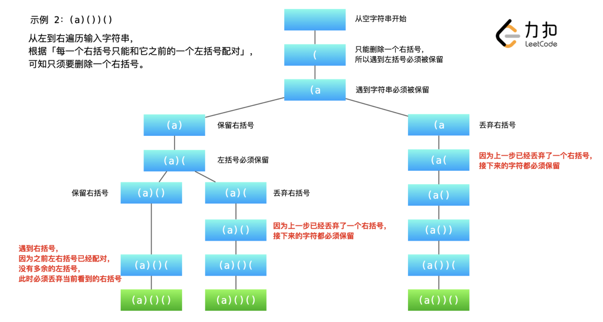

```js
var removeInvalidParentheses = function(s) {
    const hash = new Set()

    // 首先判断需要删除的多余的左括号和右括号
    let leftRemove = 0, rightRemove = 0
    for(let i = 0; i < s.length; i++) {
        if(s.charAt(i) === '(') {
            leftRemove++
        }else if (s.charAt(i) === ')') {
            if(leftRemove === 0) {
                rightRemove++
            }
            if(leftRemove > 0) {
                leftRemove--
            }
        }
    }

    // DFS 算法
    const dfs = (index, leftCount, rightCount, leftRemove, rightRemove, str) => {
        if(index === s.length) {
            if(leftRemove === 0 && rightRemove === 0) {
                hash.add(str)
            }
            return
        }
        
        let char = s.charAt(index)
        // 不保留当前遍历到的字符
        if(char === '(' && leftRemove > 0) {
            dfs(index + 1, leftCount, rightCount, leftRemove - 1, rightRemove, str)
        }
        if(char === ')' && rightRemove > 0) {
            dfs(index + 1, leftCount, rightCount, leftRemove, rightRemove - 1, str)
        }

        // 保留当前遍历到的字符
        str = str +　char
        if(char !== '(' && char !== ')') {
            dfs(index + 1, leftCount, rightCount, leftRemove, rightRemove, str)
        }
        if(char === '(') {
            dfs(index + 1, leftCount + 1, rightCount, leftRemove, rightRemove, str)
        }else if (rightCount < leftCount) {
            dfs(index + 1, leftCount, rightCount + 1, leftRemove, rightRemove, str)
        }
    }

    dfs(0, 0, 0, leftRemove, rightRemove, '')
    const res = []
    hash.forEach(item => {
        res.push(item)
    })
    return res
};
```


## 0309 最佳买卖股票时机含冷冻期

<p>给定一个整数数组，其中第<em>&nbsp;i</em>&nbsp;个元素代表了第&nbsp;<em>i</em>&nbsp;天的股票价格 。​</p>

<p>设计一个算法计算出最大利润。在满足以下约束条件下，你可以尽可能地完成更多的交易（多次买卖一支股票）:</p>

<ul>
	<li>你不能同时参与多笔交易（你必须在再次购买前出售掉之前的股票）。</li>
	<li>卖出股票后，你无法在第二天买入股票 (即冷冻期为 1 天)。</li>
</ul>


<p><strong>示例:</strong></p>

<pre><strong>输入:</strong> [1,2,3,0,2]
<strong>输出: </strong>3 
<strong>解释:</strong> 对应的交易状态为: [买入, 卖出, 冷冻期, 买入, 卖出]</pre>


**解法：动态规划**

* 我们目前持有一支股票，对应的「累计最大收益」记为 `dp[i][0]`
* 我们目前不持有任何股票，并且处于冷冻期中，对应的「累计最大收益」记为 `dp[i][1]`
* 我们目前不持有任何股票，并且不处于冷冻期中，对应的「累计最大收益」记为 `dp[i][2]`

状态转移方程：

* 对于`dp[i][0]`
  * 可以在 i-1 天就已经持有，对应`dp[i-1][0]`
  * 可以第 i 天买入，那么第 i-1 天就不能持有股票，且不处于冷冻期中，加上买入股票的负收益，对应`dp[i-1][2] - prices[i]`

则 `dp[i][0] = Math.max(dp[i-1][0], dp[i-1][2]-prices[i])`

* 对于`dp[i][1]`，第 i 天处于冷冻期的原因是因为 i-1 天卖出了股票，对应的状态为`dp[i-1][0]`加上卖出股票的正收益 `prices[i]`

则 `dp[i][1] = dp[i-1][0] + prices[i]`

* 对于`dp[i][2]`，第 i 天结束之后不持有任何股票并且不处于冷冻期，说明当天没有进行任何操作
  * 如果处于冷冻期，对应的状态为`dp[i-1][1]`
  * 如果不处于冷冻期，对应的状态为`dp[i-1][2]`

则`dp[i][2] = Math.max(dp[i-1][1], dp[i-1][2])`


```js
var maxProfit = function(prices) {
    const n = prices.length
    if(n === 0) return 0
    const dp = new Array(n)
    for(let i = 0; i < n; i++) {
        dp[i] = new Array(3).fill(0)
    }
    dp[0][0] = -prices[0]
    for(let i = 1; i < n; i++) {
        dp[i][0] = Math.max(dp[i-1][0], dp[i-1][2]-prices[i])
        dp[i][1] = dp[i-1][0] + prices[i]
        dp[i][2] = Math.max(dp[i-1][1], dp[i-1][2])
    }
    
    return Math.max(dp[n-1][1], dp[n-1][2])
};
```


## 0312 戳气球

<p>有 <code>n</code> 个气球，编号为<code>0</code> 到 <code>n - 1</code>，每个气球上都标有一个数字，这些数字存在数组 <code>nums</code> 中。</p>

<p>现在要求你戳破所有的气球。戳破第 <code>i</code> 个气球，你可以获得 <code>nums[i - 1] * nums[i] * nums[i + 1]</code> 枚硬币。 这里的 <code>i - 1</code> 和 <code>i + 1</code> 代表和 <code>i</code> 相邻的两个气球的序号。如果 <code>i - 1</code>或 <code>i + 1</code> 超出了数组的边界，那么就当它是一个数字为 <code>1</code> 的气球。</p>

<p>求所能获得硬币的最大数量。</p>

<p> </p>

<strong>示例 1：</strong>

<pre>
<strong>输入：</strong>nums = [3,1,5,8]
<strong>输出：</strong>167
<strong>解释：</strong>
nums = [3,1,5,8] --> [3,5,8] --> [3,8] --> [8] --> []
coins =  3*1*5    +   3*5*8   +  1*3*8  + 1*8*1 = 167</pre>


<p><strong>示例 2：</strong></p>

<pre>
<strong>输入：</strong>nums = [1,5]
<strong>输出：</strong>10
</pre>


<p> </p>

<p><strong>提示：</strong></p>

<ul>
	<li><code>n == nums.length</code></li>
	<li><code>1 <= n <= 500</code></li>
	<li><code>0 <= nums[i] <= 100</code></li>
</ul>


**解法：动态规划**

* 首先在 `nums` 左右各添加 1 构成新数组 `val`，便于进行计算
* 创建`dp[i][j]`，表示戳破 i 到 j 范围内气球可获得最大金币数
* 我们假设最后戳破的气球编号为 `k`，最后戳破，则它左右两边都只剩 1
  * 当前值为 `sum = val[k] * val[left] * val[right]`
  * 此时总的 `dp[i][j] = dp[i][k] + sum + dp[k][j] `（无后效性）
  * 先循环，找到从 left 到 right 中，哪个 k 使得当前 `dp[i][j]`最大，在其内部递归找到最大的`dp[i][k]`和`dp[k][j]`

```js
/**
 * @param {number[]} nums
 * @return {number}
 */
var maxCoins = function(nums) {
    const n = nums.length
    let val = new Array(n + 2).fill(1)
    for(let i = 1; i < val.length - 1; i++) {
        val[i] = nums[i-1]
    }
    const dp = new Array(n + 2).fill(0).map(() => new Array(n + 2).fill(-1))
    const solve = (left, right) => {
        if(left === right - 1) return 0
        if(dp[left][right] != -1) return dp[left][right]
        for(let i = left + 1; i < right; i++) {
            let current = val[i] * val[left] * val[right]
            current += solve(left, i) + solve(i, right)
            dp[left][right] = Math.max(dp[left][right], current)
        }
        return dp[left][right]
    }
    return solve(0, n + 1)
};
```


## 0322 零钱兑换

<p>给定不同面额的硬币 <code>coins</code> 和一个总金额 <code>amount</code>。编写一个函数来计算可以凑成总金额所需的最少的硬币个数。如果没有任何一种硬币组合能组成总金额，返回 <code>-1</code>。</p>

<p>你可以认为每种硬币的数量是无限的。</p>

<p> </p>

<p><strong>示例 1：</strong></p>

<pre>
<strong>输入：</strong>coins = <code>[1, 2, 5]</code>, amount = <code>11</code>
<strong>输出：</strong><code>3</code>
<strong>解释：</strong>11 = 5 + 5 + 1</pre>


<p><strong>示例 2：</strong></p>

<pre>
<strong>输入：</strong>coins = <code>[2]</code>, amount = <code>3</code>
<strong>输出：</strong>-1</pre>


<p><strong>示例 3：</strong></p>

<pre>
<strong>输入：</strong>coins = [1], amount = 0
<strong>输出：</strong>0
</pre>


<p><strong>示例 4：</strong></p>

<pre>
<strong>输入：</strong>coins = [1], amount = 1
<strong>输出：</strong>1
</pre>


<p><strong>示例 5：</strong></p>

<pre>
<strong>输入：</strong>coins = [1], amount = 2
<strong>输出：</strong>2
</pre>


<p> </p>

<p><strong>提示：</strong></p>

<ul>
	<li><code>1 <= coins.length <= 12</code></li>
	<li><code>1 <= coins[i] <= 2<sup>31</sup> - 1</code></li>
	<li><code>0 <= amount <= 10<sup>4</sup></code></li>
</ul>


**解法1：DFS**

具体思路和 0039数组总和 一样，但是会超时

```js
var coinChange = function(coins, amount) {
    if(amount === 0) return 0
    coins.sort((a,b) => b-a)
    let len = Infinity
    const dfs = (target, ans, index) => {
        if(target < 0) return
        if(target === 0) {
            len = Math.min(len, ans.length)
            return
        }
        for(let i = index; i < coins.length; i++) {
            dfs(target - coins[i], [...ans, coins[i]], i)
        }
    }
    dfs(amount, [], 0)
    if(len === Infinity) return -1
    return len
};
```

**解法2：动态规划 完全背包问题**


```js
var coinChange = function(coins, amount) {
    const dp = new Array(amount + 1).fill(Infinity)
    dp[0] = 0
    for(let i = 1; i < dp.length; i++) {
        for(let j = 0; j < coins.length; j++) {
            if(coins[j] <= i) {
                dp[i] = Math.min(dp[i], dp[i - coins[j]] + 1)
            }
        }
    }
    return dp[amount] > amount ? -1 : dp[amount]
};
```


## 0337 打家劫舍Ⅲ


<p>在上次打劫完一条街道之后和一圈房屋后，小偷又发现了一个新的可行窃的地区。这个地区只有一个入口，我们称之为&ldquo;根&rdquo;。 除了&ldquo;根&rdquo;之外，每栋房子有且只有一个&ldquo;父&ldquo;房子与之相连。一番侦察之后，聪明的小偷意识到&ldquo;这个地方的所有房屋的排列类似于一棵二叉树&rdquo;。 如果两个直接相连的房子在同一天晚上被打劫，房屋将自动报警。</p>

<p>计算在不触动警报的情况下，小偷一晚能够盗取的最高金额。</p>

<p><strong>示例 1:</strong></p>

<pre><strong>输入: </strong>[3,2,3,null,3,null,1]


     <strong>3</strong>
    / \

   2   3
    \   \ 
     <strong>3</strong>   <strong>1</strong>

<strong>输出:</strong> 7 
<strong>解释:</strong>&nbsp;小偷一晚能够盗取的最高金额 = 3 + 3 + 1 = <strong>7</strong>.</pre>

<p><strong>示例 2:</strong></p>

<pre><strong>输入: </strong>[3,4,5,1,3,null,1]
&nbsp;    3
    / \
   <strong>4</strong>   <strong>5</strong>
  / \   \ 
 1   3   1

<strong>输出:</strong> 9
<strong>解释:</strong>&nbsp;小偷一晚能够盗取的最高金额&nbsp;= <strong>4</strong> + <strong>5</strong> = <strong>9</strong>.
</pre>


**解法：动态规划**

我们可以用 f(o) 表示选择 o 节点的情况下，o 节点的子树上被选择的节点的最大权值和；g(o) 表示不选择 o 节点的情况下，o 节点的子树上被选择的节点的最大权值和；l 和 r 代表 o 的左右孩子。

* 当 o 被选中时，o 的左右孩子都不能被选中，故 o 被选中情况下子树上被选中点的最大权值和为 l 和 r 不被选中的最大权值和相加，即 `f(o) = g(l) + g(r)`

* 当 o 不被选中时，o 的左右孩子可以被选中，也可以不被选中。对于 oo 的某个具体的孩子 xx，它对 oo 的贡献是 xx 被选中和不被选中情况下权值和的较大值。故 `g(o) = max{f(l), g(l)}+max{f(r), g(r)}`


我们可以用哈希表来存 f 和 g 的函数值，用深度优先搜索的办法后序遍历这棵二叉树，我们就可以得到每一个节点的 f 和 g。根节点的 f 和 g 的最大值就是我们要找的答案。

```js
var rob = function(root) {
    const f = new Map();
    const g = new Map();

    const dfs = (node) => {
        if (node === null) {
            return;
        }
        dfs(node.left);
        dfs(node.right);
        f.set(node, node.val + (g.get(node.left) || 0) + (g.get(node.right) || 0));
        g.set(node, Math.max(f.get(node.left) || 0, g.get(node.left) || 0) + Math.max(f.get(node.right) || 0, g.get(node.right) || 0));
    }
    
    dfs(root);
    return Math.max(f.get(root) || 0, g.get(root) || 0);
};
```


## 0338 比特位计数

<p>给定一个非负整数&nbsp;<strong>num</strong>。对于&nbsp;<strong>0 &le; i &le; num </strong>范围中的每个数字&nbsp;<strong>i&nbsp;</strong>，计算其二进制数中的 1 的数目并将它们作为数组返回。</p>

<p><strong>示例 1:</strong></p>

<pre><strong>输入: </strong>2
<strong>输出: </strong>[0,1,1]</pre>


<p><strong>示例&nbsp;2:</strong></p>

<pre><strong>输入: </strong>5
<strong>输出: </strong><code>[0,1,1,2,1,2]</code></pre>


<p><strong>进阶:</strong></p>

<ul>
	<li>给出时间复杂度为<strong>O(n*sizeof(integer))</strong>的解答非常容易。但你可以在线性时间<strong>O(n)</strong>内用一趟扫描做到吗？</li>
	<li>要求算法的空间复杂度为<strong>O(n)</strong>。</li>
	<li>你能进一步完善解法吗？要求在C++或任何其他语言中不使用任何内置函数（如 C++ 中的&nbsp;<strong>__builtin_popcount</strong>）来执行此操作。</li>
</ul>


**解法：动态规划**

分奇数和偶数：

* 偶数相当于被某个更小的数乘以 2，在二进制运算中，就是左移一位，即在低位加个 0
* 奇数相当于在上一个偶数加 1

```js
var countBits = function(n) {
    const dp = new Array(n + 1)
    dp[0] = 0
    for(let i = 1; i <= n; i++) {
        if(i % 2) {
            dp[i] = dp[i-1] + 1
        }else {
            dp[i] = dp[i / 2]   
        }
    }
    return dp
};
```


## 0347 前 K 个高频元素

<p>给你一个整数数组 <code>nums</code> 和一个整数 <code>k</code> ，请你返回其中出现频率前 <code>k</code> 高的元素。你可以按 <strong>任意顺序</strong> 返回答案。</p>

<p> </p>

<p><strong>示例 1:</strong></p>

<pre>
<strong>输入: </strong>nums = [1,1,1,2,2,3], k = 2
<strong>输出: </strong>[1,2]
</pre>


<p><strong>示例 2:</strong></p>

<pre>
<strong>输入: </strong>nums = [1], k = 1
<strong>输出: </strong>[1]</pre>


<p> </p>

<p><strong>提示：</strong></p>

<ul>
	<li><code>1 <= nums.length <= 10<sup>5</sup></code></li>
	<li><code>k</code> 的取值范围是 <code>[1, 数组中不相同的元素的个数]</code></li>
	<li>题目数据保证答案唯一，换句话说，数组中前 <code>k</code> 个高频元素的集合是唯一的</li>
</ul>


<p> </p>

<p><strong>进阶：</strong>你所设计算法的时间复杂度 <strong>必须</strong> 优于 <code>O(n log n)</code> ，其中 <code>n</code><em> </em>是数组大小。</p>


**解法：堆排序**

和 215 题一样的思路

```js
var topKFrequent = function(nums, k) {
    const hash = new Map()
    for(let item of nums) {
        if(hash.has(item)) hash.set(item, hash.get(item)+1)
        else {
            hash.set(item, 1)
        }
    }
    const heap = new Array()
    hash.forEach((value, key) => {
      heap.push([value, key])
    })
    let heapSize = heap.length
    const maxHeapify = (n, heapSize) => {
        let l = 2*n + 1
        let r = 2*n + 2
        let largest = n
        if(l < heapSize && heap[l][0] > heap[largest][0]) largest = l
        if(r < heapSize && heap[r][0] > heap[largest][0]) largest = r
        if(largest !== n) {
            [heap[n], heap[largest]] = [heap[largest], heap[n]]
            maxHeapify(largest, heapSize)
        }
    }
    for(let i = Math.floor(heapSize / 2) - 1; i >= 0; i--) {
        maxHeapify(i, heapSize)
    }
    for(let i = heap.length - 1; i >= 0; i--) {
        [heap[0], heap[i]] = [heap[i], heap[0]]
        heapSize--
        maxHeapify(0, heapSize)
    }
    const res = []
    while(k > 0) {
        res.push(heap.pop()[1])
        k--
    }
    return res
};
```


## 0394 字符串解码

<p>给定一个经过编码的字符串，返回它解码后的字符串。</p>

<p>编码规则为: <code>k[encoded_string]</code>，表示其中方括号内部的 <em>encoded_string</em> 正好重复 <em>k</em> 次。注意 <em>k</em> 保证为正整数。</p>

<p>你可以认为输入字符串总是有效的；输入字符串中没有额外的空格，且输入的方括号总是符合格式要求的。</p>

<p>此外，你可以认为原始数据不包含数字，所有的数字只表示重复的次数 <em>k</em> ，例如不会出现像&nbsp;<code>3a</code>&nbsp;或&nbsp;<code>2[4]</code>&nbsp;的输入。</p>

<p>&nbsp;</p>

<p><strong>示例 1：</strong></p>

<pre><strong>输入：</strong>s = &quot;3[a]2[bc]&quot;
<strong>输出：</strong>&quot;aaabcbc&quot;
</pre>


<p><strong>示例 2：</strong></p>

<pre><strong>输入：</strong>s = &quot;3[a2[c]]&quot;
<strong>输出：</strong>&quot;accaccacc&quot;
</pre>


<p><strong>示例 3：</strong></p>

<pre><strong>输入：</strong>s = &quot;2[abc]3[cd]ef&quot;
<strong>输出：</strong>&quot;abcabccdcdcdef&quot;
</pre>


<p><strong>示例 4：</strong></p>

<pre><strong>输入：</strong>s = &quot;abc3[cd]xyz&quot;
<strong>输出：</strong>&quot;abccdcdcdxyz&quot;
</pre>


**解法：栈**

[外层的先等等，把内层的解决了再和你连线 - 字符串解码 - 力扣（LeetCode）](https://leetcode-cn.com/problems/decode-string/solution/zhan-de-ji-yi-nei-ceng-de-jie-ma-liao-bie-wang-lia/)

```js
 const decodeString = (s) => {
    let numStack = [];        // 存倍数的栈
    let strStack = [];        // 存 待拼接的str 的栈
    let num = 0;              // 倍数的“搬运工”
    let result = '';          // 字符串的“搬运工”
    for (const char of s) {   // 逐字符扫描
        if (!isNaN(char)) {   // 遇到数字
            num = num * 10 + Number(char); // 算出倍数
        } else if (char == '[') {  // 遇到 [
            strStack.push(result); // result串入栈
            result = '';           // 入栈后清零
            numStack.push(num);    // 倍数num进入栈等待
            num = 0;               // 入栈后清零
        } else if (char == ']') {  // 遇到 ]，两个栈的栈顶出栈
            let repeatTimes = numStack.pop(); // 获取拷贝次数
            result = strStack.pop() + result.repeat(repeatTimes); // 构建子串
        } else {                   
            result += char;        // 遇到字母，追加给result串
        }
    }
    return result;
};
```


## 0399 除法求值

<p>给你一个变量对数组 <code>equations</code> 和一个实数值数组 <code>values</code> 作为已知条件，其中 <code>equations[i] = [A<sub>i</sub>, B<sub>i</sub>]</code> 和 <code>values[i]</code> 共同表示等式 <code>A<sub>i</sub> / B<sub>i</sub> = values[i]</code> 。每个 <code>A<sub>i</sub></code> 或 <code>B<sub>i</sub></code> 是一个表示单个变量的字符串。</p>

<p>另有一些以数组 <code>queries</code> 表示的问题，其中 <code>queries[j] = [C<sub>j</sub>, D<sub>j</sub>]</code> 表示第 <code>j</code> 个问题，请你根据已知条件找出 <code>C<sub>j</sub> / D<sub>j</sub> = ?</code> 的结果作为答案。</p>

<p>返回 <strong>所有问题的答案</strong> 。如果存在某个无法确定的答案，则用 <code>-1.0</code> 替代这个答案。如果问题中出现了给定的已知条件中没有出现的字符串，也需要用 <code>-1.0</code> 替代这个答案。</p>

<p><strong>注意：</strong>输入总是有效的。你可以假设除法运算中不会出现除数为 0 的情况，且不存在任何矛盾的结果。</p>

<p> </p>

<p><strong>示例 1：</strong></p>

<pre>
<strong>输入：</strong>equations = [["a","b"],["b","c"]], values = [2.0,3.0], queries = [["a","c"],["b","a"],["a","e"],["a","a"],["x","x"]]
<strong>输出：</strong>[6.00000,0.50000,-1.00000,1.00000,-1.00000]
<strong>解释：</strong>
条件：<em>a / b = 2.0</em>, <em>b / c = 3.0</em>
问题：<em>a / c = ?</em>, <em>b / a = ?</em>, <em>a / e = ?</em>, <em>a / a = ?</em>, <em>x / x = ?</em>
结果：[6.0, 0.5, -1.0, 1.0, -1.0 ]
</pre>


<p><strong>示例 2：</strong></p>

<pre>
<strong>输入：</strong>equations = [["a","b"],["b","c"],["bc","cd"]], values = [1.5,2.5,5.0], queries = [["a","c"],["c","b"],["bc","cd"],["cd","bc"]]
<strong>输出：</strong>[3.75000,0.40000,5.00000,0.20000]
</pre>


<p><strong>示例 3：</strong></p>

<pre>
<strong>输入：</strong>equations = [["a","b"]], values = [0.5], queries = [["a","b"],["b","a"],["a","c"],["x","y"]]
<strong>输出：</strong>[0.50000,2.00000,-1.00000,-1.00000]
</pre>


<p> </p>

<p><strong>提示：</strong></p>

<ul>
	<li><code>1 <= equations.length <= 20</code></li>
	<li><code>equations[i].length == 2</code></li>
	<li><code>1 <= A<sub>i</sub>.length, B<sub>i</sub>.length <= 5</code></li>
	<li><code>values.length == equations.length</code></li>
	<li><code>0.0 < values[i] <= 20.0</code></li>
	<li><code>1 <= queries.length <= 20</code></li>
	<li><code>queries[i].length == 2</code></li>
	<li><code>1 <= C<sub>j</sub>.length, D<sub>j</sub>.length <= 5</code></li>
	<li><code>A<sub>i</sub>, B<sub>i</sub>, C<sub>j</sub>, D<sub>j</sub></code> 由小写英文字母与数字组成</li>
</ul>


**解法一：图 广度优先搜索**

* 首先通过 hash 表建立起 字符-数字 之间的映射，便于后续查询
* 通过数据建立 (字母)-数字-值 之间的映射关系
* 检索 queries 
  * 如果没有这两个字母，返回 -1
  * 如果有这两个字母，则进行广度优先搜索，将左侧字母所有关联的字母逐个搜索，并计算权值，直到找到右侧字母

```js
/**
 * @param {string[][]} equations
 * @param {number[]} values
 * @param {string[][]} queries
 * @return {number[]}
 */
var calcEquation = function(equations, values, queries) {
    let id = 0
    const hashMap = new Map()
    for(let i = 0; i < equations.length; i++) {
        if(!hashMap.has(equations[i][0])){
            hashMap.set(equations[i][0], id)
            id++
        }
        if(!hashMap.has(equations[i][1])){
            hashMap.set(equations[i][1], id)
            id++
        }
    }

    const edges = new Array(id).fill(0)
    for(let i = 0; i < id; i++) {
        edges[i] = []
    }
    for(let i = 0; i < equations.length; i++) {
        const left = hashMap.get(equations[i][0]), right = hashMap.get(equations[i][1])
        edges[left].push([right, values[i]])
        edges[right].push([left, 1.0 / values[i]])
    }

    const ret = []
    for(let i = 0; i < queries.length; i++) {
        const query = queries[i]
        let result = -1.0
        if(hashMap.has(query[0]) && hashMap.has(query[1])) {
            const ia = hashMap.get(query[0]), ib = hashMap.get(query[1])
            if(ia === ib) {
                result = 1.0
            }else {
                const points = []
                points.push(ia)
                const ratios = new Array(id).fill(-1.0)
                ratios[ia] = 1.0
                
                while(points.length && ratios[ib] < 0) {
                    const x = points.pop()
                    for(const [y, val] of edges[x]) {
                        if(ratios[y] < 0) {
                            ratios[y] = ratios[x] * val
                            points.push(y)
                        }
                    }
                }
                result = ratios[ib]
            }
        }
        ret[i] = result
    }
    return ret
};
```


## 0406 根据身高重建队列

<p>假设有打乱顺序的一群人站成一个队列，数组 <code>people</code> 表示队列中一些人的属性（不一定按顺序）。每个 <code>people[i] = [h<sub>i</sub>, k<sub>i</sub>]</code> 表示第 <code>i</code> 个人的身高为 <code>h<sub>i</sub></code> ，前面 <strong>正好</strong> 有 <code>k<sub>i</sub></code><sub> </sub>个身高大于或等于 <code>h<sub>i</sub></code> 的人。</p>

<p>请你重新构造并返回输入数组 <code>people</code> 所表示的队列。返回的队列应该格式化为数组 <code>queue</code> ，其中 <code>queue[j] = [h<sub>j</sub>, k<sub>j</sub>]</code> 是队列中第 <code>j</code> 个人的属性（<code>queue[0]</code> 是排在队列前面的人）。</p>

<p> </p>


<p><strong>示例 1：</strong></p>

<pre>
<strong>输入：</strong>people = [[7,0],[4,4],[7,1],[5,0],[6,1],[5,2]]
<strong>输出：</strong>[[5,0],[7,0],[5,2],[6,1],[4,4],[7,1]]
<strong>解释：</strong>
编号为 0 的人身高为 5 ，没有身高更高或者相同的人排在他前面。
编号为 1 的人身高为 7 ，没有身高更高或者相同的人排在他前面。
编号为 2 的人身高为 5 ，有 2 个身高更高或者相同的人排在他前面，即编号为 0 和 1 的人。
编号为 3 的人身高为 6 ，有 1 个身高更高或者相同的人排在他前面，即编号为 1 的人。
编号为 4 的人身高为 4 ，有 4 个身高更高或者相同的人排在他前面，即编号为 0、1、2、3 的人。
编号为 5 的人身高为 7 ，有 1 个身高更高或者相同的人排在他前面，即编号为 1 的人。
因此 [[5,0],[7,0],[5,2],[6,1],[4,4],[7,1]] 是重新构造后的队列。
</pre>


<p><strong>示例 2：</strong></p>

<pre>
<strong>输入：</strong>people = [[6,0],[5,0],[4,0],[3,2],[2,2],[1,4]]
<strong>输出：</strong>[[4,0],[5,0],[2,2],[3,2],[1,4],[6,0]]
</pre>


<p> </p>

<p><strong>提示：</strong></p>

<ul>
	<li><code>1 <= people.length <= 2000</code></li>
	<li><code>0 <= h<sub>i</sub> <= 10<sup>6</sup></code></li>
	<li><code>0 <= k<sub>i</sub> < people.length</code></li>
	<li>题目数据确保队列可以被重建</li>
</ul>


**解法：从低到高**

* 首先对 people 数组根据身高从低到高进行排序
* 一个个 shift 出来
  * 如果 item[1] 为 0 则直接插入，因为前面没有比他高的
  * 如果不为 0，则统计前面有几个比他高的，直到等于 item[1]

```js
var reconstructQueue = function(people) {
    people.sort((a, b) => a[0] - b[0])
    let res = new Array(people.length).fill(null)
    while(people.length > 0) {
        let item = people.shift()
        let count = 0
        let num = item[1]
        if(num === 0) {
            for(let i = 0; i < res.length; i++) {
                if(res[i] === null) {
                    res[i] = item
                    break
                }
            }
        }else {
            for(let i = 0; i < res.length; i++) {
                if(res[i] === null) {
                    if(count === num) {
                        res[i] = item
                        break
                    }
                    count++
                }else {
                    if(res[i][0] >= item[0]) {
                        count++
                    }else {
                        continue
                    }
                }
            }
        }
    }
    return res
};
```


## 0416 分割等和子集

<p>给你一个 <strong>只包含正整数 </strong>的 <strong>非空 </strong>数组 <code>nums</code> 。请你判断是否可以将这个数组分割成两个子集，使得两个子集的元素和相等。</p>

<p> </p>

<p><strong>示例 1：</strong></p>

<pre>
<strong>输入：</strong>nums = [1,5,11,5]
<strong>输出：</strong>true
<strong>解释：</strong>数组可以分割成 [1, 5, 5] 和 [11] 。</pre>


<p><strong>示例 2：</strong></p>

<pre>
<strong>输入：</strong>nums = [1,2,3,5]
<strong>输出：</strong>false
<strong>解释：</strong>数组不能分割成两个元素和相等的子集。
</pre>


<p> </p>

<p><strong>提示：</strong></p>

<ul>
	<li><code>1 <= nums.length <= 200</code></li>
	<li><code>1 <= nums[i] <= 100</code></li>
</ul>


**解法：动态规划**

0 - 1 背包问题

* 画一个 len 行，half + 1 列的表格。这里 len 是物品的个数，half 是背包的容量。len 行表示一个一个物品考虑，half + 1多出来的那 1 列，表示背包容量从 0 开始考虑。很多时候，我们需要考虑这个容量为 0 的数值
* 状态定义：`dp[i][j]`表示从数组的 `[0, i]` 这个子区间内挑选一些正整数，每个数只能用一次，使得这些数的和**恰好等于** `j`
* 状态转移方程：很多时候，状态转移方程思考的角度是「分类讨论」，对于「0-1 背包问题」而言就是「当前考虑到的数字选与不选」
  * 不选择 `nums[i]`，如果在 `[0, i - 1]` 这个子区间内已经有一部分元素，使得它们的和为 `j` ，那么 `dp[i][j] = true`；
  * 选择 `nums[i]`，如果在 `[0, i - 1]` 这个子区间内就得找到一部分元素，使得它们的和为 `j - nums[i]`。

状态转移方程：`dp[i][j] = dp[i - 1][j] or dp[i - 1][j - nums[i]]`


```js
var canPartition = function(nums) {
    let sum = 0
    nums.map(item => sum += item)
    half = sum / 2
    if(!Number.isInteger(half)) return false
    const dp = new Array(nums.length)
    for(let i = 0; i < dp.length; i++) {
        dp[i] = new Array(half + 1).fill(false)
    }
    if(nums[0] <= half) dp[0][nums[0]] = true
    for(let i = 1; i < nums.length; i++) {
        for(let j = 0; j <= half; j++) {
            dp[i][j] = dp[i-1][j]
            if(nums[i] === j) {
               dp[i][j] = true
               continue
            }
            if(nums[i] < j) {
               dp[i][j] = dp[i-1][j] || dp[i-1][j-nums[i]] 
            }
        } 
    }
    console.log(dp)
    return dp[nums.length - 1][half]
};
```


## 0437 路径总和3

给定一个二叉树的根节点 `root` ，和一个整数 `targetSum` ，求该二叉树里节点值之和等于 `targetSum` 的 **路径** 的数目。

**路径** 不需要从根节点开始，也不需要在叶子节点结束，但是路径方向必须是向下的（只能从父节点到子节点）。

**示例 1：**

 

```
输入：root = [10,5,-3,3,2,null,11,3,-2,null,1], targetSum = 8
输出：3
解释：和等于 8 的路径有 3 条，如图所示。
```

**示例 2：**

```
输入：root = [5,4,8,11,null,13,4,7,2,null,null,5,1], targetSum = 22
输出：3
```

**提示:**

- 二叉树的节点个数的范围是 `[0,1000]`
- `-109 <= Node.val <= 109` 
- `-1000 <= targetSum <= 1000` 


**解法：双重递归**

* 首先通过 traverseNode 遍历所有的节点
* 在每个节点从头开始计数，进入 dfs 递归

```js
var pathSum = function(root, targetSum) {
    let count = 0
    const dfs = (root, sum) => {
        if(root === null) return
        sum += root.val
        if(sum === targetSum) {
            count++
        }
        dfs(root.left, sum)
        dfs(root.right, sum)
    }

    const traverseNode = (root) => {
        if(root === null) return
        dfs(root, 0)
        traverseNode(root.left)
        traverseNode(root.right)
    }
    traverseNode(root)
    return count
};
```


## 0438 找到字符串中所有字母异位词

<p>给定一个字符串&nbsp;<strong>s&nbsp;</strong>和一个非空字符串&nbsp;<strong>p</strong>，找到&nbsp;<strong>s&nbsp;</strong>中所有是&nbsp;<strong>p&nbsp;</strong>的字母异位词的子串，返回这些子串的起始索引。</p>

<p>字符串只包含小写英文字母，并且字符串&nbsp;<strong>s&nbsp;</strong>和 <strong>p&nbsp;</strong>的长度都不超过 20100。</p>

<p><strong>说明：</strong></p>

<ul>
	<li>字母异位词指字母相同，但排列不同的字符串。</li>
	<li>不考虑答案输出的顺序。</li>
</ul>


<p><strong>示例&nbsp;1:</strong></p>

<pre>
<strong>输入:</strong>
s: &quot;cbaebabacd&quot; p: &quot;abc&quot;


<strong>输出:</strong>
[0, 6]

<strong>解释:</strong>
起始索引等于 0 的子串是 &quot;cba&quot;, 它是 &quot;abc&quot; 的字母异位词。
起始索引等于 6 的子串是 &quot;bac&quot;, 它是 &quot;abc&quot; 的字母异位词。
</pre>

<p><strong>&nbsp;示例 2:</strong></p>

<pre>
<strong>输入:</strong>
s: &quot;abab&quot; p: &quot;ab&quot;


<strong>输出:</strong>
[0, 1, 2]

<strong>解释:</strong>
起始索引等于 0 的子串是 &quot;ab&quot;, 它是 &quot;ab&quot; 的字母异位词。
起始索引等于 1 的子串是 &quot;ba&quot;, 它是 &quot;ab&quot; 的字母异位词。
起始索引等于 2 的子串是 &quot;ab&quot;, 它是 &quot;ab&quot; 的字母异位词。


**解法：滑动窗口**

```js
var findAnagrams = function(s, p) {
    const sLen = s.length, pLen = p.length;
    if (sLen < pLen) {
        return [];
    }

    const ans = [];
    const sCount = new Array(26).fill(0);
    const pCount = new Array(26).fill(0);
    for (let i = 0; i < pLen; ++i) {
        ++sCount[s[i].charCodeAt() - 'a'.charCodeAt()];
        ++pCount[p[i].charCodeAt() - 'a'.charCodeAt()];
    }

    if (sCount.toString() === pCount.toString()) {
        ans.push(0);
    }

    for (let i = 0; i < sLen - pLen; ++i) {
        --sCount[s[i].charCodeAt() - 'a'.charCodeAt()];
        ++sCount[s[i + pLen].charCodeAt() - 'a'.charCodeAt()];

        if (sCount.toString() === pCount.toString()) {
            ans.push(i + 1);
        }
    }

    return ans;
};
```
